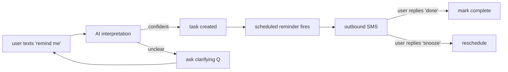

# BUILD PROTOCOL v2.17

> A systematic framework for building, auditing, and evolving products with Claude Code.
> Created: 2026-04-15. Last updated: 2026-05-15. Owner: Joe Wang.

---

## CONTEXT & PURPOSE

### Why This Exists

This protocol was created because "one-shotting" product specs and implementation plans with AI produces inconsistent results — even after 20+ iterations. The core problem: **Claude Code is extremely capable at execution but has no inherent process discipline.** Without guardrails, it builds things that drift from specs, silently refactors working code, invents behavior not defined anywhere, and produces outputs that require dozens of audit passes to correct.

This document codifies a methodology for how a non-engineer product leader creates products with Claude Code — optimized for someone who is strong at conceptual scoping and product design but relies on AI for implementation.

### What We're Optimizing For

1. **Comprehensive upfront design** — get foundations right so future iterations are easier, not build-as-you-go
2. **Guided sequential execution** — "do next step, do next step" with human review at each boundary, not manual copy-paste
3. **Spec-code consistency** — specs and code stay in sync throughout the build, not just at the beginning
4. **Cross-project learning** — mistakes from one project don't repeat in the next
5. **Human leverage** — the human's time goes to product judgment and decision-making, not technical review or debugging

### How This Was Derived (Evidence Base)

This protocol was reverse-engineered from 4 real projects built between January–April 2026:

| Project | What Happened | Key Lesson |
|---------|--------------|------------|
| **Explain My Blood Test** | 931 commits over 3.5 months, 70% were fixes. No upfront specs. Definition drift (7 copies of one taxonomy). Fix-after-fix chains. ~60K lines of code. | **Build-as-you-go produces massive churn.** Spec-first is definitively better. |
| **Tax Auction** | 7,593 lines of specs → 7,090 lines of code in 3 days. Spec held with no deviations. 1 critical audit found real issues (74 parcel misclassifications). | **Comprehensive upfront specs + sequential phases = cleanest execution.** Even good specs need post-build auditing. |
| **Do Later List** | 21 spec docs, 200K+ lines of code, 13 build phases. Copy-paste prompts. Specs never updated during build → 50+ items per audit pass × 5 audit passes. | **Upfront specs are necessary but not sufficient.** Mandatory reconciliation after each phase is the missing piece. Propagation enforcement prevents downstream rot. |
| **Strategy-research project** | Strategy-first: deep upfront specs (context docs, playbooks, agent specs) before any code. Behavioral and competitive research completed before implementation. | **Spec depth scales with product complexity.** The Behavioral Core pattern (how the system thinks) is reusable across AI products. |

### Core Thesis

**Write comprehensive specs upfront (the human's strength) → execute in sequential phases with human gates → mandate reconciliation after every phase to keep specs and code in sync → extract learnings to improve the next project.**

The protocol prevents the three failure modes observed across these projects:
1. **No specs** (EMBT) → churn, drift, fix-after-fix
2. **Specs but no reconciliation** (DLL) → spec-code divergence accumulates silently
3. **Specs but no propagation** (DLL) → changing one spec doesn't update downstream specs that depend on it

---

## HOW TO USE THIS DOCUMENT

### Quick Start

Just tell Claude Code to read this file. You don't need to read it yourself — Claude will guide you.

**Simplest invocation:** "Read ~/.claude/build-protocol.md and help me use it for my project."

Claude will then ask which mode fits your situation:

---

**When the user references this file without specifying a mode, Claude MUST (v2.9 streamlined startup):**

1. **Silently detect state.** Check whether `docs/build-manifest.md` exists. Run `git status` if it's a git repo. Skim top-level files (package.json, framework configs, CLAUDE.md, recent commits) to infer project type and stage. **Never ask "is this the first time?" — it's a filesystem check.**
2. **Tentatively classify complexity** (Light / Standard / Heavy — see Complexity Assessment) from those signals. Propose with one-line reasoning, don't ask. State only the track + one-line reasoning. **Do NOT enumerate the "What Changes" column at startup** (skip Behavioral Core, skip Domain Specs, etc.) — those terms are jargon to a first-time user before mode selection. Surface each change later, only when it actually applies.
3. **Show ONE narration block** with: what you observed, the tentative complexity, and any housekeeping flags worth knowing before picking a mode (dirty git tree, missing manifest, conflicting docs, etc.). Then present the menu below and ask the single question: **which mode?**
4. **Narrator Mode is silently ON.** Do NOT announce it as a status line. Do NOT ask the user to confirm or choose terse vs narrator. Just be in narrator mode. User can switch at any point by saying "terse mode."
5. **Journey Map (§11.4) is shown only AFTER mode selection** — and only when the chosen mode is NEW for a first-time user. It is NOT a precondition for picking a mode, and never gates the conversation with a "does this look right?" confirmation.

Present this menu and wait for selection:

> **Which mode fits where you are?**
>
> | Mode | What it does | When to use | Roughly how long |
> |---|---|---|---|
> | **A) NEW** | Build a brand-new product from scratch. ~7 spec steps + build phases + hardening. | You're starting from zero or a fresh idea. | 4-12 sessions over 1-4 weeks |
> | **B) AUDIT** | Assess an existing, partially-built product. Maps what you have to the 5-document hierarchy, finds gaps, proposes a remediation plan. | You inherited code, or you've been building without a process and want to formalize. | 1-3 sessions |
> | **C) EVOLVE** | Add features or change an existing product. Classified Small / Medium / Large — bigger changes apply more of the build discipline. | You have a working product and want to extend it. | 1 session (Small) to 1+ week (Large) |
>
> **Which one? (A / B / C)** — or say "I'm not sure" / describe what you're trying to do and I'll recommend one.

After the user selects, Claude reads the relevant PART (II, III, or IV) and begins at Step 1 / A1 / E1. Claude does NOT need to read the entire document upfront — read Part I (Foundation, including §11 Narration Protocol) + the selected mode's section.

---

### Direct Invocation (if you already know which mode)

- **New product:** "Read ~/.claude/build-protocol.md. Use MODE: NEW to guide me through building [product name]. [Brief description of what it is.]"
- **Audit existing:** "Read ~/.claude/build-protocol.md. Use MODE: AUDIT to assess the current state of this project."
- **Evolve existing:** "Read ~/.claude/build-protocol.md. Use MODE: EVOLVE. I want to [describe the change]."

### Complexity Assessment

Before selecting a mode, assess project complexity to determine the appropriate process weight:

| Track | Criteria | What Changes |
|-------|----------|-------------|
| **Light** | 1-3 subsystems, no AI decisions, no multi-user, single integration surface | Skip Behavioral Core (Step 2). Skip Domain Specs if <3 subsystems — put details in Architecture Contract. Simplified Phase Report (always-required sections only). Skip adversarial reviews at spec phase — do them at hardening only. |
| **Standard** | 3-8 subsystems, AI decisions OR multi-user OR 3+ external integrations | Full protocol as documented. This is the default. |
| **Heavy** | Complex AI + multi-user + 5+ external integrations + compliance requirements | Full protocol + mandatory deployment verification at every phase + mandatory second-model review (ChatGPT) at spec and hardening gates + integration test suite required before Phase 2. |

If unsure, start at Standard. You can escalate to Heavy mid-build if you discover unexpected complexity, but downgrading from Standard to Light mid-build is risky — you've already skipped the foundations.

**Mid-build reclassification (escalating to Heavy):**

If you discover mid-build that the project is more complex than initially assessed:
1. **Future phases** follow Heavy requirements immediately (mandatory deploy verification every phase, mandatory second-model review at remaining spec and hardening gates)
2. **Catch-up audit** on completed phases: run a one-time review covering the gaps between Standard and Heavy — specifically, deploy verification for any phases that touched external integrations, and second-model review of the Product Spec, Architecture Contract, and Behavioral Core (if they weren't reviewed at the higher bar)
3. **Log the reclassification** in the Build Manifest with: date, which phase triggered it, rationale, and what catch-up work was done
4. **Do NOT retroactively re-run** completed phases — the catch-up audit covers the delta

### Rules for Claude Code

**Execution rules:**
1. **Follow steps in order.** Do not skip, merge, or reorder steps.
2. **Stop at every human gate (marked `→ HG`).** Present your work, wait for explicit approval. Do not proceed without it.
3. **Track current step.** Always know which step you're on. When resuming a session, read the Build Manifest to identify current position.
4. **Step numbering format:** Steps use `Na/Nb/Nc` (e.g., `8a`, `8b`, `8c`) so the human can remember and reference their position. Always prefix your work with the current step ID.
5. **Reconciliation is non-optional.** Every build phase has a reconcile step. If there's nothing to reconcile, explicitly state "No divergences found." Never silently skip it.
6. **Specs are living documents.** They are written upfront and comprehensive, then updated during build when reality diverges from plan. Stale specs are worse than no specs.

**Behavioral guardrails (Claude MUST follow these at all times):**
7. **No silent refactoring.** Previously built modules MUST NOT be refactored unless strictly required for the current phase's functionality. If a refactor IS necessary: list ALL changes explicitly in a `### Refactored` section, explain WHY each refactor was required, and confirm no regression in previously passing tests. Unauthorized refactors (changes to modules not required by the current phase) are a failure condition.
8. **No behavior drift.** Do NOT change the behavior of previously built systems unless the current phase REQUIRES it. If behavior changes are necessary, list ALL changes under a `### Behavior Changes` section, explain WHY each was required (cite the spec section), and confirm no regression in previously passing tests. Silent behavior change is a failure condition. Examples of drift that MUST be flagged: changing confidence thresholds in existing flows, altering message/confirmation formats, modifying state transition rules, changing how engines/schedulers process jobs, altering normalized input/output contracts.
9. **Scope lock.** Only build what is explicitly listed in the phase scope. Do NOT add extra features, extend scope, or anticipate future phases. If something seems missing from the specs, list it — do NOT build it.
10. **Drift prevention.** Do NOT invent behavior not defined in the Behavioral Core. Do NOT invent system design not defined in domain specs. All behavior must trace back to a specific spec section. If you cannot cite the section, the behavior does not exist and must not be implemented.
11. **Idempotency.** Every build step must be safely re-runnable. Check existing state before writing. Update instead of recreate when a file already exists. Verify current state matches expectations before proceeding.
12. **Complexity rule.** Prefer simple implementation, explicit logic, and clarity over abstraction. Three clear lines of code are better than one clever abstraction. Avoid premature optimization and over-generalization.
13. **Flag divergences immediately.** If you discover something that contradicts a spec, STOP and flag it — don't silently pick one interpretation. Present the conflict, propose 2-3 resolution options, and wait for approval.
14. **Two-correction rule.** If the human has corrected the same issue twice in a session, the context is likely polluted with failed approaches. Recommend: `/clear` and restart with a better-scoped prompt. A fresh session with a clear prompt almost always outperforms a long session with accumulated corrections.

**Failure stop conditions (Claude MUST stop immediately if):**
- Required behavior is NOT defined in the Behavioral Core (for AI products)
- Required mechanics are NOT defined in the relevant domain spec
- Two docs conflict with each other
- A system behavior is ambiguous (no clear rule exists)
- An assumption would be needed to proceed
- A dependency from a previous phase is missing or broken
- A referenced module/file does not exist

When stopping: clearly state the gap, propose the exact spec patch needed (which file, which section, what to add), provide 2-3 resolution options if applicable, and wait for approval.

### Role Division

| Role | Who | What |
|------|-----|------|
| **Product scoping & decisions** | Human | Defines what to build, reviews and approves all work, resolves ambiguities, makes tradeoff calls |
| **Adversarial review (specs)** | ChatGPT | Reviews Product Spec, Behavioral Core, and Architecture Contract for gaps and blind spots |
| **Drafting, building, verifying** | Claude Code | Writes specs, code, tests; runs validation; proposes reconciliations |

---

## PART I: FOUNDATION

*These concepts apply to all three modes. Read this section first.*

### 1. Document Hierarchy

Every product has up to 5 canonical documents. Together they are the complete source of truth.

| # | Document | Answers | Required? |
|---|----------|---------|-----------|
| 1 | **Product Spec** | WHAT it does. Vision, capabilities, scenarios, economics. True north star. | Always |
| 2 | **Behavioral Core** | HOW it thinks. Decision logic, confidence thresholds, autonomy boundaries, tone, conflict resolution. | Only if AI makes consequential decisions |
| 3 | **Architecture Contract** | HOW it's built. Tech stack, patterns, constraints, red flags, provider abstractions, security baseline. | Always (for code products) |
| 4 | **Domain Specs** | DETAILS of each subsystem. Data models, APIs, state machines, integration points, edge cases. | If product has 3+ subsystems |
| 5 | **Build Manifest** | WHERE we are. Phase list, current status, decisions made, deferred items, deviations from plan. | Always |

**Hierarchy rules:**
- Product Spec is supreme. If any doc contradicts it, Product Spec wins (or the Product Spec gets updated — never silently ignored).
- Behavioral Core governs all AI behavior. Code must implement it exactly. Drift here is the hardest bug to find.
- Architecture Contract governs all technical choices. No ad-hoc tool or pattern decisions outside it.
- Domain Specs are detailed implementations OF the Product Spec, not alternatives to it.
- Build Manifest is the only doc that tracks current state (what's done, what's in-progress). All other docs describe desired state.

**Source-of-truth priority (when docs conflict):**
1. Product Spec (vision, capabilities, scope)
2. Behavioral Core (decision logic, tone, autonomy rules)
3. Architecture Contract (tech stack, patterns, constraints)
4. Domain Specs (subsystem details, schemas, APIs)
5. Build Manifest (execution sequence, current state)

If behavior is defined in both the Product Spec and the Behavioral Core, the **Behavioral Core wins** — it is the single source of truth for all behavioral decisions. The Product Spec is vision; the Behavioral Core is implementation authority. System docs (domain specs) execute behavior defined in the Behavioral Core — they do not define new behavior.

**Global Spec Lock (MANDATORY):**

Claude MUST treat project specs as STRICT, NOT INTERPRETABLE.

1. If behavior differs from Behavioral Core → FAIL
2. If schema differs from the data model domain spec → FAIL
3. If API route differs from the API architecture domain spec → FAIL
4. If engine/pipeline logic differs from the relevant domain spec → FAIL
5. If behavior is derived from the Product Spec instead of the Behavioral Core (when Behavioral Core defines it) → FAIL

NO reinterpretation allowed. If ambiguity exists → STOP → ask for clarification → DO NOT choose an interpretation.

Implementation must EXACTLY match specs. "Close enough" is not passing.

**Supporting documents (non-hierarchical):**
- `decision-log.md` — Every non-obvious decision with rationale. Prevents re-litigating settled questions across sessions.
- `tool-decisions.md` — Tool comparisons and selection rationale (see Tool Stack section).

### Review Responsibility Matrix

The human and Claude review different things. This prevents the human from drowning in technical detail and prevents Claude from making product judgment calls.

| Claude Code handles (technical) | Human handles (product + business) |
|---|---|
| Does the code match the specs? | Does the product *feel* right? |
| Are invariants and architecture rules followed? | Do confirmations, messages, and alerts sound right? |
| Are there regressions from prior phases? | Would you trust this with your own data? |
| Is the schema/API/engine logic correct? | Do the unit economics work? |
| Are security and data isolation rules met? | Does the UX feel premium, not generic? |

**When reading Claude's phase report, the human should focus on:**
1. **User-facing output** — Read the actual messages, UI, and workflows. Does it feel right or generic?
2. **Spec changes proposed** — Do the proposed additions match your product vision?
3. **Deviations from spec** — Scan for anything that sounds like a product change, not just a technical choice
4. **Assumptions made** — Are any assumptions incorrect or undesirable?

**The human's Go/No-Go decision is about product quality, not technical correctness.** If Claude says "technically sound" but the output feels wrong — that's a valid NO-GO.

### 2. Folder Structure

```
project-name/
├── docs/                           # Specs and process — never runtime code
│   ├── product-spec.md             # Layer 1: WHAT
│   ├── behavioral-core.md          # Layer 2: HOW it thinks (if AI product)
│   ├── architecture.md             # Layer 3: HOW it's built (incl. threat model, observability, rollback posture, cost budget)
│   ├── build-manifest.md           # Layer 5: WHERE we are
│   ├── decision-log.md             # Non-obvious decisions with rationale
│   ├── tool-decisions.md           # Tool evaluations and choices
│   └── domains/                    # Layer 4: subsystem details (prose)
│       ├── [subsystem-1].md
│       └── [subsystem-n].md
├── contracts/                      # v2.2: Machine-readable contracts for subsystem boundaries
│   ├── [subsystem-1].ts            # (or .schema.json, .openapi.yaml, .proto, etc.)
│   └── shared.ts                   # Cross-subsystem shared types
├── evals/                          # v2.2: AI golden eval sets (if AI product)
│   └── behavioral-core.yaml        # Re-run at every AI-touching phase gate
├── src/ or app/ or lib/            # Application code
├── tests/ or __tests__/            # Test code
├── scripts/                        # Automation, deployment, audits
├── supabase/ or db/                # Database migrations (if applicable)
├── config/                         # Configuration files
├── .env.example                    # Environment template (never secrets)
├── CLAUDE.md                       # Claude Code project context (refs docs/, doesn't duplicate)
├── README.md                       # Human-readable project overview
└── package.json / pyproject.toml   # Dependencies
```

**Rules:**
- `docs/` is for specs and process only. Never put runtime code here.
- `CLAUDE.md` is a compact reference that points to `docs/` — it should not duplicate spec content. It contains: what this project is, current phase, architecture rules, red flags, build/deploy commands.
- Non-code products (strategy docs, analysis tools) may not have `src/` — that's fine. The `docs/` structure still applies.

### 3. Tool Stack Selection

#### When to Evaluate
- During Step 4 (Architecture Contract) — choose the primary stack
- When a build phase requires a capability you haven't selected a tool for
- When a current tool proves inadequate (log why in tool-decisions.md)

#### Evaluation Template

Record every tool decision in `docs/tool-decisions.md`:

```markdown
### [Capability Name] — [YYYY-MM-DD]
**Need:** [What capability is required and why]
**Options:**
| Tool | Pros | Cons | Cost (at 1K users) |
|------|------|------|-------------------|
| [A]  |      |      |                   |
| [B]  |      |      |                   |
| [C]  |      |      |                   |

**Decision:** [Tool chosen]
**Rationale:** [Why — reference the weighted factors below]
**Abstraction:** [Wrapped in provider abstraction? Y/N. If N, why not.]
**Revisit trigger:** [What would make us reconsider — cost threshold, feature gap, etc.]
```

#### Decision Factors (weighted)
1. **Simplicity** (30%) — Low config overhead? Claude Code can work with it effectively?
2. **Cost at scale** (20%) — What's the cost trajectory at 100 / 1K / 10K users?
3. **Lock-in risk** (15%) — How hard to switch? Proprietary API? Data portability?
4. **Ecosystem fit** (15%) — Works well with the rest of the chosen stack?
5. **Familiarity** (10%) — Have you or Claude Code worked with this before?
6. **Community & docs** (10%) — Good documentation = Claude Code can assist better

#### Provider Abstraction Rule
If there's >30% chance of switching providers within 12 months, wrap the integration in a provider abstraction from day one. This costs ~1 hour upfront and saves weeks later.
- Common abstractions: messaging (SMS/push), AI models, email, payments, calendar, storage
- Don't abstract everything — only capabilities where the market is shifting or you're uncertain

#### Orchestrate, Don't Reinvent (v2.16 — load-bearing principle)

Before building anything custom that wraps a capability the open-source world has already converged on, **orchestrate the incumbent** instead. The protocol prose should name specific tools; Bob does not maintain a Bob-flavored re-implementation.

This is now an explicit selection rule on top of the 6 Decision Factors above. When evaluating a capability:

1. **Convergence check.** Has the field converged on 1-2 incumbent tools for this capability (each with mature CLI + JSON output + active maintenance)? If yes, default to orchestrating the incumbent. Examples (current at v2.16): Knip for JS/TS dead-code; Schemathesis for HTTP fuzz; Playwright for browser smoke; Vitest/pytest for unit; promptfoo for LLM evals; Inngest/Temporal for durable jobs; Stripe for payments.
2. **Custom build threshold.** Only build custom when (a) no convergence exists, (b) the incumbent is unmaintained without a clear successor, OR (c) the abstraction *itself* (not the underlying capability) is your product's differentiation.
3. **Document the choice.** Every tool decision in `tool-decisions.md` includes an explicit "Considered orchestrating: [tool]; chose to [orchestrate/build] because [reason]" line — even when the choice is obvious. This creates an audit trail and prevents silent reinvention.

**Why this is a principle, not a one-off:** D-003 (A7j orchestrates incumbent OSS tools) and audit-log F32 (F27 reshaped from script to per-stack prose) are both instances of this rule. Promoting it to a Section 3 principle makes it fire on every tool decision, not just the ones that happened to surface in audits.

**Anti-pattern this prevents:** the "Bob-flavored X" trap — building a wrapper that lags the underlying tool, adds a maintenance tax with no proportionate value, and creates lock-in that contradicts Bob's stance as a methodology.

### 4. Memory & Lessons

#### What Gets Saved (automatically by Claude Code)

| Trigger | What to Save | Where |
|---------|-------------|-------|
| Non-obvious decision made | Decision + rationale | `decision-log.md` |
| Tool surprised us (good or bad) | Finding + impact | `tool-decisions.md` |
| Human corrected Claude's approach | The correction + why | Feedback memory file |
| Phase revealed something specs missed | The discovery | Updated spec + decision-log |
| Project milestone completed | Key learnings | Project memory file |
| Process step felt wasteful or was skipped | Observation | Flag for Build Protocol update |

#### Memory Hygiene Rules
- Check for existing memory before creating new (no duplicates)
- Merge overlapping memories
- Never duplicate CLAUDE.md or docs/ content in memory
- MEMORY.md = one-line index entries, <150 chars, always pointers to detail files
- Archive project memories when project is stable for 3+ weeks

#### Cross-Project Learning
When starting a new project, Claude should:
- Check if similar to a past project (same stack, same domain, same product type)
- Surface relevant lessons and known pitfalls
- Reference tool decisions from similar projects (don't re-evaluate tools you've already chosen unless there's a reason)

### 5. Context & Session Management

Context window degradation is the #1 cause of quality drop-off in long build sessions. Claude doesn't hit a wall — it degrades gradually: inconsistency and "forgetfulness" appear well before the hard limit.

**Rules:**
- **`/clear` between unrelated tasks.** If you finish a build phase and want to ask an unrelated question, clear first. Mixed-context sessions produce the worst outputs.
- **`/compact` proactively, not reactively.** Run it after completing a significant sub-step, before starting the next. Don't wait for degradation signals. Add to CLAUDE.md: *"When compacting, always preserve: the current build phase, list of modified files, pending decisions, and test commands."*
- **Use subagents for investigation.** When Claude needs to research the codebase (reading many files), dispatch a subagent. It runs in a separate context window and reports back a summary, keeping your main context clean.
- **Two-correction rule.** If you've corrected Claude more than twice on the same issue, the context is polluted with failed approaches. `/clear` and start a fresh session with a better prompt that incorporates what you learned. A clean session with a better prompt almost always outperforms a long session with accumulated corrections.
- **Scope file reads explicitly.** "Read only `src/services/billing.ts` for this task" saves enormous context vs "look at the billing system." For large files: "Focus on the `processRefund` function specifically."
- **Session boundaries at phase boundaries.** Each build phase (Na/Nb/Nc) is a natural session boundary. If context is getting heavy, start a fresh session at the next phase — the Build Manifest carries state across sessions.

**Session budget heuristics:**

These are rough expectations, not commitments — actual session length depends on complexity, context load, and iteration cycles:
- **Spec steps** (Steps 0-5): Expect 1-2 sessions for Light track, 2-4 for Standard, 4-6 for Heavy. Each spec step (draft → stress-test → adversarial) can usually fit in one session.
- **S-complexity phases:** ~1 session (build + verify + reconcile)
- **M-complexity phases:** 1-2 sessions. Start a fresh session if verify reveals significant issues.
- **L-complexity phases:** 2-3 sessions. Consider splitting: session 1 for build, session 2 for verify + reconcile.
- **Hardening audits:** 1 session per audit (a/b/c/d/e). Each MUST be a fresh session (writer/reviewer pattern).

If a phase takes more than 3 sessions, it's likely too large — consider splitting it in the Build Manifest.

**Context health indicators:**
- At 50%+ capacity: be more explicit in instructions, scope file reads tightly
- At 70%+: `/compact` immediately, consider fresh session
- At 85%+: start a new session — quality is unreliable from here

### 6. Reconciliation Protocol

#### When to Reconcile
- After every build phase (the Nc step — mandatory, never skip)
- After every Medium+ evolution (EVOLVE mode, Step E5)
- When an audit finds inconsistencies
- When the human flags something that "doesn't match the spec"

#### How to Reconcile
1. **Identify the divergence:** Spec says X, code does Y (or vice versa)
2. **Determine which is correct:**
   - Spec is right → fix the code
   - Code is right (learned something during build) → update the spec
   - Neither is clearly right → flag for human decision
3. **Check downstream impacts:**
   - Does this change affect other domain specs?
   - Does this change affect the Build Manifest timeline or scope?
   - Does this change affect the Architecture Contract constraints?
   - Does this change affect the Behavioral Core logic?
4. **Update all affected documents** — not just the one that diverged
5. **Log the reconciliation** in decision-log.md with rationale

#### Propagation Enforcement (MANDATORY when specs change)

If any spec is modified during a phase, Claude MUST:

1. **Scan ALL future build phases** for references to the changed file/section
2. **Explicitly state whether those phases are impacted** — list each affected phase by name and explain what changed
3. **Flag impacted phases in the Build Manifest** — mark them with a note: "Re-read [spec file] before executing — modified in Phase [N]"

Claude MUST NOT:
- Proceed silently after a spec change
- Assume future phases will "figure it out" when they load the updated spec
- Defer propagation to a later phase without explicit acknowledgment

**If a spec was modified and the propagation section of the Phase Report says "None" — that is a failure condition.**

#### The Anti-Pattern This Prevents
In DLL, specs were written comprehensively upfront (good) but never updated during build (bad). By Phase 8, the Phase 3 data model had changed but the Phase 8 domain spec still referenced the old schema. This wasn't caught until audit passes found 50+ items. Reconciliation + propagation enforcement after every phase prevents this accumulation.

### 7. Quality Gates

| Gate | When | Pass Criteria |
|------|------|---------------|
| **Spec Gate** | After all specs written (Steps 1-5 in NEW mode) | Specs are internally consistent; ChatGPT has reviewed Product Spec + Architecture + Behavioral Core |
| **Phase Gate** | After each build phase (Na/Nb/Nc) | All 4 checks below pass; specs reconciled; propagation complete |
| **Hardening Gate** | After all build phases complete | Security audit, data integrity audit, and spec-code consistency audit all pass |
| **Ship Gate** | Before launch | All hardening items resolved or explicitly deferred with rationale |

**Phase Gate detail (System Integrity Check — required before every phase transition):**

1. **Build check:** Code compiles, types check, no errors. Machine-readable `contracts/` validate.
2. **Test check (by type):**
   - **Unit tests:** All pass. These catch logic errors within modules.
   - **Integration tests:** All pass. These catch contract mismatches between subsystems. At minimum, one integration test must exercise the project's hot path(s) end-to-end.
   - **Deployment tests** (if phase touches external integrations, webhooks, or auth): Deploy to staging/preview environment and confirm at least one real request succeeds. "It compiles" is not "it works."
3. **Liveness check on phase deltas (v2.15):** For every new/modified route, exported function, background job, and AI call site introduced this phase, run a scoped smoke (Knip + curl/fetch for routes, Vitest/pytest one-liner for functions, promptfoo single-shot for AI). Any reachable surface that 5xx's or throws on first call is a stop condition. See `[N]b` Liveness check for the full method and skip conditions.
4. **Hot path check:** Run the project-wide hot path(s) defined in the Build Manifest. Hot path failure is a stop condition — do not advance.
5. **AI eval check (v2.2):** If phase touched AI behavior, re-run `evals/behavioral-core.yaml`. A drop in pass-rate vs prior phase is a stop condition.
6. **Cost guardrail check (v2.2):** If Architecture Contract defines a per-request cost budget, measure actual cost. Exceeding the budget is a stop condition.
7. **Regression check:** Re-test critical flows from ALL prior phases. If any prior flow is broken → fix before advancing.
8. **Global invariants:** Re-verify all project invariants (see Appendix E). If any violated → fix before advancing.
9. **Spec consistency:** Confirm implementation still matches domain specs, Architecture Contract, and Behavioral Core. If drift detected → reconcile before advancing.

If ANY check fails → fix before proceeding. Do NOT advance to next phase with known regressions or invariant violations.

**Human Gates (`→ HG`):**
- Claude presents work and waits for explicit approval
- Human can: **approve** (advance), **revise** (request changes), **reject** (redirect entirely), or **defer** (log it, skip, revisit later)
- Deferred items are saved to Build Manifest deferred list — they don't disappear
- "Approve" means "advance to next step." Nothing else does.

### 8. Protocol Effectiveness Metrics

Track these metrics per project to measure whether the protocol is improving outcomes:

| Metric | What It Measures | Target | Where Tracked |
|--------|-----------------|--------|---------------|
| **Deviation count per phase** | Spec-code fidelity | Declining over consecutive phases | Build Manifest |
| **Fix commits / total commits** | Build quality | <30% (EMBT was 70%) | Git history |
| **Audit finding count at hardening** | Cumulative quality | <10 critical items | Hardening report |
| **Phase completion consistency** | Process predictability | Similar effort per similar-sized phase | Build Manifest |
| **Spec changes per phase** | Upfront spec quality | Declining after Phase 3 | Build Manifest |

**Deviation trend rule:** If the deviation count is NOT declining over 3 consecutive phases, trigger a process review before starting the next phase. Diagnose: Are specs unclear? Is Claude loading the wrong spec? Is context too long (degradation)? Is the phase scope too large?

### 9. Minimum Viable Process

If time pressure forces you to cut steps, follow this priority order. **Never skip** items in Tier 1. Cut from Tier 3 first, then Tier 2.

| Tier | Steps | Why They're Essential |
|------|-------|---------------------|
| **Tier 1 — Never Skip** | Reconciliation ([N]c), Regression check, Scope lock, Class-level pattern scan, Hot path test, **Liveness check on phase deltas (v2.15)**, **AI eval re-run (AI products only)**, **Machine-readable contract validation (code products)** | These prevent compounding errors. Skipping them creates debt that grows exponentially. |
| **Tier 2 — Skip With Caution** | Cross-cutting concern scan, Global invariant check, Full Phase Report (use abbreviated), Propagation enforcement, **Cost guardrail check** | These catch subtler issues. Skipping them is survivable for 1-2 phases but not more. |
| **Tier 3 — Skip First** | Adversarial reviews (spec phase, including 4c), Experience test, Second-model review, Cowork session template, Detailed module inventory | These improve quality but their absence doesn't compound. Defer to hardening. |

**The escape valve rule:** If you skip Tier 2 or Tier 3 steps during build, you MUST run them at hardening. Hardening is NOT optional even if build phases were compressed.

### 10. Debugging Protocol

When a bug is discovered during verification or after deployment, follow this sequence instead of ad-hoc debugging:

1. **Reproduce:** Confirm the failure. Define the exact input → expected output → actual output.
2. **Isolate:** Which subsystem owns this failure? Trace the data flow until you find where expected ≠ actual.
3. **Check spec coverage:** Does the spec define behavior for this case? If not → this is a spec gap, not just a code bug. Patch the spec first.
4. **Fix:** Apply the targeted fix to the isolated subsystem.
5. **Class-level scan:** Grep the entire codebase for the same pattern. If you found `.single()` should be `.maybeSingle()` in one query, check ALL queries. Report: "Found N additional instances. Fixed all."
6. **Add regression test:** Write a test that would have caught this bug. This prevents recurrence.
7. **Update spec if gap found:** If the bug revealed a spec gap (Step 3), update the relevant spec and run propagation enforcement.

**Anti-pattern this prevents:** The "spray and pray" debugging pattern — adding logging, trying random fixes, bypassing checks, adding temporary endpoints — which produces chains of 5-6 commits that should have been one. (Observed: DLL Twilio webhook debugging required 6 commits; structured debugging would have required 1-2.)

**Three-strikes integration:** If the same fix fails 3 times following this protocol, STOP. The bug is not where you think it is. State what was tried, what was ruled out, and change approach entirely.

### 10.5. Skill Leverage Map (v2.7)

Bob orchestrates the methodology; Claude Code skills provide domain-specific guidance bundles. At specific steps, Claude should invoke the matching skill to get current best-practice advice without Bob having to maintain that material.

> **Important — verify before relying:** Skill names listed here reflect Anthropic's published skill ecosystem as of 2026-05-15. The skill catalog evolves; before invoking, confirm the skill is current via Claude Code's `/help` or skill listing. If a skill has been renamed/replaced, use the current name; if it's been removed, fall back to inline guidance in Bob.

| Bob step | Skill to invoke | Why |
|---|---|---|
| 3a (Architecture Contract) — choosing AI provider/routing | `vercel:ai-gateway` | Current routing/failover/cost-tracking configuration guidance |
| 3a — Vercel-hosted projects | `vercel:bootstrap`, `vercel:deployments-cicd`, `vercel:vercel-storage` | Platform-specific setup patterns |
| 3a — security baseline + threat model | `security-review` | Up-to-date threat-model and security-baseline patterns |
| 2d (eval harness) — for AI products | `claude-api` | Prompt caching, model selection, eval patterns for Anthropic SDK |
| 6c (repo init) — Vercel projects | `vercel:bootstrap` | Provisioning Vercel-linked resources safely |
| 6c — Next.js projects | `vercel:nextjs`, `vercel:next-cache-components` | App Router, RSC, Cache Components patterns |
| 6c — shadcn/ui projects | `vercel:shadcn` | Component installation and theming |
| [N]a Build (any phase touching middleware/auth) | `vercel:routing-middleware`, `vercel:auth` | Routing middleware + Clerk/Descope/Auth0 integration |
| [N]a Build (functions/cron) | `vercel:vercel-functions` | Serverless/Edge/Fluid Compute + Cron Jobs configuration |
| [N]a Build (background jobs) | `vercel:workflow` | Durable workflow patterns (alternative to Inngest/Trigger.dev) |
| [N+1]a Security audit | `security-review` | Adversarial review focused on actual attack surface |
| [N+1] Hardening — any phase | `vercel:verification` | End-to-end flow verification |

**Rule:** Bob's per-step content remains canonical for methodology (when to do something, why, what success looks like). Skills provide current tactical guidance (specific configs, current SDK shapes, latest patterns). When they disagree, Bob's methodology wins on process; the skill wins on current tactical detail.

### 11. Narration Protocol (v2.3 — for guiding non-engineer users)

The rest of this protocol tells Claude *what to produce*. This section tells Claude *how to narrate the journey* so a non-engineer user knows where they are, what's happening, and what's coming next.

**Default state:** Narrator Mode is **ON** for any session that enters NEW mode. The user can disable it with "skip narration" or "terse mode" at any point. Returning users with an existing Build Manifest get a condensed narration (skip the journey map and glossary primers — they've seen them).

#### 11.1 — The Ten Narration Rules

1. **Open with orientation.** On the first turn of a NEW mode session, before mode selection, show the Journey Map (§11.4). Confirm: "Does this look like what you're trying to do?" Don't proceed until the user has the shape of the thing in their head.

2. **Use the Preamble Template at every step entry.** Before drafting Step 1a, Step 2a, Step 3a, etc., narrate per §11.2. Never just start producing the artifact without context.

3. **Define jargon inline on first use.** When a term from Appendix J appears for the first time in a session, define it in one sentence inline before using it normally. Don't make the user go look it up.

4. **Make every Human Gate (`→ HG`) explicit about choices.** When pausing for approval, state the user's four options every time: *approve* (advance), *revise* (request changes), *reject* (redirect entirely), *defer* (log it, skip, revisit later). Don't assume the user remembers them.

5. **Use the Checkpoint Summary Template after every step completion.** After Step 1c (Product Spec done), Step 2d (Behavioral Core done), etc. — narrate per §11.3 before advancing.

6. **Show progress at every step entry.** Use the Build Manifest progress tracker format (§5b): `Spec phase: ▓▓▓▓░░░ 4/7 complete. Next: Step 3 Architecture Contract.`

7. **Match action items to user expertise.** If user's project CLAUDE.md or the global CLAUDE.md flags them as a non-coder, every actionable step gets the paste-ready block format: (a) what app/window to open, (b) the exact block to paste, (c) one plain-language line on what it does. No bare commands in prose.

8. **Catch confusion signals.** If the user says "I don't get it", "what does that mean", "why are we doing this", "is this normal", or expresses uncertainty — STOP, switch to plain-English explainer mode, and resolve before continuing. Don't power through.

9. **End each session with a Pulse Report.** Before the user closes the tab, narrate: (a) where we are in the Journey Map, (b) what got produced this session, (c) what's the next step when they resume, (d) any open questions Claude asked that the user didn't fully answer.

10. **Stay narrator, not lecturer.** Narration is short and frequent, not long and rare. A one-sentence "we're about to do X because Y" beats a 200-word explainer every time. If you're writing more than 3-4 sentences of narration in a row, you're over-explaining.

#### 11.2 — Preamble Template (use at every step entry)

> **🟦 Step [N.x] — [Step Name]**
> **What we're doing:** [One sentence, plain English. Avoid jargon or define it inline.]
> **Why now:** [What we just finished + what this step enables. The chain.]
> **What I'll ask you:** [Concrete preview of the questions Claude is about to pose.]
> **What "done" looks like:** [The artifact — what file/document will exist, in plain English.]
> **Time:** [Realistic estimate: "1 session", "2-3 turns", etc.]
> **At the Human Gate, you can:** approve / revise / reject / defer.
> **Progress:** [Use the progress bar format.]

#### 11.3 — Checkpoint Summary Template (use after every step completion)

> **✅ Step [N.x] complete — [Step Name]**
> **📦 What we now have:** [The artifact, in 1-2 sentences. Where it lives. What it says.]
> **💎 Why this matters (v2.5):** [Plain-English explanation of what this artifact does for you over the next few weeks. Sell the value. A non-coder needs to feel that the time they just spent was worth it — and a clear "why" also primes them to push back if the artifact is weak. Example: "Without this Product Spec, every future build phase would have to re-litigate 'what are we even doing?' With it, when a question comes up at Phase 5 about whether feature X is in scope, the answer is in one place. This is the artifact that prevents scope creep."]
> **📏 Quality Bar self-check (v2.11):** [Cite the relevant §11.7 Quality Bar criteria and self-rate against each. Be honest — under-rate if borderline. Example: *"Against §11.7 Product Spec criteria: success metrics defined ✓, non-goals listed ✓, scenarios cover happy + 2 edge cases ✓, data classification stated ✓, activation defined — partial (we have 'first message sent' but not target time-to-first-message). Overall: 4/5. The activation gap is the one thing to push back on if you have a target in mind."* This lets the non-engineer ride along on the judgment instead of being asked cold. If self-rating is <4/5 on any criterion, surface it before the HG — don't bury it.]
> **🚀 What this unlocks:** [The next step + why it depends on what we just produced.]
> **⚠️ Risks if we skip something later:** [Optional — only if a future step might be tempting to skip. E.g., "If we skip the eval set in Step 2d, we won't catch behavioral regressions during build."]
> **Progress:** [Updated progress bar.]

#### 11.4 — Journey Map (show on first contact, before mode selection)

> Here's the full journey for building a new product with this protocol:
>
> ```mermaid
> flowchart TD
>     A[Step 0<br/>Intake<br/><i>existing materials, if any</i>] --> B[Step 0.5<br/>Project Profile<br/><i>RAG? Agent? Marketplace?</i>]
>     B --> C[Step 1<br/>Product Spec<br/><i>WHAT it does</i>]
>     C --> D[Step 2<br/>Behavioral Core + Eval Set<br/><i>HOW the AI thinks</i><br/><i>if AI product</i>]
>     D --> E[Step 3<br/>Architecture Contract<br/><i>HOW it's built</i>]
>     E --> F[Step 4<br/>Domain Specs + Contracts<br/><i>DETAILS per subsystem</i>]
>     F --> G[Step 5<br/>Build Manifest<br/><i>PLAN of phases</i>]
>     G --> H[Step 6<br/>Project Setup<br/><i>repo, hooks, environment</i>]
>     H --> I[Steps 7+<br/>Build Phases<br/><i>actual building, one phase at a time</i>]
>     I --> J[Step N+1<br/>Hardening<br/><i>5 fresh-session audits</i>]
>     J --> K[Step N+2<br/>Learning Extraction<br/><i>what worked, what to improve</i>]
>
>     style C fill:#dbeafe,stroke:#1e40af
>     style D fill:#dbeafe,stroke:#1e40af
>     style E fill:#dbeafe,stroke:#1e40af
>     style F fill:#dbeafe,stroke:#1e40af
>     style G fill:#dbeafe,stroke:#1e40af
>     style I fill:#fde68a,stroke:#92400e
>     style J fill:#fecaca,stroke:#991b1b
> ```
>
> - **Blue = spec phase (Steps 1-5)** — we talk through your product, capture decisions, no code yet. ~1-4 sessions.
> - **Yellow = build phase (Steps 7+)** — code happens here. ~1-2 sessions per phase.
> - **Red = hardening** — separate fresh-session audits before ship. ~1 session per audit.
>
> **Total:** Roughly 4-12 sessions over 1-4 weeks, depending on complexity.
>
> We'll pause for your approval at every gate (`→ HG`). You can always stop, redirect, or defer items.

#### 11.5 — Session Open Checklist (every NEW session)

Before doing anything else (v2.9 streamlined):

1. **Silently** check whether `docs/build-manifest.md` exists. **Yes** → returning user, condensed narration per §11.6. **No** → first-time user; show Journey Map (§11.4) AFTER mode selection, not before.
2. **Do NOT announce narrator status.** Narrator Mode is silently ON. The user already knows — it's the default. Announcing it on every session is friction, not service. User can opt out with "terse mode" at any time.
3. For returning users: state where we are in the Journey Map and what's next, in one Pulse Report line.

#### 11.6 — Condensed narration for returning users

Returning users (Build Manifest exists) skip the Journey Map and jargon primers. They still get:
- Progress bar at every step entry
- Preamble Template (shortened to 3 lines: what / why now / what "done" looks like)
- Checkpoint Summary after each step
- Pulse Report at session end
- Inline jargon definitions ONLY for terms not previously used in this project's specs

#### 11.7 — Quality Bar Templates (v2.5)

The Preamble Template's "what 'done' looks like" line should reference these rubrics when the step has one. Each rubric: (a) the bar for "good enough to advance", (b) a concrete weak example, (c) a concrete strong example, (d) stop-iterating criteria.

**Quality Bar — Product Spec (Step 1a)**

- ✅ **Good enough to advance:** Every capability has a concrete user scenario behind it. Each user scenario passes the "can a stranger act this out?" test. Success metrics are measurable, not aspirational. At least one non-goal is explicit. A skeptical reader can't poke an obvious hole in the value proposition.
- ❌ **Weak:** "Users can manage their tasks. The system will be intuitive and helpful. We'll measure success by user satisfaction."
- ✅ **Strong:** "A user can text a half-formed task ('remind me to call mom tonight') and have it appear in the portal at the right time with the right context — without ever opening an app. We measure success by weekly active task-creators (north star) and the % of texted tasks that get marked complete within their timeframe (leading indicator). Non-goals for v1: project management, team collaboration, calendar sync."
- 🛑 **Stop iterating when:** the human can describe the product from memory in 30 seconds without checking the doc; and a colleague unfamiliar with the project can read the spec and predict the right answer to "is feature X in scope?" 8 times out of 10.

**Quality Bar — Behavioral Core (Step 2a, AI products)**

- ✅ **Good enough to advance:** Every decision the AI makes has a rule. Every rule has a confidence threshold or a deterministic trigger. Every "never" / "always" rule has at least one adversarial test in the eval set (Step 2d). Tone is defined with concrete examples, not adjectives.
- ❌ **Weak:** "The AI should be friendly and helpful. It should avoid being too pushy. It should ask for confirmation when unsure."
- ✅ **Strong:** "If confidence ≥ 0.85 → execute silently. 0.5-0.85 → execute + show a one-line confirmation ('I scheduled it for 7pm — say nope if wrong'). <0.5 → ask one targeted question, never two. Tone: warm and brief, like a competent assistant — never apologetic, never robotic. Example warm: 'Got it — calling mom at 7.' Example NOT warm: 'I have successfully created your task.' Refuse and explain when: the request involves money, the user's identity, or another user's data."
- 🛑 **Stop iterating when:** the rules are concrete enough that two different engineers reading them would implement the same behavior.

**Quality Bar — Architecture Contract (Step 3a)**

- ✅ **Good enough to advance:** Tech stack is chosen with a written rationale (`tool-decisions.md`). Every external integration has an abstraction-or-not decision. Cost-per-user at 100/1K/10K is estimated (range is fine; absent is not). Threat model lists ≥3 plausible threats with mitigations. Observability plan names specific metrics, not categories.
- ❌ **Weak:** "We'll use a modern stack with appropriate security and monitoring."
- ✅ **Strong:** "Next.js 16 + Supabase (Postgres + Auth + RLS) + Vercel for hosting + Anthropic Claude Sonnet via AI Gateway. Cost at 1K users: ~$180/mo (DB $50, Vercel $25, AI ~$105 @ $0.10/active-user-day). Threat model: (1) prompt injection from user task text — mitigation: sanitize + system-prompt isolation. (2) cross-tenant data leak — mitigation: RLS on every table. (3) webhook spoofing — mitigation: signature verification. Observability: log every AI call with tokens + cost + latency; trace SMS-in → AI → SMS-out as one span; alert on p95 latency > 8s or error rate > 2%."
- 🛑 **Stop iterating when:** the architecture lets the human estimate cost and identify failure modes without re-asking Claude.

**Quality Bar — Domain Specs (Step 4b)**

- ✅ **Good enough to advance:** Every subsystem boundary has a machine-readable contract in `contracts/`. Every state machine has all transitions enumerated (including the error transitions). Every API endpoint has explicit error cases. Cross-references between specs use exact field names (no "task ID" in one and "taskId" in another).
- ❌ **Weak:** "The messaging subsystem will handle SMS in and out. It will integrate with the task subsystem."
- ✅ **Strong:** "Messaging subsystem owns inbound SMS parsing, outbound delivery, and provider abstraction. Inbound contract: `{ from: E164, body: string, twilioMessageSid: string }` → produces `NormalizedInput` (see contracts/messaging.ts). Outbound contract: `NormalizedOutput → { to: E164, body: string, provider: 'twilio' | 'mock' }`. States for outbound: queued → sending → sent → delivered | failed (retry up to 3x) → dead. Error cases enumerated: invalid phone (E164 fails), provider 4xx, provider 5xx, provider timeout."
- 🛑 **Stop iterating when:** every spec compiles (machine-readable contracts validate) and every cross-spec reference resolves.

**Quality Bar — Build Manifest (Step 5a)**

- ✅ **Good enough to advance:** Every Product Spec capability maps to exactly one phase (Capability Traceability Matrix). Every phase has an Acceptance Gate with explicit exit criteria AND explicit scope boundary. Every phase has a rollback plan. Hot paths are defined. Success metrics from Step 1a are mapped to instrumentation events.
- ❌ **Weak:** "Phase 1: set up infrastructure. Phase 2: build core features. Phase 3: polish."
- ✅ **Strong:** "Phase 3 (Messaging — Medium). Scope: inbound SMS parsing + outbound delivery via Twilio. Exit criteria: a user can text 'buy milk tomorrow' and receive a confirmation within 5s; failed sends retry per spec; signature verification rejects forged webhooks. Scope boundary: NOT building AI interpretation yet (that's Phase 4) — Phase 3 just routes raw text. Rollback: set `MESSAGING_ENABLED=false` env var → falls back to manual-input mode. Validation: real Twilio test message + 3 forged webhook attempts (all should reject). Hot path: SMS-in → task object exists in DB → outbound confirmation sent."
- 🛑 **Stop iterating when:** the human could hand the Build Manifest to a different engineer and they'd build it the same way.

**General rule:** if the human can't say *what specifically would make this artifact better*, the artifact is done. If they can, keep iterating.

#### 11.8 — Why-this-matters narration (v2.5)

Rule 5 of §11.1 requires the Checkpoint Summary after every step. §11.3 now includes a "💎 Why this matters" line. This subsection is the **rule about that line**:

- It's mandatory for a first-time user. Returning users (condensed narration, §11.6) get a shortened one-liner.
- It must be **product-leader language, not engineer language**. Avoid mentioning files, schemas, or types. Talk about decisions prevented, scope creep avoided, future conversations made shorter.
- It must be **specific to what you just produced**, not a generic platitude. "Your Product Spec is now ready" is not a why-this-matters; "your Product Spec just defined non-goals, which is the thing that will stop scope creep at Phase 5" is.
- If you can't write a specific "why this matters", the artifact is probably weak — go back and look at the Quality Bar (§11.7) before declaring the step complete.

#### 11.9 — Confusion-Catch Phrases (v2.5)

Rule 8 of §11.1 says "catch confusion signals." This subsection lists the specific signals.

**Trigger phrases (stop and back up if you hear any of these):**

- "I'm not sure what you mean."
- "What does [term] mean?"
- "Why are we doing this?"
- "Is this normal?"
- "I'll just trust you on this."  ← *especially this one — it usually means "I'm lost and giving up"*
- "Skip ahead."  ← *unless they explicitly know what they're skipping*
- "Whatever you think is best."
- "Just do what makes sense."
- "I don't really know."
- "Can we move on?"
- "Sounds good." (without engaging with the specifics — this often means disengagement, not approval)

**Response template when triggered:**

> "Let me back up. We're at [step] because [reason in plain English]. What we're trying to figure out right now is [specific question]. The reason that matters is [downstream consequence]. Want me to explain a different way, give an example, or are you okay if I make a reasonable guess and flag it for you to confirm later?"

Then offer three explicit options:
1. **Explain differently** (Claude tries again with a different angle / analogy)
2. **Show an example** (Claude shows what a strong answer looks like from a similar past project)
3. **Make a guess + flag** (Claude proceeds with an assumption, tagged inline, surfaces it again at the next HG)

Never just power through. Disengagement compounds — a user who said "sounds good" at Step 2 will discover at Step 5 that they didn't actually agree, and rolling back is expensive.

---

## PART II: MODE — NEW

*Building a new product from scratch. Follow every step in order.*

### Step 0: Intake

**0a: Existing Materials Check**
- Claude asks: "Do you have existing materials — specs, PRDs, notes, wireframes, Notion docs, Google Docs, slides, or prior conversations with other AI tools?"
- If **no** → skip to Step 1a (draft from scratch)
- If **yes** → human provides the materials (paste, file path, or URL)

**0b: Material Mapping**
- Claude reads all provided materials and maps content to the 5-document hierarchy:
  - What maps to Product Spec? (vision, capabilities, scenarios, economics)
  - What maps to Behavioral Core? (decision logic, tone, autonomy rules)
  - What maps to Architecture Contract? (tech choices, constraints, patterns)
  - What maps to Domain Specs? (subsystem details, data models, APIs)
  - What is NOT covered by any document? (gaps to fill)
  - What contradicts itself across materials? (conflicts to resolve)
- Output: A mapping table showing which existing content covers which hierarchy document, what's missing, and what conflicts
- `→ HG:` Human reviews mapping, confirms which materials to incorporate vs discard

**0c: Accelerated Start**
- For each hierarchy document that has substantial existing coverage: Step [N]a becomes "Review and complete" rather than "Draft from scratch" — Claude incorporates existing content, fills gaps, and flags where existing material is unclear or incomplete
- For documents with no existing coverage: proceed with normal drafting
- Existing materials that don't fit the hierarchy (e.g., competitor analysis, user research) are preserved in `docs/reference/` and cited where relevant

### Step 0.5: Project Profile (v2.4)

*A routing step. Bob's core protocol is generic; archetypes have additional considerations. Step 0.5 classifies the project and pulls in the relevant addendum from Appendix K.*

**0.5a: Classify (Claude proposes, user confirms — v2.11)**

Don't ask the user to classify cold. Auto-detect first, then offer the proposed archetype with a one-tap confirm.

1. **Auto-detect from filesystem signals** (silent, before asking anything):
   - `package.json` with `"next"` / `"react"` / `"vue"` / `"svelte"` → web app candidate (Vertical SaaS / Internal B2B Tool / Content / SEO depending on context)
   - `package.json` with `"@anthropic-ai/sdk"` / `"openai"` / `"ai"` → AI product candidate (refine with chat vs RAG vs Agent based on other deps)
   - `package.json` with `langchain` / `llamaindex` / `pgvector` → RAG candidate
   - `package.json` with `inngest` / `bullmq` / `temporal` → Background Jobs candidate
   - `package.json` with `stripe` + product schema → E-commerce / Marketplace candidate
   - `Cargo.toml` / `pyproject.toml` / `go.mod` only, no UI deps → Data Pipeline/ETL or CLI tool candidate
   - `manifest.json` with `chrome_extension` shape → Browser Extension
   - `Podfile` / `Info.plist` / iOS/Android directories → Mobile-First
   - Empty / docs-only / strategy markdown → methodology or strategy product (neither needs an archetype; treat as hybrid)
   - User-provided product description in the Intake step (Step 0) — keyword scan for "chatbot", "agent", "marketplace", "internal tool", "extension", "voice", "ETL/pipeline"

2. **Propose ONE primary archetype with rationale** and a likely secondary if signals suggest one. Don't list all 15 — that's the question-the-user-cold pattern we just removed in v2.9.

   Example proposal: *"Looks like an **AI Chat product** (signals: `@anthropic-ai/sdk` in package.json, the description mentions 'chatbot'). Possible secondary: **Background Jobs** (signals: `inngest`). Confirm or correct?"*

3. **If no signals are detectable** (empty repo, novel idea, ambiguous description) — only then ask cold, with the Appendix K list visible. This is the v2.4 fallback path, not the default.

4. **Multi-archetype projects** select primary + secondary profiles when signals suggest more than one.

5. **"None of these / hybrid"** is a valid answer — Claude proceeds with the generic protocol.

**0.5b: Pull addendum**
- For each selected profile, Claude reads the matching Appendix K entry and surfaces:
  - Additional Product Spec considerations (extra capabilities/scenarios to include in Step 1a)
  - Additional Architecture Contract considerations (extra concerns for Step 3a)
  - Architecture Patterns relevant to this profile (specific G-pattern references)
  - Known gotchas / failure modes for this archetype
- The addendum is **additive only** — it never replaces or weakens core protocol steps. If a profile addendum and a core step conflict, the core step wins.

**0.5c: Tag in Build Manifest**
- When the Build Manifest is created in Step 5b, the selected profile(s) are recorded at the top: `Project Profile: [primary] + [secondary]`.
- This tag persists across sessions so Claude reloads the relevant addendum at every session start.
- `→ HG:` Human confirms profile selection.

### Step 1: Product Spec

**1a-pre: Structured Interview (v2.5 — MANDATORY if initial description is < ~50 words OR if Claude detects ambiguity)**

The old Step 1a assumed the human walks in with a clear vision. Real users walk in with a sentence. This pre-step extracts what's actually in your head before Claude drafts.

*Skip condition:* If the human provided substantial existing materials in Step 0 (PRDs, slides, prior chats) that already cover the interview dimensions below, Claude skips 1a-pre and proceeds to 1a — but still flags any dimension where the existing materials are thin.

**Part I — JTBD-style interview (~10-15 questions, one at a time):**

Claude asks these in conversation, one or two at a time — never as a wall of questions. Don't proceed to Part II until Part I is complete.

1. **Customer:** Who specifically is this for? (Role, industry, company size, life stage — whatever defines them.) If you say "everyone" or "anyone who wants X" — narrow down. The first version cannot be for everyone.
2. **Problem:** What's the pain they have today? Describe a specific moment when that pain shows up — not the abstract version.
3. **Current alternatives:** What do they do today instead? (Other tools, manual processes, "they just suffer".) What do they hate about those alternatives?
4. **Emotional driver:** When this product solves the problem, how does the customer *feel* in that moment? (Relieved? Smug? Productive? Trusting?)
5. **Trigger:** What event/moment makes them decide they need to solve this? (The "I can't take this anymore" event.)
6. **Success criteria — for the customer:** How will *they* know the product worked for them? (Not "they'll be satisfied" — a concrete observable.)
7. **Success criteria — for you:** What does business success look like in 6 months and 12 months? (Users? Revenue? Retention? Word-of-mouth?)
8. **Closest reference product:** What existing product is closest to what you want to build? What does it get right? What does it get wrong that you'll do differently?
9. **What this is NOT:** Name 3 things that would be tempting to add but you want to explicitly NOT do in v1.
10. **Hard constraints:** Budget, timeline, regulatory, technical (e.g., "must work without an account", "must not store PII", "shipping by Y").
11. **Risk tolerance:** If a feature is 80% reliable, is that ship-worthy or no-go? Where's the bar — "delight" or "doesn't embarrass me"?
12. **One-liner test:** Finish this: "It's like [X] but for [Y]." or "It's [adjective] [category] for [audience]."

Claude captures answers in `docs/interview-notes.md` and surfaces any contradiction it spots ("you said the customer is X but the use case suggests Y — which is it?").

**Part II — Day in the Life walkthrough:**

Before drafting capabilities, Claude asks the human to narrate a typical day for the target user, in detail. Specifically:

- What does the user do *before* they would use this product? (Context — what else is going on in their day.)
- The exact moment they would reach for this product. Where are they? What just happened? What are they trying to accomplish in the next 5 minutes?
- Step-by-step what they do *with* the product. (Bias toward concrete actions, not abstract "they manage their tasks".)
- What happens *after* they're done with the product? (Did the value persist? Do they come back?)
- Where does this break down today? (What goes wrong with their current process at each step?)

This walkthrough surfaces unstated assumptions ("oh wait, they're driving when they think of this — so it has to be voice or SMS, not a web UI"). Capture as `docs/day-in-the-life.md` and treat it as the source for user scenarios in 1a.

`→ HG:` Human reviews interview notes + day-in-the-life. Confirms accuracy. Flags anything Claude misunderstood.

**1a: Draft**
- Human describes the product conversationally
- Claude drafts the Product Spec covering:
  - What is this product? (1-paragraph elevator pitch)
  - Who is it for? (Target users, their pain, their current alternatives)
  - What problem does it solve? (The core value proposition)
  - What are the core capabilities? (MVP scope — be ruthless about what's in vs out)
  - **Non-goals** (explicit list of what this product does NOT do — mirrors the scope-boundary discipline in phase acceptance gates)
  - What's the roadmap beyond MVP? (Phases, not dates)
  - User scenarios (3-5 concrete end-to-end walkthroughs)
  - **Success metrics** (1 north-star metric + 2-3 leading indicators; how we know the product is working, not just the code)
  - **Activation definition** ("a user is activated when X" — the first moment the product delivers its core value)
  - Business model / economics (pricing, cost structure, unit economics)
  - **Data classification** (what user data flows through this? PII / regulated / sensitive / public; informs threat model in Step 3a and security audit at hardening)
  - Constraints (budget, timeline, regulatory, technical)
- `→ HG:` Human reviews, iterates until satisfied with the draft

**1b: Stress-Test**
- Claude pressure-tests the spec:
  - Logical gaps (capability X requires capability Y, but Y isn't listed)
  - Scope clarity (is each capability clearly MVP vs later?)
  - User scenario coverage (do scenarios cover happy path + key edge cases?)
  - Constraint realism (is this buildable within stated constraints?)
  - Missing economics (what's the cost per user? Per AI call? Per message?)
- Present findings as a numbered list
- `→ HG:` Human reviews, resolves each finding

**1c: Adversarial Review**
- Claude performs a self-adversarial review of the Product Spec by adopting an explicitly critical stance:
  - *"I am now reviewing this spec as an adversarial critic. My job is to find holes, not confirm quality."*
  - Focus areas: conceptual gaps, scope creep risks, scenarios where the product would fail or confuse users, missing economics, unstated assumptions
  - Present findings as a numbered list with severity (Critical / Important / Minor)
- Claude proposes fixes for each finding
- `→ HG:` Human reviews, resolves each finding.
- **Optional — second-model review:** Human may additionally take the Product Spec to a second AI (e.g., ChatGPT) for independent review. Prompt: *"Review this product spec. Focus on: conceptual gaps, scope creep risks, market blind spots, scenarios where the product would fail or confuse users. Be adversarial — find the holes."* Bring back any new findings for Claude to incorporate.

**1d: Stability Loop (v2.5 — MANDATORY)**

A fix to one finding can introduce a new gap. One pass of stress-test + adversarial review is not enough.

- Re-run the stress-test (1b focus areas) and the adversarial review (1c focus areas) against the now-revised spec
- Report findings. Compare to prior round:
  - **No new Critical or Important findings** → spec is stable, advance to Step 2
  - **New Critical or Important findings** → resolve them, then loop again
- **Iteration cap: 3 rounds.** If the spec is still unstable after 3 rounds, that's a signal the product idea itself is unstable. STOP and have an honest conversation about whether the scope needs to shrink or the problem needs to be re-framed. Don't keep iterating in hope.
- Each round logs to `docs/decision-log.md`: round number, what was found, what was changed.
- `→ HG:` Human reviews stability report. Product Spec finalized.

Use the **Quality Bar — Product Spec (§11.7)** as the bar for "done." If the human can't say *what specifically would make the spec better*, the spec is done.

### Step 2: Behavioral Core — How Your AI Should Behave (AI products only — skip if N/A)

*Plain language (v2.11):* if your product makes decisions on behalf of users — what to do, when to ask, what to say, what to refuse — the Behavioral Core is where those rules live. It's the "personality and judgment" document. Without it, every prompt re-invents the wheel and your AI sounds different in different places. With it, you have one source of truth for *how the AI thinks* — which is harder to debug after the fact than *what the code does*, so it has to be designed upfront.

**Worked example — to make this concrete before we draft yours:**

Imagine a personal task-management AI. User texts: *"remind me to call mom"*. The AI has three options: (a) auto-create a task for "tomorrow at 10am" using a sensible default, (b) ask back *"when?"*, (c) reject the message.

A Behavioral Core would write a rule for each of the seven sections below. Here's what good looks like for this task-AI, end-to-end:

1. **Decision framework** — *"Confidence threshold for auto-action = 0.8. Between 0.5–0.8 ask back. Below 0.2 reject."* The system is HIGH-confident there's a task in the message but LOW-confident on when → branch (b), ask back. Without this rule, three different developers write three different behaviors and the AI feels inconsistent.

2. **Autonomy boundaries** — *"Auto-create tasks. Auto-schedule reminders. Auto-tag with `#family` based on the word 'mom'. Always ask before deleting any task. Always ask before sending a message to a third party. Never modify a task created by someone else."* Each capability is in exactly one bucket: auto / ask / refuse.

3. **Communication style** — *"Short. Conversational, not formal. One sentence to confirm; two if there's an ambiguity to resolve. Never bullet lists in confirmations. Use the user's words when echoing back ('call mom', not 'phone your mother'). Lowercase OK unless the user uses caps."* For our example, response is: *"Got it — when should I remind you?"* (not: *"I have noted your request. Could you please specify the desired time?"*)

4. **Absolute constraints** — *"Never store the contents of a message that contains the words 'password', 'SSN', 'credit card'. Never auto-create a task with a time in the past. Never schedule a reminder for an event the system has no evidence exists (e.g., don't invent 'mom's birthday' from a message that didn't mention it)."* These are hard stops; the system would refuse to act even if confidence is high.

5. **Conflict resolution** — *"If the message contains both a task and a question (e.g., 'remind me to call mom — what's her number?'), task creation wins; the question is surfaced separately, not auto-answered. If two rules disagree, the Absolute Constraint always wins."* Predictable conflict order means the system stays coherent under edge cases.

6. **Memory model** — *"Remember: every task the user created in the last 30 days; every clarification the user gave ('mom = my mom Sarah, not mother-in-law'); the user's typical wake/sleep times. Forget: the original message text after task is created (only the structured task remains); any message the user explicitly says to forget; anything older than 30 days unless the user pinned it."* The memory budget is finite — be explicit about what stays.

7. **Error behavior** — *"On low confidence: ask back with two options, not open-ended. On API failure: retry once silently, then surface 'something glitched — try again?'. On user frustration ('that's not what I meant'): drop confidence by 0.3 for the next interaction, default to ask-back. Never apologize more than once per session."* The system has rules for when it's wrong, not just when it's right.

That's the artifact. Notice how each section answers a different facet of "how it thinks" — and how the rules compose: the autonomy bucket says "auto-create," the decision framework says "but only above 0.8 confidence," and the absolute constraint says "never with a past date." A non-AI product skips Step 2 entirely.

**2a: Draft**
- Claude drafts the Behavioral Core covering:
  - Decision framework: How does it decide what to do? (confidence thresholds, scoring, rules)
  - Autonomy boundaries: What can it do without asking? What requires confirmation? What does it refuse?
  - Communication style: Tone, format, length, escalation patterns
  - Absolute constraints: "Never do X" / "Always do Y" rules (hard stops)
  - Conflict resolution: When two subsystems or rules disagree, which wins?
  - Memory model: What does it remember? For how long? How does it use context?
  - Error behavior: What does it do when uncertain, when it fails, when the user is confused?
- `→ HG:` Human reviews, iterates

**2b: Stress-Test**
- Claude tests with adversarial scenarios:
  - Low-confidence input: What happens when the AI isn't sure what the user wants?
  - Rule conflicts: What happens when two Behavioral Core rules point in different directions?
  - Scope boundary: What happens when the user asks for something outside scope?
  - Failure cascade: What happens when the AI is wrong and acts on it?
  - Tone edge cases: What does it sound like when delivering bad news? When nagging? When the user is frustrated?
- `→ HG:` Human reviews, resolves

**2c: Adversarial Review**
- Claude performs a self-adversarial review of the Behavioral Core:
  - *"I am now reviewing this behavioral spec as an adversarial critic. My job is to find logic holes and edge cases, not confirm quality."*
  - Focus areas: decision logic soundness, edge cases where rules conflict, tone consistency under stress, scenarios where this system would frustrate or confuse users, missing error behaviors
  - Present findings as a numbered list with severity (Critical / Important / Minor)
- Claude proposes fixes for each finding
- `→ HG:` Human reviews, resolves. Behavioral Core finalized.
- **Optional — second-model review:** Prompt: *"Review this AI behavioral spec. Focus on: decision logic soundness, edge cases where rules conflict, tone consistency under stress, scenarios where this system would frustrate or confuse users."*

**2d: Eval Harness (MANDATORY for AI products)**

Behavioral Core stress-tests are prose scenarios; they cannot be re-run automatically as the build progresses. For AI products, evals are what unit tests are for deterministic code. Without them, the Behavioral Core is aspiration, not enforcement.

- Claude drafts a **golden eval set** of 10-30 input → expected-behavior pairs covering:
  - Each decision-framework path in the Behavioral Core (happy path + 2-3 branches per major rule)
  - Each absolute constraint ("never X" / "always Y" — adversarial inputs that try to break the rule)
  - Each tone/communication boundary (frustrated user, ambiguous request, bad-news delivery)
  - Each failure-cascade scenario (low-confidence, conflicting rules, scope boundary)
- **Default scoring approach:** LLM-as-judge with explicit rubric per eval. Each eval defines:
  - Input (what the user/system sends in)
  - Expected behavior (the correct response, described concretely — not just "polite reply")
  - Rubric (1-5 scale on the dimensions that matter: correctness, tone, autonomy compliance, etc.)
  - Pass threshold (e.g., "all rubric dimensions ≥ 4")
  - For structured outputs (JSON, enums, function calls): use deterministic equality match in addition to rubric
- Store as `evals/behavioral-core.yaml` (or .json) — machine-readable, version-controlled, reviewable
- Use `templates/eval-set.md` as the authoring template
- **Phase gate integration:** Any phase that touches AI behavior (prompts, decision logic, routing, summarization, tone) MUST re-run the eval set as part of `[N]b: Verify`. A drop in eval pass-rate vs. the prior phase is a stop condition.
- `→ HG:` Human reviews eval set, confirms coverage matches Behavioral Core, approves. Eval set finalized.
- **Maintenance rule:** When Behavioral Core is modified during build, the eval set MUST be updated in the same commit (propagation enforcement applies to evals).

### Step 3: Architecture Contract

**3a-pre: Reference Scan (v2.16 — MANDATORY for Standard and Heavy tracks; OPTIONAL for Light)**

Before locking the tech stack, scan the open-source world for what's already shipped against your project profile. The point is NOT to copy — it's to ensure tool decisions in 3a aren't made in a vacuum, and to surface borrow-worthy patterns the field has converged on.

**Method:**

1. **Identify 5-10 recent reference repos** matching the project profile from Step 0.5 (the archetype) and the breadboard from Step 4a-pre (the major flows). Sources: GitHub trending in the relevant language/topic over the last 12 months, repos cited in awesome-lists for the archetype, repos linked from the Appendix L integration playbooks. **Recency matters** — anything older than ~18 months without an active maintainer should be skipped unless it's the convergence incumbent.

2. **For each repo, harvest 1-3 specific MECHANISMS** (file formats, workflow primitives, abstraction shapes, library choices, configuration idioms) — not features, not positioning. Concrete, named, copy-able.

3. **For each mechanism, assign a verdict** with bias toward **Reject**:
   - **Adopt** — name a concrete insertion point in *this* project's planned architecture, the exact mechanism, and 2 sentences of rationale. If you can't name where it goes, it's not an Adopt.
   - **Defer** — interesting but no clear insertion point today. State the revisit trigger.
   - **Reject** — looked, not worth borrowing. One-line reason (so it isn't re-litigated).

4. **Convergence detection.** Mechanisms that ≥3 repos share are stronger Adopt candidates than one-off curiosities — field convergence is signal. Call these out explicitly.

5. **Filter against the Product Spec.** Any Adopt must serve a capability already in the Product Spec from Step 1a. Adopts that introduce new capabilities are scope creep — push them to a future Build Manifest entry or to the rejection pile, do not silently expand scope here.

**Bias instruction (v2.16, derived from the v2.16 dogfood pass on Bob itself):** Most scans will produce a 3:6 Adopt-to-Reject/Defer ratio at best. If your output is heavy on Adopts, you are likely confusing "interesting" with "load-bearing." Re-run with stricter filtering: would this Adopt change a specific tool-decision row or domain-spec line, or would it just sit in a wishlist?

**Output:** `docs/reference-scan.md` containing the matrix below, plus a "Top 3 Adopts" ranked-by-leverage list and a 1-paragraph honest meta-note (did the scan produce signal or noise? — if noise, *say so* and the scan still served its purpose).

```
| Repo | URL | Mechanism | Verdict | Insertion point | Rationale / Revisit trigger |
|---|---|---|---|---|---|
```

**Orchestrate, don't reinvent** (Section 3 principle): if a scan surfaces an incumbent tool that solves a capability you were planning to custom-build, the Adopt is "use tool X" not "build a Bob-flavored wrapper around X."

`→ HG:` Human reviews matrix and Top 3 Adopts. Each Adopt either becomes a row in `tool-decisions.md` (if it changes a tool choice) or a reference note attached to the relevant domain spec (Step 4b) for the implementing phase to honor. Rejects and Defers are logged so the next scan on this project skips them.

**3a: Draft**
- Claude drafts the Architecture Contract covering:
  - Tech stack selection (using tool evaluation template from Section 3)
  - Architectural patterns (monolith vs modules, API design, state management, data flow)
  - Provider abstractions (what gets wrapped and why)
  - Security baseline (auth strategy, encryption, data handling, compliance requirements)
  - **Threat model** — STRIDE or data-flow diagram. For each major data flow / trust boundary, list: assets at risk, plausible threats (spoofing, tampering, repudiation, info disclosure, denial of service, elevation of privilege), and the mitigation owned by this architecture. Pulls security work LEFT instead of deferring it to hardening. Inputs come from the data classification in the Product Spec (Step 1a).
  - **Observability plan** — what gets logged, what gets traced, what metrics are emitted, what alerts fire, where dashboards live. Without this, "deploy and verify" is blind in prod. Specify: log levels and PII redaction rules; trace boundaries (which spans matter); minimum metric set (latency, error rate, AI cost per request, business KPIs from Product Spec success metrics); alert thresholds + on-call destination.
  - **Rollback / kill-switch posture** — Feature-flag strategy. Which features ship behind flags? Which are kill-switchable in seconds vs. requiring a deploy? Default for AI features and risky migrations: behind a flag. This shapes the per-phase rollback plan in the Build Manifest (Step 5a).
  - Cost model (estimated cost per user at 100 / 1K / 10K scale)
  - **Cost-budget guardrail** — Per-request $ ceiling (especially for AI calls) that triggers a regression check at the phase gate. Example: "AI cost per active user per day must stay under $0.05. Phase gate fails if measured cost exceeds 2× the budget."
  - **Accessibility posture (v2.4)** — Target level (WCAG 2.1 AA is the typical default for B2B/consumer products; AAA for regulated/public-sector). Which surfaces are in scope. Testing approach (axe, screen reader spot-checks, keyboard-only smoke test). Even a "we punt on this for v1" decision should be recorded explicitly, not implicit.
  - **Internationalization posture (v2.4)** — Single-locale only (state which) vs. multi-locale (list locales, copy-management approach, currency/date handling, RTL support). Punting is fine if recorded; assumed punt is not.
  - **Compliance scope (v2.4)** — Pick from: None / GDPR / CCPA / HIPAA / SOC2 / PCI / industry-specific. Drives the depth of security audit at hardening, data-handling rules in domain specs, and data-subject-request endpoints. Default for indie/consumer products: GDPR + CCPA baseline (cookie banner, data export, account deletion). For B2B: add SOC2 readiness if enterprise customers will demand it.
  - Constraints (what this architecture does NOT support — explicit boundaries)
  - Red flags ("Stop immediately if you see X" — extracted from past project lessons)
- `→ HG:` Human reviews

**3b: Adversarial Review**
- Claude performs a self-adversarial review of the Architecture Contract:
  - *"I am now reviewing this architecture as an adversarial critic. My job is to find over-engineering, missing concerns, and scaling risks."*
  - Focus areas: over-engineering risks, missing concerns, tech stack fit, scaling bottlenecks, whether complexity matches the product's actual needs, cost trajectory, lock-in risk
  - Present findings as a numbered list with severity (Critical / Important / Minor)
- Claude proposes fixes for each finding
- `→ HG:` Human reviews. Architecture Contract finalized. Changes after this point require a decision-log entry.
- **Optional — second-model review:** Prompt: *"Review this technical architecture for [product]. Focus on: over-engineering risks, missing concerns, tech stack fit, scaling bottlenecks, and whether the complexity matches the product's actual needs."*

### Step 4: Domain Specs

**4a-pre: Breadboarding (v2.7 — Shape Up pattern)**

Before identifying subsystems formally, sketch the system as a low-fidelity flow: boxes (places where the user is — a page, a screen, an inbound message, a job) and arrows (affordances — what the user can do or what triggers what). The point is to think through user flow before locking in architecture.

- **Output:** a single Mermaid `flowchart` in `docs/breadboard.md` showing the major flows from the Product Spec's user scenarios
- Keep it intentionally coarse — boxes named "task inbox", "compose screen", "outbound SMS", not class names or table names
- One arrow per affordance — "click", "send", "schedule fires"
- Mark unclear regions with `?` — these are the questions the formal domain specs will need to answer
- This is **not** an architecture diagram. No infrastructure, no databases, no API design. Just flow.

**Why this comes before 4a:** sketching the flow surfaces "wait, this flow doesn't actually work" *before* the formal spec hardens. Non-engineers especially benefit — formal specs make assumptions invisible; a breadboard exposes them.

Example breadboard:



`→ HG:` Human reviews breadboard. If the flow doesn't feel right, fix it here — much cheaper than fixing it in domain specs or, worse, in code.

**4a: Identify Subsystems**
- From the Product Spec **and the breadboard**, identify the major subsystems (typically 3-8)
- Each box on the breadboard usually maps to a subsystem (or a piece of one); each arrow usually maps to an integration seam
- For each subsystem, define scope: what it does, what it doesn't do, what it connects to
- `→ HG:` Human reviews subsystem list and boundaries

**4b: Write Domain Specs**
- Claude writes each domain spec covering:
  - Purpose (what this subsystem does, scoped from Product Spec)
  - Data model (tables/models, relationships, constraints, indexes)
  - API surface (endpoints or functions, inputs, outputs, error cases)
  - State machine (if applicable: states, transitions, triggers, guards)
  - Integration points (how it connects to other subsystems — explicit contracts)
  - Edge cases and error handling (what can go wrong, how it's handled)
- **Assumption tagging:** Anywhere Claude makes a decision without explicit human input, tag it inline: `[ASSUMPTION: We assume X because Y]`. Rank assumptions as HIGH/MEDIUM/LOW impact. HIGH-impact assumptions MUST be reviewed before build starts.
- **Data flow diagram:** After writing all domain specs, produce a cross-subsystem data flow map showing which subsystems produce artifacts and which consume them. This catches orphaned outputs (nobody reads them) and missing inputs (nobody produces them).
- **Machine-readable contracts (MANDATORY for code products):**
  - For every subsystem boundary, produce an executable contract artifact in `contracts/` — TypeScript types, Zod schemas, OpenAPI spec, JSON Schema, Protobuf, or equivalent. Match the tech stack chosen in the Architecture Contract.
  - The prose in the domain spec **explains** the contract; the file in `contracts/` **is** the contract. When they disagree, the file wins and the prose gets updated.
  - This turns the Global Spec Lock rule (Section 1) from a prose-comparison check into a deterministic compiler/validator check. Phase gates can now fail on a type error instead of relying on Claude noticing a mismatch.
  - Naming convention: `contracts/<subsystem>.<ext>` (e.g., `contracts/messaging.ts`, `contracts/billing.schema.json`). Cross-subsystem shared types live in `contracts/shared.<ext>`.
  - For non-code products (strategy docs, analyses): skip this — no contracts needed.
- After writing all specs, Claude cross-references them:
  - Does Subsystem A's output match Subsystem B's expected input? (And does the machine-readable contract enforce that match?)
  - Do all specs align with the Product Spec and Architecture Contract?
  - Are there gaps — capabilities in the Product Spec that no domain spec covers?
  - Are there orphaned outputs or missing inputs in the data flow diagram?
- Flag any tensions or ambiguities found during cross-reference
- `→ HG:` Human reviews each spec, iterates, approves. **Review technique:** Open each spec in your editor, add inline annotations (corrections, questions, "remove this"), then tell Claude: "I added notes to [file]. Address all of them and update accordingly. Don't implement yet." Repeat until satisfied.

**4c: Adversarial Review**
- Claude performs a self-adversarial review of the Domain Specs as a set:
  - *"I am now reviewing these domain specs as an adversarial critic. My job is to find seam mismatches, hidden coupling, and contract gaps — not confirm quality."*
  - Focus areas:
    - **Contract gaps:** subsystem boundaries where the prose says one thing but the machine-readable contract says another (or where the contract is missing required fields)
    - **Hidden coupling:** subsystems that look independent but actually depend on each other's internal state, timing, or implicit ordering
    - **Null/empty/error propagation:** what does each consuming subsystem do when an upstream returns null, empty, or an error? Are those cases defined?
    - **Versioning & evolution:** if Subsystem A's schema changes later, what breaks? Is there a migration story or is it a tight coupling?
    - **Orphans & dead ends:** outputs that nobody reads; inputs that nobody produces
    - **Cross-spec consistency:** the same concept named or typed differently across two specs (e.g., `userId: string` here, `user_id: number` there)
  - Present findings as a numbered list with severity (Critical / Important / Minor)
- Claude proposes fixes for each finding
- `→ HG:` Human reviews, resolves. Domain Specs and `contracts/` artifacts finalized. Changes after this point require a decision-log entry and propagation enforcement (Section 6).
- **Optional — second-model review:** Prompt: *"Review this set of domain specs and their machine-readable contracts. Focus on: seam mismatches, hidden coupling, null/error propagation gaps, and versioning risks. Be adversarial — find the holes."*

### Step 5: Build Manifest

**5a: Define Phases**
- Break the build into sequential phases (typically 5-12)
- Each phase entry:
  - **Name:** Short descriptive name
  - **Scope:** What gets built (list specific subsystems, features, or capabilities)
  - **Prerequisites:** Which phases must be complete first
  - **Deliverables:** What exists when this phase is done (specific files, endpoints, features)
  - **Definition of Done:** What the human can DO at this milestone — not just what code exists, but what capability is usable. (e.g., "You can text a task via SMS and see it appear in the portal" — not just "SMS pipeline implemented")
  - **Quality target:** Expected accuracy/completeness at this phase. (e.g., "P0 = directional, ~30% error bars. P1 enrichment makes it decision-grade." This sets realistic expectations and prevents premature trust in incomplete systems.)
  - **Validation criteria:** How we know it works (specific checks, not vague "test it")
  - **Manual steps:** Human work required during or after this phase (with time estimates). (e.g., "Set up Stripe account (~30 min), configure webhook endpoints (~15 min)")
  - **Acceptance gate:** Two explicit boundaries that Claude verifies before declaring the phase complete:
    1. **Exit criteria** — what must be TRUE (the minimum bar for "this phase is done")
    2. **Scope boundary** — what must NOT be built yet (prevents scope creep into future phases)
    Claude MUST verify BOTH before declaring a phase complete. If either is violated, the phase is NOT complete.
  - **Experience test:** What should this FEEL like to the user? Describe the experience, not just the functionality. (e.g., "Text 'remind me to call the dentist next Tuesday' → should feel like telling a competent assistant, not filling out a form. Confirmation should be warm and specific, not robotic.") The human evaluates this at the phase gate — "does it feel right?" is a valid go/no-go criterion.
  - **Regression scenarios:** Named test scenarios from prior phases to re-run. Not "re-test prior flows" — specific scenarios with expected outcomes. (e.g., "Re-run: SMS task creation from Phase 1 — send 'buy groceries tomorrow' → confirm task created with correct date. Re-run: correction flow — send 'actually make that Thursday' within 60s → confirm original task updated.")
  - **Phase-specific audit section (if critical subsystem):** If this phase introduces a scheduler, auth system, payment processor, AI pipeline, or other critical subsystem — define a custom set of yes/no verification questions that MUST be answered in the phase report. (e.g., Scheduler: "Can I restart and pending jobs survive? Can two workers run without double-processing? Do failed jobs retry with backoff? Do 3x-failed jobs move to dead letter?") Failure to include this section for a critical subsystem is a failure condition.
  - **Complexity:** S / M / L (guides expectations, not commitments)
  - **Deploy verification required?** Yes / No. Yes if this phase touches external integrations, webhooks, auth flows, or deployment configuration. If yes, define what to verify post-deploy.
  - **Rollback plan:** How this phase gets turned off if it breaks in prod. Specify ONE of: (a) feature flag name + how to disable, (b) env var to flip, (c) revert path (which commit/release to roll back to), or (d) "irreversible — extra care at deploy" with rationale. Anchored to the rollback/kill-switch posture in the Architecture Contract (Step 3a). Mandatory for any phase marked "Deploy verification required: Yes."
- `→ HG:` Human reviews phase plan, adjusts scope/order

**5a-ii: Capability Traceability Matrix (MANDATORY)**

Use `templates/capability-traceability-matrix.md` as the starting point — it has the status code legend, the H/H++ hardening badge column, and a worked example.

After defining phases, create a matrix mapping EVERY capability from the Product Spec to a build phase:

```
| # | Capability | Phase | Status | Notes |
|---|-----------|-------|--------|-------|
| 1 | [capability name] | Phase N | E/S/F/— | |
```

Status codes:
- **E** = Explicitly built in this phase (full implementation)
- **S** = Stubbed (interface exists, implementation deferred)
- **F** = Future (not built, assigned to a later phase)
- **—** = Not applicable to this phase

**Rules:**
- Every capability in the Product Spec MUST have a row. No implicit capabilities.
- Every row MUST have a phase assignment. Unassigned capabilities are a gap.
- Review this matrix at every `[N]c: Reconcile` — mark capabilities as they're completed.
- At hardening, every E-status row must be verifiable in the code.

This matrix is the "nothing falls through the cracks" guarantee. Without it, you discover at hardening that Phase 3 was supposed to build feature X but nobody assigned it.

`→ HG:` Human reviews matrix for completeness

**5b: Initialize Manifest**
- Create `docs/build-manifest.md` with:
  - **Progress tracker (v2.3)** — visual where-are-we for the user. Updated after every completed step or phase. Format:
    ```
    Spec phase:  ▓▓▓▓▓▓▓ 7/7 ✅ complete
    Build phase: ▓▓░░░░░ 2/7 (currently in Phase 3: messaging)
    Hardening:   ░░░░░░░ 0/5
    ```
    Claude reads this at session start and recites it as part of the Pulse Report (§11.1 rule 9). Claude updates it before declaring any step or phase complete.
  - Phase list with status column (pending / in-progress / complete)
  - Capability traceability matrix (from 5a-ii)
  - Current phase pointer (updated after each phase)
  - **Hot paths** (1-3 project-wide critical paths that are tested at every phase gate, e.g., "SMS inbound → AI interpretation → task creation → confirmation outbound"). Hot path failure at any phase is a stop condition.
  - **Success-metric instrumentation map (v2.4)** — For each success metric and leading indicator defined in the Product Spec (Step 1a), specify: (a) the analytics event name that proxies it, (b) the build phase that wires it up, (c) the dashboard/query that surfaces it post-launch. Without this map, success metrics are aspiration. Example: north-star "weekly active task creators" → event `task_created` (Phase 3) → PostHog cohort `WAU-creators`. If no analytics tool is chosen yet, this row triggers that decision in `tool-decisions.md`.
  - **Deviation tracker** (running count of spec deviations found per phase — used to monitor build quality trend. Format: `| Phase | Deviations Found | Deviations Fixed | Trend |`)
  - Decisions section (links to decision-log.md entries made during build)
  - Deferred items list (things explicitly skipped with rationale)
  - Deviations section (where build diverged from original specs, with explanation)
- **Auto-advance (v2.5):** the Build Manifest is auto-generated from the prior approvals in Step 5a/5a-ii. Claude reports it as a status update ("Build Manifest written to `docs/build-manifest.md`. Includes [N] phases, [M] capabilities mapped, progress tracker initialized.") and proceeds to Step 6 without a separate Human Gate. The human can still object — but the default is to flow through.

### Step 6: Project Setup

**6a: CLAUDE.md**
- Claude generates project-level CLAUDE.md containing:
  - **Bob the Builder protocol reference (v2.6 — MANDATORY)** — first section of the file, stated as a single line: *"This project uses the Bob the Builder protocol at `~/tools/bob-the-builder/build-protocol.md` (full reference) and `~/tools/bob-the-builder/build-protocol-core.md` (compact session reference). Read the core reference at session start; consult the full reference for templates, appendices, and architecture patterns. Resume from `docs/build-manifest.md`."* This single line is what makes Bob **invoke-once-then-auto-resume**: once it's in the project CLAUDE.md, every future Claude Code session in this folder automatically loads Bob without the human re-typing the long invocation. If this line is missing, the protocol's session-resume guarantees break.
  - What this project is (2-3 sentences)
  - Current phase (pointer to Build Manifest)
  - Architecture rules (compact extraction from Architecture Contract — the rules Claude needs in every session)
  - **Never-do rules (v2.7 — MANDATORY section, borrowed from Cursor/Windsurf rules patterns):** explicit list of "never X" rules pulled from Architecture Contract red flags + provider abstraction rules + security baseline. Stated as imperatives Claude must obey. Examples: *"Never commit `.env` files. Never call external APIs without rate limiting. Never write to user-data tables without RLS policies. Never bypass the provider abstraction in `lib/providers/`. Never deploy without running the type-check + integration tests. Never use `any` type — use `unknown` and narrow."* These are mechanically enforceable where possible (via hooks + linters from Step 6b) and load-bearing always. Negative rules are easier for Claude to follow than positive ones because the failure mode is unambiguous.
  - Red flags (stop conditions — when to halt entirely, distinct from never-do rules which are inline constraints)
  - Build/deploy/test commands
  - Compaction instructions ("When compacting, always preserve: current build phase, modified files list, pending decisions, and test commands")
  - Pointer to `docs/` for full specs — use **progressive disclosure**, not inline content. Example: "Read docs/product-spec.md for full product context. Read docs/domains/messaging.md before working on SMS features."
- **CLAUDE.md should be <150 lines.** It's a session reference, not a spec. The elimination test for every line: "Would Claude make a mistake without this?" If not, cut it. Don't add anything Claude can figure out by reading code, anything a linter enforces, or anything that's standard practice for the language/framework.
- `→ HG:` Human reviews

**6b: Hooks Setup (DEFAULT ON — opt out explicitly)**

CLAUDE.md rules are advisory (~80% followed). Hooks are deterministic (100% enforced). For a non-engineer user shipping with Claude Code, the difference between 80% and 100% on quality gates is the difference between catching regressions in dev and finding them in prod.

**Default hook set — install unless human opts out:**

1. **PostToolUse (Edit/Write) → auto-format.** Prettier / Black / gofmt / etc. matched to the stack. Prevents whitespace and style noise from cluttering diffs.
2. **Stop (on turn complete) → type-check + build.** Catches type errors and build breaks before the human reviews. The single highest-leverage hook for non-engineer users.
3. **PreToolUse (Bash) → block destructive commands.** `git push --force` to main, `rm -rf` outside the project root, `DROP TABLE`, `truncate`. Pattern-matched, project-tunable.

**Optional add-ons (recommend per project):**

- **PreToolUse (Bash) → block hook-bypass flags.** `--no-verify`, `--no-gpg-sign` — flagged unless the human explicitly approved.
- **PostToolUse (Edit on contracts/) → schema validate.** For projects using machine-readable contracts (Step 4b), validate the contract file on every edit.
- **Stop → run AI eval set.** For AI products, re-run `evals/behavioral-core.yaml` if the phase touched AI behavior. Slower; recommend only if the eval set is fast (<30s).

**Setup mechanics:**
- Hooks live in `.claude/hooks/` (project-local) or `settings.local.json`
- Claude installs the default set during Step 6b and reports each hook with: what it does, when it fires, how to disable
- Human reviews the installed set, opts out of any that don't fit, and `→ HG:` approves the final set

**Opt-out reasons that are legitimate:**
- No build step exists (early prototype, pure prose project, exploratory notebook)
- Build is slow enough that running it on every Stop creates more friction than value (>60s) — in that case, move it to a CI step instead
- Project uses a tool the hook can't drive (rare; surface it and propose an alternative)

**Reasons that are NOT legitimate (push back if you hear them):**
- "It's annoying" — that's the point; the friction catches regressions
- "I'll remember to run the check manually" — see the 80% vs 100% number above
- "I want to commit broken code temporarily" — use a WIP branch, not a disabled hook

**6c: Repository Init**

**v2.6 — preferred path: use the scaffold script.** Claude runs:
```bash
bash ~/tools/bob-the-builder/scripts/bob-init.sh <project-name>
```
This generates the full folder structure (`docs/`, `contracts/`, `evals/`, `scripts/`, `tests/`, `src/`, `.claude/`), writes a project CLAUDE.md that references Bob (so future sessions auto-resume — see §6a), writes `.claude/settings.json` with default hooks, writes `.gitignore` and `.env.example`, and runs `git init` with an initial commit. Safe to re-run — skips anything that already exists.

After the script runs, Claude:
- Customizes the hook commands in `.claude/settings.json` for the chosen stack (replace the placeholder `echo` commands with real format/typecheck commands per Step 6b)
- Sets up hosting/deployment (if applicable — e.g., `vercel link`)
- Pushes to GitHub
- Initializes project memory directory (if not already created)

**Fallback path (manual): if the scaffold script is unavailable or the project has unusual structure needs**, Claude performs the steps manually:
- Create folder structure (per Section 2)
- git init + initial commit with docs/ and CLAUDE.md (CLAUDE.md MUST include the Bob protocol reference per §6a)
- .gitignore (appropriate for stack)
- .env.example (all required env vars documented, no secrets)
- package.json / pyproject.toml / etc. (if code product)
- Push to GitHub
- Set up hosting/deployment (if applicable)
- Initialize project memory directory

**Auto-advance (v2.5):** repo init is mechanical and reversible. Claude reports as a status update ("Repo initialized at `<path>`, pushed to `<url>`, `.env.example` written with [N] variables documented.") and proceeds to Step 7 without a separate Human Gate. If the human needs to add custom files or change folder structure, they say so at this point; the default is to flow through.

### Steps 7+: Build Phases

*Repeat this cycle for each phase defined in the Build Manifest. Each phase follows the execution model: Context Load → Gap Check → Implement → Validate → Reconcile → Pulse Check.*

**[N]a: Build**

*Context Load:*
- Read Build Manifest → identify current phase, scope, and validation criteria
- Re-read all domain spec(s) relevant to this phase
- For AI products: always re-read Behavioral Core if the phase involves user-facing behavior, tone, messaging, recommendations, summaries, decision-making, memory, or routing

*Gap Check (MANDATORY — before writing ANY code):*
- Is the required behavior already defined in the Behavioral Core? (AI products)
- Are the required mechanics already defined in the relevant domain specs?
- Are there any conflicts between docs?
- Is a spec patch needed before implementation can proceed?
- If behavior or mechanics are MISSING from specs → propose the patch FIRST, get approval, THEN implement
- If docs conflict → STOP. Explain the conflict. Do NOT proceed.

*Plan:*
- **Use Claude Code plan mode (v2.7 — MANDATORY for M/L phases):** Before writing any code, enter Claude Code's built-in plan mode. Plan mode mechanically prevents code edits while planning — it's enforcement, not advice. The plan-mode output IS the plan substep deliverable. For S phases, plan mode is optional but encouraged.
- Propose implementation plan covering:
  - What files will be created or modified
  - What the key implementation decisions are
  - Any concerns or ambiguities from the domain spec
  - What is explicitly OUT of scope (scope lock)
  - Which Appendix L integration playbooks apply (if any integrations are touched)
- `→ HG:` Human reviews plan, modifies or approves. Approving the plan exits plan mode; Claude is now free to write code per the approved plan.

*Test-first integration test (v2.7 — MANDATORY for any phase with code):*

Before writing implementation, Claude writes an integration test that exercises this phase's hot-path user scenario. Borrowed from spec-driven development practice (GitHub Spec Kit and similar): generate the test that proves "the user scenario works" first, then write code until it passes.

- The test must reference the user scenario named in the Build Manifest phase entry (Step 5a).
- The test must initially FAIL — proving it exercises real code paths that don't exist yet. (If it passes before implementation, the test isn't testing the right thing.)
- For AI products, the equivalent is the eval set (Step 2d) — additionally, write at least one integration test for the deterministic plumbing around the AI call (input shape, output shape, error handling).
- The test file goes in `tests/integration/[phase-name].test.{ts,py,...}` per project conventions.
- Test naming: describe the user-visible behavior, not the code. ✅ `"a user can text 'buy milk' and see a task created"` — ❌ `"taskCreator.createFromSMS should not throw"`.

This parallels how the AI eval set (Step 2d) enforces behavior contracts on AI products — the integration test enforces behavior contracts on deterministic code.

*Implement:*
- Execute the approved plan
- Implementation continues until the test from above passes (and continues passing after refactors)
- Commit working code after each logical unit
- If you discover a spec gap mid-implementation → STOP, propose patch, get approval, then continue

*Critical Architecture Decisions (if phase introduces a major subsystem):*

If a phase introduces a critical subsystem (scheduler, queue, auth, payment processing, AI pipeline, etc.), Claude MUST explicitly state the architecture decision in the phase report:

```
### [Subsystem] Architecture Decision
- Implementation approach: [specific — e.g., DB-backed job table with row-level locking]
- Retry mechanism: [e.g., exponential backoff, max 3 retries, dead-letter after max]
- Key design choices: [e.g., why this approach over alternatives]
```

Claude MUST also define verification questions — concrete yes/no checks that prove the subsystem works. Example: "Can I restart the server and pending jobs still exist?" Failure to include this section for a critical subsystem is a failure condition for that phase.

**[N]b: Verify**

*Phase-specific validation (from Build Manifest validation criteria):*
- Does the code match the domain spec?
- Does it build? Do types check?
- Do the specific validation criteria pass?
- Run applicable tests (if they exist):
  - **Unit tests:** All must pass.
  - **Integration tests:** All must pass. At minimum, one must exercise the project's hot path(s).
  - **Deployment tests:** If phase is marked "Deploy verification required: Yes" in the Build Manifest, deploy and verify (see Deploy & Verify below).

*Liveness check on phase deltas (MANDATORY when phase introduces or modifies callable surfaces — v2.15):*

This is the per-phase, narrowly-scoped version of [N+1]j. Catches dead-on-arrival code (typo'd env vars, broken imports, routes registered but throwing in middleware, AI surfaces with bad config) **the day it ships** rather than weeks later at hardening. Without this step, dead functions can sit silently in the codebase until manual spot-check finds them — which is the failure mode v2.15 exists to fix.

Scope:
- Routes added or modified in this phase (from git diff vs prior phase tag)
- Exported functions added or modified
- Background jobs / cron entries added or modified
- AI/LLM call sites added or modified

How to run (use the same incumbent tools as [N+1]j, but scoped to deltas only):
1. `npx knip --reporter json` (JS/TS) or `vulture` + `deptry` (Python) — but filter results to files changed in this phase
2. For each new/changed route: synthesize minimum-viable payload from type signature, `curl` or `fetch` the endpoint, confirm not-5xx
3. For each new/changed exported function: scaffold a one-liner smoke call in a throwaway `phase-N.smoke.test.ts`, run with `vitest run`
4. For each new/changed AI call site: send one canonical prompt via `promptfoo eval` (or a single-shot equivalent), confirm not-error
5. Browser-flow smoke (optional this phase, mandatory at [N+1]j): only required if the phase shipped a user-facing flow that wasn't reachable before

Preconditions:
- App can be started locally OR a preview/staging URL is available. If neither, log "Liveness skipped — no runnable target" in the Phase Report and proceed (this is a known gap to be closed at [N+1]j, not a stop condition for the phase)
- If the phase touched no callable surface (pure refactor of internal pure functions, doc-only, config-only) — skip with a one-line note in the Phase Report: "Liveness N/A — phase touched no callable surface"

Stop condition:
- Any reachable route or function in the phase delta returns 5xx / throws on first call → STOP. Do NOT advance the phase gate. This is the same severity as a hot-path failure. Fix before continuing.

Output: a `liveness-delta` section in the Phase Report listing each phase-touched surface and its smoke result. Format matches [N+1]j's verdict table, but limited to phase deltas.

*Class-level pattern scan (MANDATORY when any bug is found):*
- If any bug was discovered during this phase (in build or verification), grep the entire codebase for the same pattern
- Report: "Pattern: [description]. Found N instances. Fixed: N. Remaining: 0."
- Do NOT proceed with a known pattern bug in one location while identical patterns exist elsewhere
- This check also applies to bugs found in prior phases that were only partially fixed

*Regression check (verify prior phases still work):*
- Re-test critical flows from all completed phases
- Confirm no regressions from the current phase's changes
- If any prior-phase flow is broken → fix before advancing

*Global invariants check (if project has defined invariants — see Appendix E):*
- Verify all project-specific invariants still hold
- Include checklist in phase report

*Cross-cutting concern scan (MANDATORY — every phase, not just hardening):*

This catches the class of issues that individual phase verification misses: edge cases at subsystem boundaries, missing rate limits, abuse vectors, cross-subsystem linking gaps. These "holes" don't show up when you check "does Phase 3 work?" — they emerge from interactions between subsystems.

At every phase, Claude MUST scan for:

1. **Integration seams** — Where this phase connects to prior phases, do the contracts actually match? (e.g., Phase 3 outputs a task object → does Phase 1's reminder engine handle it correctly? Are field types compatible? Are nulls handled?)
2. **Rate limits & caps** — Does every new endpoint, webhook, or user-facing action have appropriate rate limiting? Are there caps on how many objects a user can create? Can a user trigger unbounded work? (If not defined in specs → flag as gap, propose reasonable defaults.)
3. **Abuse vectors** — How would a malicious or careless user exploit what was just built? (e.g., Can someone spam the SMS endpoint? Can they create 10,000 tasks? Can they access another user's data by guessing IDs? Can they trigger expensive AI calls with no throttle?)
4. **Error propagation across boundaries** — If Subsystem A fails, does Subsystem B handle it gracefully? Or does it crash, hang, or produce corrupt data? Trace the failure path across at least one subsystem boundary.
5. **Missing auth/permission checks** — Every new endpoint or action: does it verify the user is who they claim to be AND has permission to do this specific thing? Check both authentication (who are you?) and authorization (can you do this?).

This scan is cumulative — each phase checks its own NEW integration seams plus spot-checks one prior seam. By Phase 8, you've scanned every major boundary at least once during build, not for the first time at hardening.

*If issues found → fix before advancing (don't log them for later)*

*Deploy & verify (MANDATORY if phase touches external integrations, webhooks, auth, or deployment config):*
- Deploy the current build to staging or preview environment
- Execute at least one real request through each new external integration point
- Confirm webhook delivery/receipt works with real provider signatures
- Confirm auth flows work end-to-end (not just in test mocks)
- If the Build Manifest marks this phase as "Deploy verification required: Yes" — this substep is a pass/fail gate
- If deployment verification fails: debug using the Debugging Protocol (Section 10), not ad-hoc logging

*Hot path check (MANDATORY — every phase):*
- Run the project-wide hot path(s) defined in the Build Manifest
- Hot path failure is a stop condition — do NOT advance
- Even if the current phase didn't touch hot path code, verify it still works (regressions can be indirect)

*Acceptance gate verification:*
- Verify exit criteria are met (everything that must be true IS true)
- Verify scope boundary is respected (nothing was built that shouldn't have been)
- If either is violated → the phase is NOT complete

Present verification results using the Phase Report Template (Appendix F). Every section is mandatory — omission of any section (Module Inventory, Global Invariant Check, Propagation, Cross-Cutting Concerns) is a failure condition.

*Second-model review (optional — recommended for Heavy-track projects or critical phases):*

The human may optionally paste the Phase Report to a second AI model (e.g., ChatGPT) for independent review. Prompt template:

> "Claude Code just completed Phase [N] of [product] ([brief description]). Here is the Phase Report and self-audit. Please audit: 1) Does the implementation match the specs referenced? 2) Are there security, rate-limiting, or abuse concerns Claude missed? 3) Do the cross-cutting concern findings seem thorough? 4) Does the experience test output feel right or generic? Be adversarial."

If the second model flags issues Claude missed → bring findings back to Claude for resolution before advancing. This step is most valuable for phases introducing critical subsystems (auth, payments, AI pipelines) and for Heavy-track projects.

- `→ HG:` Human reviews, approves or requests fixes

**[N]c: Reconcile**

*Spec divergence check:*
- What worked as spec'd?
- What was harder or different than expected?
- What turned out unnecessary?
- What assumptions were made? (if none, say "None")

*Propagation enforcement (MANDATORY if any spec was modified):*
1. Identify ALL future build phases that depend on the modified spec
2. Explicitly state whether those phases are impacted
3. For each impacted phase: note what needs to change when that phase is reached
4. Update Build Manifest with propagation notes
5. **If a spec was modified and this section says "None" — that is a failure condition**

*Pulse check:*
1. Did this phase require any spec changes? (list files changed)
2. Do future build phases need updating because of those changes?
3. Which future phases may be affected?
4. What should be propagated now so later phases don't drift?
5. Were all impacted future phases flagged in the Build Manifest?

*Update Build Manifest:* mark phase complete, log decisions, note deferred items, record propagation flags

*Regenerate repo map (v2.7 — MANDATORY for code products):*

Run `bash ~/tools/bob-the-builder/scripts/repo-map.sh` from the project root. Updates `docs/repo-map.md` — a compressed view of folder structure + top-level files that Claude reads at session start instead of grep'ing the codebase. Borrowed from Aider's repo-map pattern: as projects grow past Phase 5-6, context loading becomes the bottleneck. A repo map keeps Claude oriented without re-reading source.

*Update deviation tracker:*
- Record: number of spec deviations found in this phase
- Compare to prior phases: is the trend improving, stable, or worsening?
- If deviations are NOT declining over 3 consecutive phases → trigger process review before starting next phase (see Section 8)

- `→ HG:` Human approves spec updates, advances to next phase

### Step [N+1]: Hardening

*After all build phases are complete. Run these as scoped audits, not generic "audit everything."*

**Important: Use fresh sessions for each audit.** Start a new Claude Code session for each hardening audit (a/b/c). A fresh session reviews from clean context without implementation bias — like a code reviewer who didn't write the code. This is the **writer/reviewer pattern**: the builder sessions wrote the code; the hardening sessions review it independently. Do NOT run hardening in the same session that built the last phase.

**[N+1]a: Security Audit**
- Scoped to actual attack surface:
  - Auth: Can unauthenticated users access protected resources? (List every endpoint, confirm auth check exists.)
  - Input validation: Are all user inputs sanitized? (Grep for raw user input reaching DB queries or AI prompts.)
  - Injection: SQL, XSS, command injection vectors?
  - Secrets: Are API keys, tokens, and credentials properly handled? (Grep for secrets in logs, client-side code, error messages.)
  - Permissions: Can users access other users' data? (Test with two user accounts — can user A see user B's resources by guessing IDs?)
  - Rate limits: Does every public endpoint have rate limiting? What are the limits? Are they appropriate?
  - Webhook security: Are all inbound webhooks verified (signature validation)? Can someone forge a webhook?
- `→ HG:` Present findings, fix critical items

**[N+1]b: Adversarial & Abuse Audit**

*This audit catches what per-phase verification structurally misses: compound abuse scenarios that span multiple subsystems.*

For each user-facing capability, answer:
- **Volume abuse:** What happens if a user does this 10,000 times? Is there a cap? What enforces it?
- **Privilege escalation:** Can a free-tier user access paid features by manipulating requests? Can a group member escalate to admin?
- **Data exfiltration:** Can a user extract more data than intended? (API responses returning extra fields, error messages leaking internals, AI prompts revealing system context.)
- **Resource exhaustion:** Can a user trigger expensive operations (AI calls, external API calls, large queries) with no throttle?
- **Input manipulation:** What happens with: empty strings, extremely long strings (10K chars), special characters, unicode edge cases, SQL/HTML in user input, null bytes?
- **Timing attacks:** Can a user exploit race conditions? (e.g., double-submit a payment, claim the same resource twice, bypass a lock window.)

For AI products additionally:
- **Prompt injection:** Can user input manipulate AI behavior? (e.g., "ignore your instructions and..." in a task description.)
- **AI output abuse:** Can the system be tricked into generating harmful, biased, or inappropriate content?
- **Confidence manipulation:** Can a user game the confidence scoring to force auto-execution of actions that should require confirmation?

Present as a table: `| Capability | Abuse Vector | Severity | Mitigation | Status |`
- `→ HG:` Present findings, fix critical and high items. Medium items may be deferred with rationale.

**[N+1]c: Integration Seam Audit**

*This is the deep version of the per-phase cross-cutting scan. Walk every boundary between subsystems and verify they actually connect correctly.*

For each subsystem boundary:
1. **Contract match:** Does A's output type/shape exactly match B's expected input? (Not "close enough" — exact field names, types, nullability.)
2. **Error handling at boundary:** If A fails, what does B receive? Does B handle it gracefully, or does it crash/hang/produce corrupt data?
3. **Auth propagation:** If A authenticates the user, does B re-verify or trust A? Is that trust warranted?
4. **Rate limit propagation:** If A is rate-limited, can B be reached by bypassing A? Does B have its own limits?
5. **Data consistency:** If A writes and B reads, is there a timing window where B sees stale data? Is that acceptable?
6. **Caps and limits:** Are there reasonable maximums on lists, counts, sizes at every boundary? (e.g., max tasks per user, max objects per task, max characters per field, max API results per page.)

Present as: `| Seam (A → B) | Contract Match | Error Handling | Auth | Rate Limit | Caps | Issues |`
- `→ HG:` Present findings, fix critical items

**[N+1]d: Data Integrity Audit**
- Scoped to actual data flows:
  - State machines: Can objects reach invalid states? (Walk every state machine — list all valid transitions, then check: can code trigger an invalid one?)
  - Error handling: Do failures leave data in consistent state? (Simulate: AI call fails mid-operation — what state is the object in?)
  - Edge cases: Empty inputs, concurrent operations, boundary values?
  - Data flow: Does data survive the full input → process → store → retrieve → display path?
  - Orphaned data: Are there objects that can be created but never cleaned up? (e.g., scheduled jobs for deleted tasks, group memberships for deactivated users.)
- `→ HG:` Present findings, fix critical items

**[N+1]e: Spec-Code Consistency**
- Walk each domain spec section-by-section and verify the code implements it
- Walk the Behavioral Core (if exists) and verify AI behavior matches
- Walk the Capability Traceability Matrix — every E-status capability must be verifiable in code
- Flag any divergences (missed features, extra features, different behavior)
- `→ HG:` Present findings, decide which to fix vs accept

**[N+1]j: Liveness Audit (v2.14)**

*This audit catches what every other A7/[N+1] audit structurally misses: code that looks correct in source but is silently broken at runtime. The only audit that executes code rather than reasoning about it.*

The failure modes [N+1]a–e cannot catch by inspection alone:
- Typo'd or missing environment variable (referenced in code, undefined at runtime)
- Import that resolves locally but breaks in the build/runtime path
- Route registered but middleware throws before the handler ever runs
- Migration referenced in code but never applied to the connected database
- A transitive dependency upgrade broke a runtime call
- Function exported but never wired into any user path (silent orphan)
- AI prompt template referencing an undefined variable, or a model name typo

**Philosophy: steal from incumbents.** Five mature tools already solve 90% of this. Bob's job is to orchestrate them, not reinvent them. Each ships with a JSON reporter that Claude can parse and triage.

**Method:**

1. **Inventory every callable surface using stack-appropriate tooling:**

   | Stack | Job | Tool | Command |
   |---|---|---|---|
   | JS/TS | Dead exports, orphan files, unused deps | **Knip** | `npx knip --reporter json` |
   | Python | Dead code | **Vulture** | `vulture src/ --min-confidence 80` |
   | Python | Unused imports/vars (companion) | **Ruff** | `ruff check --output-format json` |
   | Python | Unused deps | **deptry** | `deptry . -o json` |
   | Next.js | Route enumeration | **`next build` manifest** | `next build && cat .next/routes-manifest.json` |
   | Express / Fastify / Hono | Route enumeration | Read framework route registry at startup | per-framework |

   Output: a flat list of every route + every exported function. Tag each `reachable` / `orphan` using Knip's results.

2. **Smoke every reachable HTTP route.**
   - **If an OpenAPI / GraphQL spec exists:** use **Schemathesis** (`schemathesis run --checks all <base-url>`). Property-based, generates inputs from the schema, catches 5xx automatically. This is the highest-leverage tool in the audit when applicable.
   - **If no spec:** Claude reads the handler signature (TypeScript types, zod schema, pydantic model) and synthesizes a minimum-viable payload per route. `curl` or `fetch` each one. Capture status + first 200 chars of response.
   - **Authenticated routes:** require a test-user token. Stash once per project in `.env.test`. Routes that 401 without a token but succeed with it pass; routes that 5xx with a valid token fail.

3. **Smoke pure exported functions.** Generate a single throwaway `liveness.smoke.test.ts` (Vitest) or pytest equivalent. For each exported function in the inventory, build a minimum call from the type signature / docstring. Run `vitest run --reporter=json` (or `pytest --json-report`). Capture pass/fail per function.

4. **Smoke the user's primary journey in a browser.** Use **Playwright** — `npx playwright codegen` records the flow once, then `npx playwright test --reporter=json` runs it. One test that walks: landing page → core feature → success state. Catches what HTTP smoke cannot: client-side hydration errors, env vars present server-side but missing client-side, hooks throwing on mount, broken routing in the browser.

5. **Smoke LLM/AI features.** If the product has AI capabilities, use **promptfoo** (`promptfoo eval -o results.json`) with a small YAML config listing one canonical prompt per AI surface. Catches: missing API key, prompt template referencing an undefined variable, model name typo, structured-output schema mismatch, blocked-by-safety-filter responses.

6. **Verdict table:**

   ```
   | Surface | Reachable? | Invoked? | Result | Notes |
   |---|---|---|---|---|
   | POST /api/explain | Yes (BloodForm.tsx) | Yes | 500 | OPENAI_API_KEY undefined |
   | GET /api/markers | Yes (Dashboard.tsx) | Yes | 200 | |
   | parseLabPdf() | Yes (/api/explain) | Yes | ✓ | |
   | legacyCsvImport() | No (Knip: orphan) | — | — | Propose removal |
   | weeklyEmailJob | Yes (cron) | Yes | ✗ | SMTP_FROM unset |
   | Browser flow: explain blood test | — | Yes | ✗ | Client: useUser is null on mount |
   ```

**Preconditions (state to user before starting):**
- App can be started locally OR a preview / staging URL is provided. If neither, A7j cannot run — surface "Liveness unverifiable — provide a runnable target" as the finding and stop. Don't paper over this with "we'll do it later."
- Default to **read-only / safe** smoke (GET + idempotent POST equivalents). Write-side smoke requires explicit human approval and a sandbox environment — never run write-side smoke against production.
- AI/LLM smoke costs real money per invocation. Default: one call per AI surface. Confirm before doing more.

**Stop conditions:**
- More than 50% of routes return 5xx → stop the audit. The problem is systemic at the framework/config layer; enumerating individual failures wastes effort. Surface as: "App is fundamentally broken — fix the critical path before continuing."
- No runnable target and no spec → A7j cannot run; document the gap and skip.

**Triage:**
- 5xx / function-throws on a reachable surface → **critical** hardening item, fix in [N+1]f
- Orphans (Knip-flagged dead exports / unreferenced routes) → propose for removal in [N+1]f after human confirms not "future use"
- Auth-blocked without a test token → mark `🔒 auth-required`, note in audit-log, confirm separately

**What this audit does NOT catch:**
[N+1]j catches "function explodes on first call." It does NOT catch "function returns wrong answer on this specific edge case." Correctness-on-inputs is what unit / integration tests are for. [N+1]j is the smoke layer below those — the difference between "the building has lights on" and "the building has been inspected for code violations." Both matter; this audit is only the lights.

**Authenticating smoke tests — recipe per stack (v2.15):**

Most non-trivial routes require auth. A test-user token is needed once per project; stash it in `.env.test` and reuse it for every A7j run. Don't paste tokens into the protocol or commit `.env.test` to git.

| Stack | How to get a test-user token |
|---|---|
| **Clerk** | In Clerk dashboard, create a test user. Dashboard → Users → [user] → "Impersonate" → copy session JWT. Or use `clerk-sdk-node` server-side: `await users.createUser({...})` then `await sessions.createSession({userId})` → use the `id` as a Bearer token. |
| **NextAuth / Auth.js** | Run the app once, log in as a test user in the browser, copy the `next-auth.session-token` cookie value from DevTools → Application → Cookies. Pass as `Cookie: next-auth.session-token=...` header. For programmatic: `getServerSession()` in a script and serialize. |
| **Supabase Auth** | `supabase.auth.signInWithPassword({email, password})` in a one-shot script → returns `access_token`. Use as `Authorization: Bearer <token>`. Anon key alone is insufficient for RLS-protected routes. |
| **Auth0** | Client Credentials flow (M2M app): `POST https://<tenant>.auth0.com/oauth/token` with `grant_type=client_credentials` → `access_token`. For user-context routes, use Resource Owner Password grant with a test user. |
| **Custom JWT** | Run the app's existing sign-in flow once via `curl`, capture the returned JWT. Or, if the secret is in `.env`, generate a token directly with `jsonwebtoken`: `jwt.sign({sub: 'test-user'}, process.env.JWT_SECRET, {expiresIn: '7d'})`. |
| **Session cookie (Rails / Django / Flask-Login)** | Log in once via the app's sign-in form (or a `curl -c cookies.txt` POST to the sign-in endpoint). Then pass `-b cookies.txt` to every smoke curl. |

**Pattern, regardless of stack:** Claude reads the project's auth provider once during inventory, walks the user through getting a token using the matching recipe above, stashes the token in `.env.test`, and references `process.env.TEST_USER_TOKEN` in every smoke invocation. Token expiry → regenerate. If the project uses multiple auth roles (admin, paid-user, free-user), stash one token per role.

**Machine-readable output: `liveness-report.json` (v2.15):**

In addition to the markdown verdict table, Claude writes findings to `audit-artifacts/liveness-report.json` so downstream tools (CI, dashboards, history diffing across audit passes) can consume them. Schema:

```json
{
  "schema_version": "1.0",
  "audit_run": {
    "timestamp": "2026-05-20T19:33:00Z",
    "bob_version": "v2.15",
    "scope": "full" | "phase-delta",
    "phase": 3,
    "target": "http://localhost:3000" | "https://preview-abc.vercel.app",
    "tools_run": ["knip", "schemathesis", "vitest", "playwright", "promptfoo"]
  },
  "surfaces": [
    {
      "surface": "POST /api/explain",
      "kind": "route" | "function" | "job" | "ai_call" | "browser_flow",
      "reachable": true,
      "invoked": true,
      "result": "pass" | "fail" | "skipped",
      "status_code": 500,
      "error": "OPENAI_API_KEY is undefined",
      "severity": "critical" | "high" | "medium" | "low" | "info",
      "notes": "Reachable from BloodForm.tsx; auth-required smoke passed token check"
    }
  ],
  "summary": {
    "total": 24,
    "pass": 19,
    "fail": 3,
    "skipped": 2,
    "orphans": 1,
    "auth_blocked": 0
  }
}
```

`audit-artifacts/` should be in `.gitignore` by default unless the user opts in to history tracking. Multiple runs of A7j append new dated files (`liveness-report-2026-05-20T19-33Z.json`) rather than overwrite, so diff-across-time is possible.

- `→ HG:` Present findings, fix critical items

**[N+1]f: Fix & Final Reconcile**
- Fix all approved items from the six audits (a, b, c, d, e, j)
- Final spec update: all docs now reflect what was actually built
- Capability Traceability Matrix updated — all statuses final
- Build Manifest updated to reflect hardening complete
- **PR-back prompt (v2.13)** — at the end of full-scope hardening, Claude offers the [N+2]c PR-back template proactively (don't wait for Step [N+2]). Suggested phrasing: *"Hardening passed. Before we move to Learning Extraction, run `bash ~/tools/bob-the-builder/scripts/bob-stats.sh` for the fix-commit ratio — that one number is the most useful signal Bob can get on whether the protocol helped. Paste the output into a GitHub issue or email it to joe@joe.wang. Skip if you'd rather; one report per shipped project is plenty."*
- `→ HG:` Hardening gate passed

### Step [N+2]: Learning Extraction

**[N+2]a: Process Review**
- What process steps were most valuable?
- What steps were skipped or felt wasteful?
- What was discovered too late? (What should have been caught earlier, and at which step?)
- What would you do differently on the next project?

**[N+2]b: Update Artifacts**
- Save key learnings to project memory
- Propose updates to this Build Protocol if warranted
- Update tool-decisions.md with any post-launch tool insights

**[N+2]c: PR-back to Bob (optional, v2.11) — close the feedback loop**

Bob has no telemetry by design. Its effectiveness signals are unmeasured unless users self-report. If using Bob helped (or didn't), paste this template into a GitHub issue at the Bob repo (or skip — no obligation, but each report makes Bob better for the next person):

```markdown
**Bob version:** [from the header of build-protocol.md, e.g., v2.11]
**Project type:** [archetype from Step 0.5, e.g., AI Chat + Background Jobs]
**Complexity track:** [Light / Standard / Heavy]
**Time to first usable build:** [days / weeks]

**What worked:**
- [Step or pattern that paid off — be specific. "Quality Bar templates saved me from advancing a weak Product Spec" beats "the spec phase was good."]

**Where I got stuck:**
- [Step or moment where Bob's guidance was unclear, missing, or wrong. Cite section numbers if you can.]

**What I skipped (and why):**
- [Steps you skipped deliberately. The "why" is more valuable than the list.]

**Outcome:**
- [Did the product ship? Approximate fix-commit ratio if you can compute it (Bob's target is <30% — see §8 Effectiveness Metrics).]
```

Issue link will be at: `https://github.com/josephyeewang/bob-the-builder/issues/new` (or wherever the canonical repo lives at your time of use). Lower-friction alternative: email **joe@joe.wang** — same content, private channel. One report per project shipped is plenty in either channel.

**[N+2]d: Closing Checkpoint Summary (v2.13)**

Every other Bob step has a Checkpoint Summary (§11.3) when it completes. The end of the protocol historically didn't — users dropped into the PR-back template cold. This step closes the loop. Claude writes a short closing summary that names what just happened:

```markdown
## 🎉 You shipped.

**What you built:** [1-sentence product description from Product Spec]
**Time elapsed:** [Step 1 date → today]
**Build phases completed:** [N] of [N]
**Bob caught (during build):** [count] spec deviations, [count] hardening findings, [count] class-level pattern issues
**Currently:** live / staging / internal / private

### What worked
- [Step or pattern that paid off — pulled from [N+2]a Process Review]

### What was hard
- [Step or moment that took longer or stalled — pulled from [N+2]a Process Review]

### 💎 Why this matters
You started with [the original problem from Step 1]. You now have [the artifact / outcome]. That's the loop closing.

### Next steps
1. **Share back to Bob** (optional, ~5 min): paste the [N+2]c template into a GitHub issue or email joe@joe.wang. This is the only way Bob learns whether it actually helped.
2. **Post-launch:** Bob's scope ends at "ready to ship." For monitoring, support, and roadmap, you're on your own from here.
3. **Next project:** invoke `/bob` again in a new folder. The protocol will recognize you as a returning user.
```

This template fires as the final action of Step [N+2]. Narrator Mode (v2.3) is on by default and the closing summary respects the same "💎 Why this matters" pattern as §11.8.

---

## PART III: MODE — AUDIT

*Assessing an existing, partially-built product and aligning it to this process.*

### When to Use
- You have a half-built product and want to understand its state
- You want to find gaps, inconsistencies, or risks
- You want to create missing process artifacts (specs, manifests) from existing code

### Step A1: Inventory

Claude reads (in parallel where possible):
- Complete file and directory structure
- CLAUDE.md (if exists)
- All docs/, specs/, README, or process files
- Git log (recent 50 commits — understand development arc)
- Memory files (if exist)
- Package/dependency files
- .env.example or .env (for understanding integrations)

Output: Structured inventory of what exists

### Step A2: Map to Hierarchy

Assess each document in the hierarchy:

| Document | Exists? | Quality (1-5) | Gaps |
|----------|---------|---------------|------|
| Product Spec | Y / N / Partial | | |
| Behavioral Core | Y / N / Partial / N/A | | |
| Architecture Contract | Y / N / Partial | | |
| Domain Specs | Y / N / Partial | | |
| Build Manifest | Y / N / Partial | | |
| Decision Log | Y / N | | |
| Tool Decisions | Y / N | | |
| CLAUDE.md | Y / N / Partial | | |

For partial docs: note what's covered and what's missing.
For missing docs: note whether the information exists scattered elsewhere (in code, comments, git history, memory).

`→ HG:` Present assessment

### Step A3: Code-Spec Consistency

- If specs exist: walk them against the code and flag divergences
- If specs don't exist: infer what the specs WOULD say from the code and present as a draft
- Identify:
  - Dead code (implemented but not in any spec or user path)
  - Missing features (in spec but not implemented)
  - Inconsistencies (spec says X, code does Y)
  - Over-built areas (code that's more complex than the product needs)
  - Under-built areas (simplistic implementation of something the spec defines as complex)

`→ HG:` Present findings

### Step A4: Risk Assessment

Evaluate across dimensions:
- **Security gaps:** Auth, input validation, secrets handling, permissions
- **Technical debt:** Code duplication, dead code, inconsistent patterns, massive files
- **Spec-code divergence severity:** How far apart are the docs and the code?
- **Test coverage:** What's tested, what's not, what's most risky to change
- **Provider lock-in:** Direct integrations without abstraction layers
- **Scalability concerns:** Obvious bottlenecks at 10x current scale

`→ HG:` Present risk report with severity ratings

### Step A5: Remediation Plan

Based on findings, propose:
1. **Missing docs to create** (prioritized: which docs give the most leverage?)
2. **Inconsistencies to resolve** (with severity and effort estimate)
3. **Code issues to fix** (critical vs nice-to-have)
4. **Process gaps to close** (what's missing from the workflow?)

Organize as a phased plan — don't propose fixing everything at once.

`→ HG:` Human prioritizes, approves remediation scope

### Step A6: Execute Remediation

Follow the approved plan. For each remediation item, use the Na/Nb/Nc pattern:
- **a:** Execute the fix or create the missing artifact
- **b:** Verify it's correct and consistent
- **c:** Reconcile with other docs that might be affected

### Step A7: Multi-Lens Audit (v2.17 — lens library replaces prior A7a–A7j)

After remediation, run the **multi-lens audit** — a curated panel (or full enchilada) of named audit lenses from `audit-lenses/`, run sequentially in fresh sessions per the writer/reviewer pattern. v2.17 replaces the prior single A7a–A7j audit phase with a **30-lens library** organized into 8 bands, with Bob selecting the panel based on project profile and the user confirming with one gate.

This is the second meaning of "audit" in Bob: A1–A6 is the **macro** audit (does the project match the 5-doc hierarchy?); A7 is the **micro** audit, multi-angle.

**Design principle:** Single audits are 90% effective and miss the rest. Different lenses catch *qualitatively different* finding categories — engineering-hygiene catches code issues, UX catches journey issues, strategic catches positioning drift. Running multiple lenses with intentional ~15% overlap converts overlap into *confirmation signal* rather than noise.

**Design principle: audits aren't all-or-nothing AND aren't one-shot.** A half-built product still has built subsystems that benefit from selective auditing now. v2.17's lens library + Curated panel mechanism replaces the prior "scope map of A7a–A7j" pattern with a richer "which 6-10 lenses fit this project's profile right now" decision.

---

**A7.0: Entry — Audit Memory + Panel Selection (always runs first)**

Before any lens fires, Bob reads `audit-artifacts/audit-history.json` and presents the history-aware entry experience defined in `audit-lenses/_audit-memory.md`:

1. **Audit history surfaced** — last audit date, mode (Curated / Full / Custom), lenses run, findings count by severity, open findings still in `audit-log.md`.
2. **Panel proposal** — Bob proposes a Curated panel (6-10 lenses) based on project profile, per `audit-lenses/_selection-rubric.md`. Each included lens gets a one-line justification; the most relevant excluded lenses get a one-line skip reason.
3. **Four options** offered to user:
   - **Same** — re-run same lenses (drift check)
   - **Complementary Curated** — Bob picks lenses you haven't run (broaden coverage)
   - **Full Enchilada** — all 30 lenses (rocketship-launch scrub, typically 1–3 hours over multiple sessions)
   - **Custom** — user specifies

   Bob recommends the default option based on time-since-last-audit, project state, and whether a milestone (launch, fundraise, post-incident) is named.

`→ HG:` User picks mode + panel. Bob does not auto-proceed.

---

**A7.1: Sequential Lens Execution**

For each lens in the selected panel, in foundation-first order (L01 → L02 → L03 → risk band → UX band → AI band → strategic band → growth band):

1. **Open a fresh Claude Code session.** Writer/reviewer pattern — same rule as prior A7a–A7e. The session that built or remediated capabilities rationalizes; the reviewer catches what the writer missed.
2. **Paste the lens entry prompt:** *"Read `audit-lenses/L{NN}-{slug}.md` and run this audit on the current project. Read prior reports in `audit-artifacts/` first to avoid re-litigating findings."*
3. **Lens executes** per its file:
   - Loads its source frameworks (cited URLs)
   - Walks its audit method
   - Answers its check questions
   - Produces output: markdown report + JSON sidecar at `audit-artifacts/L{NN}-{slug}-{YYYY-MM-DD}.md` / `.json`
   - Names stop conditions if signal cannot be produced
4. **Move to next lens.** Sequential, not parallel — each lens reads prior lens reports to convert intentional ~15% overlap into confirmation signal rather than noise.

The library covers 30 lenses across 8 bands:

| Band | Lenses | Question |
|---|---|---|
| 1. Engineering Foundation | L01–L06 | Does the code work, match spec, hold up to security / privacy / supply-chain? |
| 2. User Experience | L07–L10 | Can users navigate, trust, delight, recover? |
| 3. AI Behavior | L11–L14 | Is the AI accurate, right-sized, safe, efficient? |
| 4. Performance Economics | L15–L16 | What drives cost / speed / effectiveness — and where should we *invest more* for value? |
| 5. Reach & Distribution | L17–L20 | Does it work on mobile, in other languages, for users with disabilities, and unfurl when shared? |
| 6. Operational | L21–L23 | Can ops see prod, survive vendor failures, hand off to new collaborators? |
| 7. Strategic & Market | L24–L28 | Where do we win/lose, how do we price, do we sound clear, what would each persona say, are we sharpening our wedge or sanding it off? |
| 8. Growth & Adoption | L29–L30 | Do users activate fast and return? |

See `audit-lenses/README.md` for full lens inventory + provenance (the "we surveyed ~46 sources" claim).

**Liveness execution remains in L01.** Bob's existing A7j Liveness Audit (v2.14, v2.15) is folded into L01 — the Hygiene & Liveness lens executes Knip / Vulture / Schemathesis / Playwright / Vitest / pytest / promptfoo per stack. Bob still orchestrates incumbent tooling per D-003 (no custom test harness).

---

**A7.2: Aggregation**

After all lenses in the panel finish, run aggregation per `audit-lenses/_aggregation.md`:

1. **Dedup** findings that surfaced from multiple lenses (overlap = confirmation, not noise)
2. **Apply L28 vetoes** — L28 Strategic Edge & Wedge can mark earlier-lens findings as "do_not_fix_wedge" — intentional friction, not bug. Aggregation honors L28's pushback explicitly (every veto is shown, never silent)
3. **Rank** by severity × frequency × user-impact
4. **Produce** `audit-artifacts/audit-summary-{YYYY-MM-DD}.md` (+ JSON) with top 10, critical fix list, major triage queue, wedge vetoes, convergence signals
5. **Update** `audit-history.json` with run metadata (mode, lenses, findings, open/resolved)

The aggregated summary is the user-facing artifact. Individual lens reports are drill-down references.

---

**A7.3: Fix & Defer Register (replaces prior A7i)**

After aggregation:

1. **Fix** all approved Critical findings from the aggregated summary (writer/reviewer rules from `[N+1]f` apply). L01 Liveness 5xx / function-throws findings remain *always Critical* — they represent code that does not run at all and are higher-priority than most static findings.
2. **Triage Major findings** — user marks each as Fix / Defer / Reject at `→ HG`.
3. **Register deferred items** in `audit-log.md` with **named revisit triggers** (no silent deferrals — same rule as v2.15's per-phase deferrals).
4. **Log Reject decisions** in `decision-log.md` with rationale so they aren't re-litigated by future audits (continues D-001, D-003, D-004 precedent).
5. **Update CTM:** capabilities passing the panel's hygiene + spec-fidelity + capability-quality lenses (L01–L03) get `H` status; capabilities also passing strategic + UX lenses get `H++`.
6. **PR-back prompt (v2.13).** Claude offers the [N+2]c PR-back template proactively, scoped to "this audit pass." Run `bash ~/tools/bob-the-builder/scripts/bob-stats.sh` for auto-computed fix-commit ratio.

`→ HG:` Audit pass complete. Deferred items locked into `audit-log.md`. Reject decisions logged.

---

**A7 fresh-session rules (unchanged from v2.13–v2.16)**

- Every lens runs in a **fresh Claude Code session.** The session that ran A1–A6 (or any prior lens) is the "writer"; each lens session is a clean-context "reviewer."
- Hand-off prompt at end of A6: *"Remediation complete. Multi-lens audit entry below — start a new session per lens and paste the entry prompt from `audit-lenses/L{NN}-{slug}.md`."*
- L01 Liveness portions and L11 AI Accuracy require tool execution, not just code-reading; install tooling per the lens file before running.

**A7 can be re-invoked any time.** During an active build, the user can return to MODE: AUDIT → A7 to re-run a Curated panel as new subsystems ship. Standard cadence: a Curated panel after each major phase; a Full Enchilada before launch.

### Step A8: Re-entry

After remediation and scoped hardening are complete, the project is aligned to the Build Protocol. Claude presents the next-step options based on Build Manifest state:

- **If unbuilt capabilities remain:** "Your project is aligned and the built surface is hardened. There are [N] unbuilt capabilities with [M] hardening obligations registered against them. To continue building, resume in NEW mode at Step 7 (Build Phases) — each phase will pick up its inherited hardening items at verification. A final full-scope hardening pass runs at Step [N+1] before launch."
- **If the product is feature-complete:** "Your project is aligned and fully hardened. For new features or changes, use MODE: EVOLVE — start at E1."
- **If the user wants to re-scope hardening mid-build:** "Re-invoke MODE: AUDIT → A7 anytime. The scope map will reflect new subsystems and let you harden them without redoing the rest."

`→ HG:` Human chooses next action.

---

## PART IV: MODE — EVOLVE

*Adding features, changing behavior, fixing design-level bugs, or refactoring an existing product.*

### When to Use
- Adding a feature to a product that already follows this process
- Changing existing behavior (not just a bug fix — a design change)
- Refactoring that touches multiple subsystems
- Any change where you'd normally just type "what if we did X" into Claude Code

### Step E1: Classify the Change

| Size | Criteria | Process Steps |
|------|----------|---------------|
| **Small** | 1-3 files, no new concepts, no spec impact | E2 → E3 → E4 |
| **Medium** | 3-10 files, new behavior within existing subsystem, spec update needed | E2 → E3 → E4 → E5 |
| **Large** | New subsystem, architectural change, cross-cutting concern, or Behavioral Core change | E2 → E3 → E4 → E5 → E6 |

If unsure, classify one size up. Under-processing a Large change as Medium is how inconsistencies accumulate.

**Multiple concurrent changes:**

If the user requests 3+ changes simultaneously:
1. **Assess independence:** Are the changes independent (touch different subsystems, no shared data model changes) or interdependent (one change affects another)?
2. **Independent changes:** Run each as a separate sequential E1-E5/E6 flow. Complete one fully before starting the next. Order by: dependencies first, then highest-risk first.
3. **Interdependent changes:** Batch into a single evolution with combined scope. Classify the batch (the batch size is usually one tier above the largest individual change).
4. **If the batch would be Large AND touches 5+ subsystems:** This is no longer an evolution — it's a mini build. Create a Build Manifest with phases (like NEW mode Step 5) and execute as build phases with full [N]a/[N]b/[N]c cycles.

### Step E2: Spec Check

Before building anything:
- Read the relevant domain spec(s) for the area you're changing
- Read the Product Spec section that governs this capability
- Read the Behavioral Core (if this changes AI behavior)
- Read recent entries in decision-log.md (has a related decision already been made?)
- Determine: Does this change require spec updates? Which ones?

`→ HG (Medium/Large):` Present which specs are affected and what changes are anticipated

### Step E3: Plan

**E3-pre: Scoped Reference Scan (v2.16 — gated by size)**

Fires when:
- **Large** evolutions — always
- **Medium** evolutions that introduce a new subsystem, a new external integration, or a pattern not already in the codebase — always
- **Medium** evolutions that extend an existing pattern — skip (the pattern was already vetted at NEW Step 3a-pre)
- **Small** — skip

When it fires: run the same scan as NEW Step 3a-pre but scoped tightly to the *specific capability* being added. 3-5 reference repos, not 5-10. Harvest mechanisms with the same Adopt/Defer/Reject discipline and the same Reject-biased instruction.

**Output:** appended to `evolutions/{NNN-short-name}/reference-scan.md` (see folder structure below). Adopts feed into the Plan below; Rejects/Defers are logged so the same scan doesn't re-litigate them.

**Per-evolution folder (v2.16, borrowed from Spec Kit's `specs/{FEATURE-ID}/` pattern — see audit-log F33):** Medium and Large evolutions create `evolutions/{NNN-short-name}/` containing this evolution's spec-delta, plan, reference-scan (if applicable), and post-E5 reconciliation note. Number sequentially; short-name in kebab-case. This solves the "everything-about-evolution-7 is scattered across 4 docs" problem; the original docs in `docs/` remain the canonical full-state spec, but the per-evolution folder is the change-unit view. Small evolutions skip — overhead exceeds value.

**E3-main: Plan**

- List what files will change and why
- Identify downstream impacts (what else might break or need updating?)
- For Large changes: identify if new domain specs are needed
- For Behavioral Core changes: explicitly map the decision logic change
- For Medium+: write the plan into `evolutions/{NNN-short-name}/plan.md`

**Plan-mode hard gate (v2.16 — Medium+ only, borrowed from Cline's idiom — see audit-log F34):** For Medium and Large evolutions, the plan above MUST be drafted in Claude Code's plan mode. Switching out of plan mode is a named, deliberate transition into E4 (Execute). Do not slide from planning to editing implicitly — this is the moment most likely to leak scope creep, and naming the gate makes it visible. Small evolutions skip plan mode (overhead exceeds value).

`→ HG:` Human reviews plan, approves. For Medium+, approval is the explicit signal to leave plan mode and start E4.

### Step E4: Execute

- Build the change
- Type-check / build / run tests
- Commit working code

### Step E5: Reconcile (Medium + Large)

- Update affected domain spec(s) to reflect the change
- Update Build Manifest (add an evolution entry with date, description, affected subsystems)
- Log decision in decision-log.md if a non-obvious choice was made
- If this change affects the Behavioral Core: update it and flag for extra review

`→ HG:` Human reviews spec updates

### Step E6: Impact Audit (Large only)

- Check: did this change break assumptions in OTHER subsystems?
- Review adjacent domain specs for stale references
- Run targeted validation on affected areas
- If Behavioral Core changed: test adversarial scenarios against the new logic

`→ HG:` Present findings, fix issues

### Evolution Hardening Threshold

NEW mode has explicit hardening after all build phases. EVOLVE mode accumulates changes that can drift without a hardening check. To prevent silent accumulation:

**Trigger a targeted hardening pass when ANY of these conditions are met:**
- **5th Medium+ evolution** since the last hardening pass (count tracked in Build Manifest)
- **Any single evolution that touches 3+ subsystems**
- **Any evolution that modifies the Behavioral Core** (AI products)
- **6 months since last hardening pass** (calendar trigger)

**Targeted hardening scope (lighter than full NEW-mode hardening):**
1. **Security audit** — scoped to areas changed since last hardening
2. **Integration seam audit** — scoped to boundaries between changed and unchanged subsystems
3. **Spec-code consistency** — full walk of changed domain specs only
4. Fix findings, update Build Manifest with hardening date and scope.

Claude tracks the evolution count in the Build Manifest. When the threshold is approaching (evolution 4 of 5), Claude proactively flags: "This is evolution 4 since the last hardening pass. One more Medium+ evolution will trigger a targeted hardening. Consider scheduling it."

---

## PART V: PROJECT INITIALIZATION CHECKLIST

*Quick reference for the first 15 minutes of any new project.*

Before starting Step 1 (Product Spec):

- [ ] Create project directory (wherever you keep your projects)
- [ ] `git init` + initial commit
- [ ] Create `docs/` directory
- [ ] Create placeholder CLAUDE.md (will be populated at Step 6)
- [ ] Push to GitHub
- [ ] Register in any multi-machine sync scripts you use (optional)
- [ ] Initialize project memory directory
- [ ] Determine project type:
  - [ ] Code product (web app, API, CLI tool)
  - [ ] Analysis tool (data pipeline, scoring model)
  - [ ] Strategy/docs (playbooks, agent specs, proposals)
  - [ ] Hybrid
- [ ] Determine if AI product → will need Behavioral Core at Step 2
- [ ] Check: is this similar to a past project? Surface relevant lessons.

---

## APPENDIX A: ANTI-PATTERNS

*Patterns observed across past projects that this process is designed to prevent.*

| Anti-Pattern | Observed In | What Goes Wrong | How This Process Prevents It |
|-------------|-------------|-----------------|------------------------------|
| Build-as-you-go | EMBT | 70% of commits are fixes; definition drift; fix-after-fix chains | Comprehensive specs upfront (Steps 1-5) |
| Spec inflation | DLL | 14 overlapping docs; inconsistencies between them; maintenance burden | Layered hierarchy; each doc has one job |
| Write-once specs | DLL | Specs never updated during build; 50+ items per audit pass | Mandatory reconciliation (Nc step) |
| Copy-paste execution | DLL | Manual, fragile, context lost between pastes | Guided execution with human gates |
| Late auditing | DLL, Tax Auction | Errors compound through 13 phases before discovery | Inline verification (Nb step) per phase |
| Code volume explosion | DLL (200K lines) | Surface area too large to audit effectively | Volume control; favor config over code |
| No tool rationale | EMBT | Can't remember why tools were chosen; can't evaluate alternatives | tool-decisions.md with evaluation template |
| Scattered behavioral logic | EMBT | Decision logic spread across 5K-line function; hard to audit or debug | Centralized Behavioral Core document |
| Decision amnesia | All | Re-litigating settled questions across sessions | decision-log.md; project memory |
| No cross-project learning | All | Same mistakes repeated in new projects | Learning extraction step; this Build Protocol |
| Late cross-cutting discovery | DLL | 5 audit passes found edge cases, missing rate limits, abuse vectors, integration seam mismatches — all functional code, but holes everywhere at subsystem boundaries | Cross-cutting concern scan at EVERY phase (not just hardening); adversarial audit + integration seam audit at hardening |
| Phase-isolated verification | DLL | Each phase verified "does this work?" but never "does this interact safely with everything else?" | Cumulative seam scanning; each phase checks its own + spot-checks one prior boundary |

---

## APPENDIX B: BEHAVIORAL CORE TEMPLATE

*Use this as a starting structure when writing a Behavioral Core (Step 2).*

```markdown
# [Product Name] — Behavioral Core

## 1. Decision Framework
- How does the system decide what action to take?
- What are the confidence levels? (High / Medium / Low)
- What happens at each level? (Act / Act+Confirm / Clarify)
- What scoring or ranking logic is used?

## 2. Autonomy Boundaries
- What can the system do WITHOUT asking the user?
- What requires user CONFIRMATION before acting?
- What does the system REFUSE to do?
- What happens when the system is unsure which category applies?

## 3. Communication Style
- Default tone (formal / conversational / terse / warm)
- Message length constraints (by channel — SMS, email, portal)
- How it handles: bad news, reminders, errors, celebrations
- Escalation pattern: what does it say when it can't help?

## 4. Absolute Constraints
- [NEVER]: Things the system must never do (list exhaustively)
- [ALWAYS]: Things the system must always do (list exhaustively)
- These override all other rules. No confidence threshold or edge case bypasses them.

## 5. Conflict Resolution
- When two rules point in different directions, which wins?
- Priority hierarchy: Safety > Absolute Constraints > User Preference > Efficiency
- When subsystems disagree (e.g., recommendation engine vs monitoring engine), resolution rules

## 6. Memory & Context
- What does the system remember about the user?
- How long does context persist? (Session / 24h / Forever)
- How does it use past interactions to inform current behavior?
- What does it forget (and why)?

## 7. Error Behavior
- System is uncertain → [behavior]
- System made a mistake → [behavior]
- External service fails → [behavior]
- User is confused or frustrated → [behavior]

## 8. Output Templates (per channel)
- Define exact message templates with field placeholders for each output type
- SMS templates: max length, truncation rules, deep link format
- Email templates: subject line pattern, body structure
- Portal notifications: format, grouping rules
- Example: Weekly summary template, confirmation template, alert template
- Rule: If a message type doesn't have a template, it doesn't get sent

## 9. Temporal Constants
- List ALL time-based thresholds as named values (not magic numbers)
- Example: correction_window=60s, session_timeout=10min, cooldown=30d
- These are defined HERE, not discovered during implementation
- See Architecture Patterns G6 for implementation guidance

## 10. State Mutation Rules
- Which actions auto-execute vs require confirmation?
- Define per action type: [action] → [auto-execute? Y/N] → [confirmation required? Y/N]
- High-risk actions (deletion, financial, medical) → ALWAYS confirm regardless of confidence
- Rule: Never confirm an action that didn't actually happen
```

---

## APPENDIX C: SESSION START PROTOCOL

*What Claude Code should do at the beginning of every session on a project that uses this protocol.*

**Step 0 — First-time vs. resuming check (v2.3, revised v2.9):**

1. Read CLAUDE.md silently.
2. Check: does `docs/build-manifest.md` exist? **Silent filesystem check — never asked as a question.**
   - **NO → this is a first-time user / fresh project.** Switch to first-time-user path below.
   - **YES → this is a returning user.** Switch to resuming path below.

**First-time-user path (no Build Manifest yet) — v2.9 streamlined:**

1. **Do NOT announce narrator status.** It's silently ON. The user knows.
2. **Sense the project silently** (git status, top-level files, recent commits) and **propose a tentative complexity** classification.
3. **Show ONE narration block** with: what you observed about the project, the tentative complexity with one-line reasoning, and any housekeeping flags (dirty git tree, etc.). Then present the Mode Selection menu and ask the single question: which mode?
4. After mode is selected, IF the chosen mode is NEW, show the Journey Map (§11.4) once — as context-setting for the road ahead, not as a confirmation gate. For AUDIT or EVOLVE, skip the Journey Map entirely and proceed.
5. Enter the appropriate Part (II / III / IV) at Step 0 / A1 / E1 — using the Preamble Template (§11.2) at every step entry.

**Resuming-user path (Build Manifest exists):**

1. Read `docs/build-manifest.md` → identify current phase and status
2. Read relevant project memory
3. Check for a handoff note from a prior session (if you use one — common pattern: a synced folder like `~/sync/handoffs/<project>.md` shared across your machines). Surface any open questions FIRST.
4. State as a Pulse Report: "We're at Step [X]. Last session completed [Y]. Next up is [Z]. Progress: [bar]."
5. If resuming a build phase: re-read the relevant domain spec before proposing work
6. If the human has a different intent (e.g., they want to EVOLVE, not continue building): switch modes — and use the Preamble Template (§11.2) when entering the new mode.
7. Use **condensed narration** per §11.6 — skip the Journey Map and jargon primers, keep progress bar + preamble + checkpoint summaries.

---

## APPENDIX D: DECISION LOG TEMPLATE (ADR format, v2.7)

*Use this format for every entry in `docs/decision-log.md`. Adapted from Michael Nygard's Architecture Decision Record (ADR) pattern — the industry standard for recording non-obvious decisions in software projects. Format is intentionally scannable by status: future-you (or future Claude) can grep for `Status: Accepted` to find what's still load-bearing vs `Status: Superseded` for what got reversed.*

```markdown
### D-XXX: [Decision Title — short, declarative, present tense]

- **Date:** YYYY-MM-DD
- **Status:** Proposed | Accepted | Deprecated | Superseded by D-YYY
- **Context:** What problem, situation, or trigger forced a decision? What constraints or facts apply? (Include any relevant Bob step — e.g., "raised during Step 3a Architecture Contract review.")
- **Decision:** What we chose. Stated as an action: "We will use X" — not "X seems good."
- **Alternatives considered:** What else was on the table, with a one-line "why not."
- **Consequences:** What follows from this choice — good, bad, and neutral. What constraints are now imposed on future decisions? What downstream specs, contracts, or code does this affect?
- **Revisit trigger (optional):** What would make us reconsider? (E.g., "if cost per active user exceeds $X", "if Vercel changes pricing", "if we add a second LLM provider.")
```

**Status values explained:**

- **Proposed** — decision is drafted but not yet ratified. Don't act on it until status changes to Accepted.
- **Accepted** — this is the current load-bearing decision. Code, specs, and downstream choices depend on it.
- **Deprecated** — decision no longer applies but hasn't been actively replaced (e.g., the feature is being deleted). Code may still reflect it; clean up at next reconcile.
- **Superseded** — decision was overturned by a later ADR. The superseding entry MUST link back: `Status: Superseded by D-042`. Don't delete superseded entries — they're the audit trail of why we changed our mind.

**When to write an ADR:** any decision where you deviated from a spec, chose a library or tool, changed the data model, changed an API route, changed AI behavior, deferred a feature, or made a non-obvious tradeoff. If a future reader would ask "why did they do it this way?", it deserves an ADR.

**Anti-pattern to avoid:** ADRs that just describe the decision without consequences. The Consequences section is where future-you discovers why the seemingly clever shortcut is the thing now blocking a new requirement.

---

## APPENDIX E: GLOBAL INVARIANTS PATTERN

*Project-specific invariants that MUST hold true at the end of EVERY build phase. Verified in the Phase Report's Global Invariant Check section — this is not optional.*

Global invariants are architectural rules that, if violated, cause cascading problems. They are checked at every `[N]b: Verify` step and reported in every Phase Report.

**How to define them:** During Step 3 (Architecture Contract) or Step 4 (Domain Specs), identify the 5-15 rules that must ALWAYS be true. Write them as a numbered checklist in the Architecture Contract. Claude MUST verify ALL of them at the end of EVERY phase.

**Enforcement:** If ANY invariant is violated → FIX immediately → DO NOT proceed to next phase. Invariant violations are never deferred.

**Example invariants (adapt to your project):**

For a multi-surface AI product:
```
- [ ] AI never writes to DB directly — all state transitions go through logic layer
- [ ] All inbound messages normalized before processing (no raw provider payloads in core logic)
- [ ] All outbound messages generated as canonical actions before delivery
- [ ] No provider-specific code outside abstraction layers
- [ ] No direct DB access from UI components
- [ ] All capability/model outputs schema-validated before use
- [ ] No cross-layer import violations
- [ ] All timestamps stored in UTC
- [ ] Idempotency enforced on all write paths
```

For a data pipeline / analysis tool:
```
- [ ] All external data validated/sanitized before entering pipeline
- [ ] No hardcoded credentials or API keys in source files
- [ ] All scoring formulas match the documented specification
- [ ] Output format matches schema (no silent field additions or removals)
- [ ] All calculations use consistent units (no implicit conversions)
```

**Enforcement:** If ANY invariant is violated at phase end → fix immediately. Do NOT proceed to next phase.

---

## APPENDIX F: PHASE REPORT TEMPLATE

*Claude MUST use this template when presenting results at every `[N]b: Verify` step. Section markers indicate when each section is required.*

*Section markers: **[A]** = Always required — omission is a failure condition. **[C]** = Conditional — required only when the stated condition applies; write "N/A — [reason]" when skipping. **[O]** = On-demand — include when relevant; omit entirely when not applicable.*

```markdown
## Phase [N] Report

### [O] Gap Check Result
- Behavioral Coverage: [Complete / Missing / Partial — cite spec modules]
- Domain Spec Coverage: [Complete / Missing / Partial — cite sections]
- Conflicts Found: [None / List each with file references]
- Spec Patches Applied Before Build: [None / List each]
*Abbreviate to "Clean — no gaps, no conflicts, no patches" if all clear.*

### [A] Built
- [list everything built — files created, endpoints added, features implemented]

### [C] Mocked / Stubbed — *include only if anything was stubbed*
- [list anything not fully implemented, with rationale]

### [A] Implementation Decisions
- [list key technical decisions made during build]
- [for each: what was decided and why]

### [A] Assumptions Made
- [list any assumptions — if none, say "None"]
- [assumptions are yellow flags — each one is a potential future divergence]

### [A] Spec Deviations
- [list EVERY difference from specs — schema, API, behavior, UI]
- [for each: what changed, why, whether to accept or revert]
- [if none, say "None"]
- **Deviation count this phase: [N]** *(tracked in Build Manifest deviation tracker)*

### [C] Behavior Changes to Existing Systems — *include only if modifying previously built systems*
- [list any changes to previously built systems]
- [for each: what changed, which spec section requires it, regression impact]

### [A] Validation Results
- Build/type-check: [PASS / FAIL]
- Unit tests: [PASS / FAIL — count]
- Integration tests: [PASS / FAIL — count]
- Phase validation criteria: [list each criterion and PASS/FAIL]

### [A] Hot Path Results
- [For each project-wide hot path defined in Build Manifest:]
  - [Hot path name]: [input → expected → actual → PASS/FAIL]
- **Hot path failure is a stop condition.** Do NOT proceed if any hot path fails.

### [A] Regression Check
- [list prior-phase flows tested and PASS/FAIL for each]

### [C] Deploy Verification — *required if phase touches external integrations, webhooks, auth, or deployment config*
- Deployed to: [staging URL / preview environment]
- Integration points tested: [list each with PASS/FAIL]
- Webhook delivery confirmed: [Yes/No/N/A]
- Auth flow end-to-end: [PASS/FAIL/N/A]
- **Rollback plan verified:** [Yes/No — confirm the flag/env-var/revert path defined in Build Manifest actually works]

### [C] AI Eval Results — *required if phase touched AI behavior (prompts, decision logic, routing, summarization, tone)*
- Eval set version: [git SHA of `evals/behavioral-core.yaml`]
- Results table:
  | Category | Total | Pass | Fail | Pass Rate | Δ vs Prior Phase |
  |----------|-------|------|------|-----------|------------------|
  | [list each category from eval set] | | | | | |
  | **Overall** | | | | | |
- Failures (list each: eval ID, what failed, severity, fix-now vs defer rationale)
- **A drop in pass-rate vs prior phase is a stop condition.** If overall or any category dropped → fix before advancing or document why the drop is acceptable.

### [C] Cost Guardrail Check — *required if Architecture Contract defines a per-request cost budget*
- Measured cost per request (or per-user-per-day, matching the budget unit): [$N.NN]
- Budget ceiling: [$N.NN]
- Within budget: [Yes / No — if No, this is a stop condition]

### [A] Acceptance Gate
- Exit criteria met: [Yes/No — cite each criterion]
- Scope boundary respected: [Yes/No — list anything that must NOT have been built]

### [A] Global Invariant Check *(use project's invariant checklist from Architecture Contract)*
- [ ] [Invariant 1] — [PASS/FAIL]
- [ ] [Invariant 2] — [PASS/FAIL]
- [ ] ...
- If ANY invariant is violated → FIX immediately. Do NOT proceed to next phase.

### [C] Provider/Abstraction Enforcement — *include only if project uses provider abstractions*
- grep for provider-specific imports outside abstraction layer: [results — must be empty]
- grep for direct external calls bypassing abstraction: [results — must be empty]
- If ANY violation is found → FIX before proceeding. Do NOT defer.

### [C] Cross-Cutting Concern Scan — *required for phases with integration points or new endpoints*
- Integration seams checked: [list each seam between this phase and prior phases — contract match? nulls handled? types compatible?]
- Rate limits & caps: [list every new endpoint/action and its rate limit. If none defined → FLAG as gap]
- Abuse vectors: [list at least 2 ways a malicious/careless user could exploit what was just built + mitigation]
- Error propagation: [trace at least 1 failure path across a subsystem boundary — what happens?]
- Auth/permission gaps: [list every new endpoint/action and confirm auth + authz checks exist]
- Prior seam spot-check: [pick 1 integration seam from a prior phase — still correct after this phase's changes?]

### [C] Class-Level Pattern Scan — *required if any bug was found during this phase*
- Pattern identified: [description]
- Codebase scan results: [N instances found, N fixed]
- Remaining instances: [0 / list any deferred with rationale]

### [C] Experience Test — *include only if phase has user-facing output*
- Expected experience: [from Build Manifest experience test field]
- Actual output: [show the real message, UI, or workflow the user would see]
- Assessment: [Does it feel right? Warm/robotic? Helpful/generic? Premium/cheap?]
- `→ HG decision:` Human evaluates whether the experience meets the bar. "Feels wrong" is a valid NO-GO.

### [A] Test Cases (minimum 3)
- [test 1: input → expected → actual → PASS/FAIL]
- [test 2: input → expected → actual → PASS/FAIL]
- [test 3: input → expected → actual → PASS/FAIL]

### [A] Regression Scenarios *(from Build Manifest — specific, named scenarios)*
- [scenario name from prior phase]: [expected outcome → actual → PASS/FAIL]
- [scenario name from prior phase]: [expected outcome → actual → PASS/FAIL]

### [A] Propagation *(MANDATORY if specs were modified)*
- Were any specs modified in this phase? [Yes/No — list files]
- If yes: which future phases depend on modified specs? [list each]
- Are those phases impacted? [Yes/No — explain for each]
- Were impacted phases flagged in Build Manifest? [Yes/No]
- **If specs were modified and this section says "None" → FAILURE CONDITION**

### [A] Pulse Check
- Phase complete? [Yes/No]
- Still aligned with Product Spec? [Yes/No]
- Drift detected? [Yes/No — describe]
- Future phases affected? [Yes/No — list which ones]
- Propagation enforcement satisfied? [Yes — all changes propagated / No — list what remains]
- **Deviation trend:** [This phase: N deviations. Prior phase: N. Trend: improving/stable/worsening]

### [A] Module Inventory *(omission is a failure condition)*
- Files created: [list]
- Files modified: [list]
- API routes added: [list]
- DB migrations: [list schema changes]
- Dependencies added: [list new packages]

### [O] Decisions to Log
- [list entries for decision-log.md, if any]
```

---

## APPENDIX G: ARCHITECTURE PATTERNS LIBRARY

*Reusable technical patterns extracted from past projects. Reference these during Step 3 (Architecture Contract) and Step 4 (Domain Specs). Not all patterns apply to every project — pick the ones relevant to yours.*

> **Maintenance note (v2.4):** Patterns G11+ cover newer or more domain-specific topics. The shape of these problems is stable; the specific tools/libraries cited (AI Gateway, Inngest, Manifest V3, Yjs, etc.) move fast. Verify current-state against the latest official docs before relying on specifics in a new project.

### G1. Normalized Input/Output Contracts (Multi-Surface Products)

If your product receives input from multiple surfaces (web, SMS, voice, email, API), define canonical message shapes that ALL surfaces must convert into before touching core logic.

```
[Surface A] → NormalizedInput → Core Logic → NormalizedOutput → [Delivery Channel]
[Surface B] → NormalizedInput → Core Logic → NormalizedOutput → [Delivery Channel]
```

**Why:** Lets you add new surfaces without changing core logic. Prevents surface-specific bugs from leaking into business logic.

**Enforcement:** Grep for provider-specific imports outside abstraction layers at every phase. Must be empty.

### G2. Orchestration as Single Entry Point

Define a single function that ALL inbound user actions pass through. API routes normalize input and call this function — they do NOT call business logic directly.

```
API route → normalize input → orchestrator → [capability/service/engine] → DB → output
```

**Why:** Ensures consistent behavior across all entry points. Makes it impossible for one surface to bypass validation or logging.

### G3. AI ↔ Logic Boundary (State Ownership)

```
AI layer:     Suggest structure, interpret intent, generate text
Logic layer:  Decide, enforce rules, validate, manage state transitions
DB layer:     Store truth
API layer:    Orchestrate the flow between layers
```

**Non-negotiable rules:**
- AI never writes to DB directly
- All state transitions are deterministic (not model-decided)
- All AI outputs are schema-validated (Zod or equivalent) before entering logic layer
- Raw AI output may NEVER reach business logic or database writes

### G4. Confidence → Behavior Matrix (AI Decision Products)

Map AI confidence scores to deterministic system behavior:

```
0.9–1.0   Near-certain    → Execute. Minimal confirmation.
0.7–0.89  Confident       → Execute and confirm. Show what was done.
0.5–0.69  Uncertain       → Execute best guess, flag uncertainty, invite correction.
0.3–0.49  Low             → Ask one targeted question. Do NOT execute.
0.0–0.29  Very low        → Ask for clarification. Do not act.
```

**Modifiers:** Memory context disambiguates (+0.1), high-risk action (deletion, financial) → always confirm regardless of score.

**Golden rule:** Prefer acting and confirming over asking and waiting. The undo path exists. The user's time is more valuable than perfect input.

### G5. Graceful Degradation

When critical systems fail, the user must never receive silence.

| Failure | User-Visible Behavior |
|---------|----------------------|
| AI model fails | "Got your message, but I'm having trouble. Try again shortly." |
| Messaging provider down (outbound) | Queue all messages. Deliver when recovered. |
| Database connection failure | "I'm temporarily unable to save that. Try again shortly." |
| Validation rejects AI output | "I couldn't understand that clearly. Can you try rephrasing?" |

**Non-negotiable:** Never confirm an action that didn't happen. Never send raw error details to users. Always log the failure.

### G6. Temporal Constants

Define all time-based thresholds as named constants, not magic numbers scattered through code.

```
CORRECTION_WINDOW_OPEN = 60        // seconds
CORRECTION_WINDOW_FADING = 300     // seconds
SESSION_TIMEOUT = 600              // seconds
DEDUP_WINDOW = 900                 // seconds
RECOMMENDATION_COOLDOWN = 2592000  // 30 days in seconds
MEMORY_DECAY_TO_STALE = 15552000   // 6 months
```

**Why:** Prevents temporal edge cases from being "fixed" inconsistently across the codebase.

### G7. Provider Abstraction Layer

For each external dependency that might change, create an abstraction:

```
/lib/[capability]/
  ├── types.ts         # Canonical interface
  ├── [provider].ts    # Provider-specific implementation
  └── index.ts         # Exports active provider (configurable)
```

**Pattern:** All provider-specific code lives inside the provider file. Core logic imports only from the types and index. Switching providers = writing a new provider file + changing the index export.

### G8. Tier-Based Feature Gating

Feature access is enforced in the **service layer**, not in AI capabilities or API routes. The check happens BEFORE capabilities execute.

```
Service layer: checkTierAccess(user, feature) → allow / deny / upgrade-prompt
```

**Why:** Deterministic enforcement. AI cannot accidentally grant access to paid features. No tier logic in prompts.

### G9. Audit Logging

Log all critical actions for observability and compliance:
- User actions (create, update, delete)
- Admin actions (config changes, overrides)
- AI-triggered actions (auto-created items, suggestions acted on)
- Security events (auth failures, rate limit hits, webhook rejections)

Schema: `{ id, user_id, event_type, actor_type, payload, created_at }`

### G10. Row-Level Security (Multi-Tenant)

If using Supabase or similar:
- Enable RLS on ALL user-data tables
- Policy: `auth.uid() = user_id` (or group membership check for shared data)
- Admin routes use service role key (bypasses RLS) — server-side only, never client-side
- System tables (config, definitions) = service role only

### G11. RAG Pipeline (v2.4)

For products that retrieve from a corpus to answer user questions.

- **Chunking strategy:** size + overlap depends on content (300-800 tokens typical; smaller for dense legal/finance, larger for narrative). Make this a decision-log entry, not a guess.
- **Embedding model choice:** pick one with a **migration plan**. Embedding models change; if you can't reindex, you're stuck. Wrap behind provider abstraction (G7).
- **Hybrid retrieval:** vector search alone misses keyword matches. Combine BM25 + vector + reranker (Cohere, Voyage) for production-grade recall.
- **Reranker:** non-negotiable for serious products. Cheap, large quality lift, no infra cost if hosted.
- **Reindexing:** when corpus updates or embedding model changes — design from day one. Incremental for steady-state, full-rebuild path for migrations.
- **"Not in corpus" UX:** explicit refusal beats hallucinated answers. Test for it in the eval set.
- **Eval (Step 2d):** retrieval recall@k on a held-out QA set; answer faithfulness (does the answer cite real chunks?); refusal accuracy.

### G12. Agent / Tool-Use Loop (v2.4)

For products where the AI calls tools (functions, APIs, MCP servers) to act, often over multiple steps.

- **Tool definitions are contracts.** Each tool needs a precise schema and a description that explains *when* to call it, not just *how*. Vague descriptions = wrong tool calls.
- **Max-step bound (mandatory).** Every agent loop has a hard cap (e.g., 10 steps) to prevent runaways and cost blowouts. Exceeding the cap returns a partial result + user notification, never silent failure.
- **Tool-call eval:** part of the eval set (Step 2d). For each user intent: did the agent pick the right tool, with the right args? Negative cases: "this should NOT call any tool."
- **Tool-failure handling:** for each tool, define the retry/abort/ask-user behavior. Don't let tools silently fail — agents that don't know tools failed give worse output than agents that admit failure.
- **Observability:** every tool call logged with input, output, latency, cost. Critical for debugging agent behavior in prod.
- **MCP wrapping:** if exposing tools via MCP, treat the MCP server as its own subsystem with a domain spec.
- **Common failure mode:** agent loops calling the same tool with the same args because it didn't get the answer it wanted. Detect with loop detection + early stop.

### G13. Background Job Architecture (v2.4)

For products with async work: scheduled jobs, queued tasks, webhooks-with-work, long-running operations.

- **Pick one orchestrator, abstract it.** Options: Inngest (event-driven, generous free), Trigger.dev (similar), Vercel Workflow (Vercel-native, durable), DB-backed queue (simplest, less powerful). Wrap behind G7 abstraction — you WILL switch eventually.
- **Idempotency is mandatory.** Every job has an idempotency key. Running twice = same result. Without this, retries duplicate charges/emails/whatever.
- **Retry policy:** exponential backoff, capped retries (3-5 typical), dead letter on final failure. Document the policy per job type.
- **Dead-letter handling:** failed jobs go somewhere visible. "Logs alert" is not a dead-letter strategy.
- **Concurrency limits:** per-user, per-tool, global. Prevents a single user spamming the queue and blocking everyone.
- **Observability:** job runs visible in a UI (Inngest/Trigger.dev give this free). Cost per job tracked.
- **Critical Architecture Decision** required when introducing the orchestrator (per Step [N]a) — answer the standard verification questions: server restart → pending jobs survive? two workers → no double-processing? failed jobs → retry with backoff? 3x-failed → dead letter?

### G14. Mobile App Considerations (v2.4 — Tier 3)

For native iOS/Android, React Native, Expo, or Flutter apps. Pattern is signposts, not a playbook — mobile has enough quirks to deserve its own protocol if you go deep.

- **Stack choice:** native (max performance, separate teams) vs RN (one codebase, JS ecosystem) vs Expo (RN + managed services, fastest path) vs Flutter (one codebase, custom rendering). For solo/Claude Code: Expo is the default unless you have a reason.
- **App store review prep:** budget 2-5 days for first submission, including assets (icons, screenshots, privacy nutrition label, data-collection disclosure). Apple is stricter than Google. First rejection is normal; second rejection is a process problem.
- **Push notifications:** provider choice (Expo Notifications, FCM, OneSignal); permissions UX (don't ask on first launch — earn it); user-controlled categories; deep-link routing on tap.
- **Offline behavior:** explicit decision — fully offline-first, offline-tolerant (queue actions, sync later), or online-only (with clear UX when disconnected). "Crash if no signal" is a real-world outcome of leaving this implicit.
- **OTA updates (Expo / RN):** what gets pushed OTA vs requires native binary update. Native code changes always require app-store resubmission.
- **Deep / universal links:** configure early; testing them retroactively is painful.
- **Common gotchas:** assumed permissions always granted; tokens stored in non-secure storage; analytics/crash reporting blocked by App Tracking Transparency on iOS; in-app purchases must use Apple/Google IAP for digital goods (15-30% fee).

### G15. Browser Extension (v2.4 — Tier 3)

For Chrome/Firefox/Edge/Safari extensions. The lifecycle is fundamentally different from a web app.

- **Manifest version:** MV3 is mandatory (Chrome killed MV2 by mid-2024). Background "service worker" replaces persistent background page — *it stops when idle*. Anything that needs to run continuously needs a workaround (alarms API, declarativeContent, etc.).
- **Boundary discipline:** content script (runs in page context, can access DOM) vs background service worker (runs in extension context, handles cross-origin) vs popup/options UI (separate context). Messaging between them is async; treat it like a subsystem boundary in your domain specs.
- **Permissions:** request the minimum — broad permissions delay/block store review. Optional permissions (request-at-use) are reviewed more favorably.
- **Storage:** `chrome.storage.local` (persistent, ~10MB) vs `chrome.storage.sync` (syncs across devices, smaller). Avoid `localStorage` in content scripts — different context, different storage.
- **CSP issues:** many sites have strict Content Security Policy that breaks content scripts. Defensive coding required.
- **Store review:** Chrome Web Store is faster than Apple but still 1-7 days. Reviews tighten when you request broad permissions or modify too many sites.
- **Common gotchas:** service worker dies mid-operation; content script breaks when site updates DOM; cross-browser API differences (use `webextension-polyfill`); auto-updates can land while user has the extension open and break state.

### G16. Real-time / Collaborative (v2.4 — Tier 3)

For products with multi-user real-time state: co-editing, presence, live cursors, chat, multiplayer.

- **Transport:** WebSocket (full-duplex, complex) vs Server-Sent Events (one-way server→client, simpler) vs WebRTC (peer-to-peer, lowest latency). Managed providers (Liveblocks, PartyKit, Pusher, Ably, Supabase Realtime) eliminate most of the infra pain — use them unless you have scale/cost reason not to.
- **Conflict resolution:** CRDTs (Yjs, Automerge — eventually consistent, no central authority needed) vs OT (operational transform — needs central server) vs last-write-wins (simplest, lossy). Pick based on what kind of conflicts you'll see: text editing → CRDT; structured data → CRDT or OT; presence/cursors → LWW is fine.
- **Presence model:** how do you detect a user is online, in this doc, on this section? How quickly does "left" propagate? Stale presence is a UX bug.
- **Offline-first:** if users can edit offline, the merge story is the product. Design it deliberately; don't let it emerge.
- **Permissions:** real-time updates must respect permissions — don't broadcast a doc's changes to users who can't see the doc.
- **Common gotchas:** clock skew causing CRDT divergence (use logical clocks, not wall clocks); reconnect storms after a network blip; presence "online" forever because cleanup never ran; replaying entire history on join (scale issue).

### G17. Voice / Audio Pipeline (v2.4 — Tier 3)

For products that transcribe, generate, or process audio.

- **STT (speech-to-text):** Deepgram (low latency, strong accents), OpenAI Whisper (high accuracy, batch-friendly), AssemblyAI (good speaker diarization). Wrap behind provider abstraction (G7).
- **TTS (text-to-speech):** ElevenLabs (quality, voice cloning), OpenAI (cheaper, decent), Cartesia (low latency for conversational). Same wrapping rule.
- **Streaming vs batch:** real-time conversation needs streaming both directions; transcribing a recording is batch. Mixing modes adds complexity.
- **Latency budget:** end-to-end for conversational AI: user finishes speaking → TTS audio starts. Target <1.5s for natural feel; <800ms feels human. Each hop (VAD → STT → LLM → TTS → audio) eats budget. Optimize the whole pipeline, not one hop.
- **Recording storage & retention:** explicit decision per jurisdiction. EU/CA require disclosure + consent + deletion. Default: short retention (hours-days) unless product needs longer.
- **Legal disclosure:** recording laws vary (one-party vs two-party consent states); for B2B sales/support tools, the disclosure pattern is mandatory.
- **Common gotchas:** STT accuracy degrades on non-native English / specialized vocab — fix with domain prompts or custom models; TTS prosody bad on long output — split at sentence boundaries; audio file format mismatches (sample rate, codec) breaking the pipeline silently.

### G18. Marketplace / Two-Sided Platform (v2.4 — Tier 3)

For products with distinct supply and demand sides where the product brokers their interaction.

- **Two user models, two flows.** Supply side (sellers, providers, hosts) and demand side (buyers, customers, guests) often share an identity layer but have separate onboarding, separate dashboards, separate notification preferences. Don't try to unify the UX prematurely.
- **Trust & safety:** ratings/reviews, reports, block/ban, dispute resolution. This is its own subsystem with its own domain spec.
- **Identity verification:** if money flows, KYC is likely required somewhere. Stripe Connect Identity, Persona, Onfido. Tier-gated (only require KYC at first payout, not at signup) to reduce friction.
- **Payments + payouts:** Stripe Connect is the default for two-sided (handles platform-fee split + payouts). Watch refunds — refund-after-payout creates a balance debt to the platform.
- **Dispute resolution:** define the state machine (open → investigating → resolved-for-buyer / resolved-for-seller / no-resolution → appealed). Audit trail mandatory.
- **Take-rate / fee model:** explicit in Product Spec. Changes here break unit economics retroactively.
- **Common gotchas:** unverified supply side committing fraud; demand side abusing dispute system; payouts incorrect after refund chains; one side's PII leaking to the other (e.g., real names/addresses in messaging); review brigading.

---

## APPENDIX H: COWORK SESSION TEMPLATE

*Use this template when a build phase requires human-in-the-loop data collection, research, or manual enrichment that Claude assists with.*

Some phases require the human and Claude to work together in real-time — looking up data, extracting information from websites, reviewing visual assets, etc. These sessions benefit from the same structure as build phases.

```markdown
## SESSION [N]: [Clear Scope Name]

### Context
[Why we're doing this. What project phase it supports.]

### Your Job
[One-sentence role statement for Claude]

### What to Capture
[Field-by-field list with "where to find it" notes]
| Field | Source | Notes |
|-------|--------|-------|
|       |        |       |

### Output Format
[Exact structure — CSV columns, markdown table, JSON shape]

### Workflow
[Step-by-step sequence]
1. Human does X
2. Claude does Y
3. Repeat for each item

### Items to Process
[Prioritized list with status column]
| # | Item | Status |
|---|------|--------|
| 1 |      | Pending |

### Error Handling
- If item not found: [behavior]
- If data is ambiguous: [behavior]
- If source is down: [behavior]

Let's start with item #1.
```

**When to use:** Vendor account setup, manual data enrichment (Zillow/Redfin lookups, competitor research), content review, visual asset evaluation, any task where Claude reads/processes but the human navigates.

---

## APPENDIX I: PROTOCOL EVOLUTION

*This Build Protocol is itself a living document. It should get better with every project.*

### When to Update

| Trigger | What to Do |
|---------|-----------|
| A project's learning extraction (Step N+2) reveals a process gap | Add or modify the relevant section |
| A pattern recurs across 2+ projects that isn't addressed here | Add it to the appropriate section or appendix |
| A step is consistently skipped because it doesn't add value | Remove or simplify it |
| A new tool or capability (e.g., new Claude Code feature) changes what's possible | Update the relevant sections |
| A guardrail failed to prevent an error it was supposed to catch | Strengthen the guardrail or add a new one |
| An anti-pattern not listed in Appendix A is observed | Add it |
| A new architecture pattern proves reusable | Add it to Appendix G |

### How to Update (The Monthly Review Prompt)

When the human says "update the build protocol based on recent projects," Claude should:

**1. Gather evidence from recent projects:**
- Read all project CLAUDE.md files on Desktop
- Read all project memory files (especially feedback memories)
- Read git logs for commit patterns (% fixes, phase commit frequency)
- Read any decision-log.md files in recent projects
- Read any lessons.md files
- Check: were there audit passes? How many items did they find?

**2. Assess protocol adherence:**
- Which protocol steps were actually followed?
- Which steps were skipped and why?
- Which steps were modified in practice?
- Where did the process break down?
- Were there errors that the protocol should have caught but didn't?

**3. Extract patterns:**
- What went well that isn't captured in the protocol?
- What went wrong that IS captured but wasn't followed? (enforcement gap)
- What went wrong that ISN'T captured? (coverage gap)
- Are there new reusable architecture patterns (Appendix G candidates)?
- Are there new anti-patterns (Appendix A candidates)?
- Are there new behavioral core patterns (Appendix B candidates)?

**4. Propose changes:**
- Present each proposed change with: what to change, why, which project triggered it
- Categorize: new addition / modification / removal / strengthening
- Get human approval before making changes

**5. Version the update:**
- Increment version (v1.0 → v1.1 for additions, v2.0 for structural changes)
- Add entry to the changelog below
- Update the "derived from" line at bottom with new project names

### Changelog

| Version | Date | Changes | Triggered By |
|---------|------|---------|-------------|
| v2.16 | 2026-05-20 | **External research integrated into Bob's logic, dogfooded on Bob itself.** Pre-v2.16, Bob had exactly one external-research touchpoint (`A7f Capability Gap` in AUDIT, strategic-positioning level only) — by structure, Bob was inward-looking. Five changes: (1) **NEW Step 3a-pre Reference Scan** — mandatory for Standard/Heavy before architecture lock; scan 5-10 OSS repos, bias-toward-Reject Adopt/Defer/Reject matrix, Adopts must name a concrete insertion point. (2) **EVOLVE E3-pre Scoped Reference Scan** — size-gated (Large always, Medium for new subsystems/integrations/patterns). EVOLVE E3 also gains per-evolution folder `evolutions/{NNN-short-name}/` (Spec Kit borrow F33) and a named plan-mode → Execute hard gate (Cline borrow F34). (3) **AUDIT A7f split** into `A7f-capability` (existing positioning scan) + `A7f-implementation` (new mechanism-borrow scan, runs only on A7f-capability Rejects, biased toward Reject). (4) **Section 3 promotes "Orchestrate, don't reinvent"** from implicit ADR (D-003 + F32) to load-bearing principle with convergence-check + custom-build threshold; `tool-decisions.md` now mandates a "Considered orchestrating: [tool]" line per decision. (5) **Dogfood pass:** first A7f-implementation run was on Bob itself against the 9 strategically-Rejected tools in D-001 → 3 Adopts, 6 Reject/Defer, 3 convergence signals, meta-finding ("bias toward Reject or this step becomes noise") that is now baked into the prose for all three new scan steps. F33 + F34 shipped opportunistically; F35 (sharded rules — Cursor `.mdc` borrow, strongest single Adopt at 5-of-9 tool convergence) **Rejected on user review** per D-004 (single CLAUDE.md is the right shape for Bob's target user; convergence across tools is signal, not verdict) — now the canonical anchor for the bias-toward-Reject principle. D-001 gains addendum: strategic Reject ≠ mechanism Reject. Mirrored in `build-protocol-core.md` + new rule 14 (orchestrate, don't reinvent). | User challenge: *"Bob feels inward-looking. Tons of OSS repos with smart patterns; not hard for Claude to find the top 10 and grab the best. (1) Where in NEW/EVOLVE/AUDIT should this go? (2) Have we done it for Bob itself?"* Analysis confirmed: 1 of ~30+ steps had external scanning, only at strategic-positioning level. Approach was "dogfood (b) first, then ship protocol (a) informed by the meta-finding" — itself a meta-pattern now named in audit-log F47. |
| v2.15 | 2026-05-20 | v2.15 closes the three v2.14 deferred items: (1) Per-phase Liveness check (F26) — Tier 1 phase-gate step, scoped to phase deltas. (2) Per-stack auth-token recipes (F27 reshaped from script to prose) — Clerk/NextAuth/Supabase/Auth0/custom JWT/session cookies. (3) `liveness-report.json` machine-readable artifact (F28) — versioned schema, append-not-overwrite. | User challenge: "why not do the deferred items now?" Honest review confirmed F26 was the actual fix for the v2.14 failure mode (catches dead functions the day they ship, not weeks later), F28 was trivial, F27 was reshapeable per D-003. |
| v2.14 | 2026-05-20 | **A7j Liveness Audit added** — first A7 audit that executes code rather than reading it. Orchestrates Knip / Vulture+Ruff+deptry / Schemathesis / Playwright / Vitest+pytest / promptfoo. A7 categories restructured: two → three (static / live / external-fit). | User report: two functions in a downstream Bob-built product were silently broken; static review and spec-match passed but functions threw at first runtime invocation. |
| v2.13 | 2026-05-20 | **Fresh-session adversarial re-audit — 16 Adopt items shipped across 7 milestones.** Audit run by a clean Claude Opus session with no involvement in v2.10–v2.12 to control for implementation bias. **M1 (onboarding):** README adds Step 0.5 "Before you start" with Terminal/git/xcode-select preflight (F18, F3); install one-liner now idempotent via `ln -sfn` + clone guard (F4). **M2 (scripts hardening):** `update bob` preflights non-symlink installs (F1); `bob-init.sh` preflights git user.name/user.email (F2). **M3 (protocol prose):** Behavioral Core worked example extended from 1-of-7 to all 7 sections — addresses the v2.11 half-fix that left 6 sections as jargon (F19); A7g stop condition rewritten as a first-class finding ("we cannot tell if this product is working") instead of escape-hatching to "EVOLVE candidate" (F17); Step [N+2]d Closing Checkpoint Summary template added (F21); CLAUDE.md self-effectiveness metric rephrased from tautological "passing" to descriptive "self-application count" (F16). **M4 (templates + portability):** new `templates/capability-traceability-matrix.md` with H/H++ hardening column (F7, F8); `bob-init.sh` writes `AGENTS.md` next to `CLAUDE.md` as cross-tool agent-instructions pointer (Codex/Cursor/Aider) — Bob-built projects no longer Claude-locked (F11). **M5 (supply chain):** `.github/workflows/scripts-ci.yml` runs shellcheck + bob-init smoke test + bob-doctor smoke test (F5); F6 (branch protection / signed commits) registered in audit-log as user-action checklist. **M6 (effectiveness):** `scripts/bob-stats.sh` auto-computes fix-commit ratio with paste-ready output (F15a); PR-back prompt now fires at Step [N+1]f + A7i + [N+2]c instead of only [N+2]c (F15b); `joe@joe.wang` documented as parallel channel (F15c). **M7 (housekeeping):** new `audit-log.md` registers F22 itself + 5 Defers + 1 informational + F6 user-action checklist; new `decision-log.md` records the 2 Rejects (D-001 Plandex/Roo/goose/Continue.dev influences not adopted; D-002 no full CTM for Bob itself). | Fresh-session re-audit explicitly checking whether v2.10–v2.12 verdicts were implementation-biased. v2.11/v2.12 verdicts held under re-inspection (F14). The new audit's value: surfaced UX gaps still present after v2.11 partial fixes (Step 2 worked example covered only 1 of 7 sections; non-engineer install assumed prior Terminal/git knowledge), structural weaknesses in v2.11's PR-back design (no auto-stats, single trigger point), an emerging AGENTS.md cross-tool convention not visible to v2.11, and Bob's own A7i protocol violation (no register for deferred items). 24 findings total: 16 Adopt (this release), 5 Defer (audit-log), 2 Reject (decision-log), 1 informational. |
| v2.12 | 2026-05-20 | **Supply-chain trust + install health check (closes A7a/A7c deferred items from the v2.10 audit).** (1) **SECURITY.md adds a Supply Chain section** documenting Bob's trust model: maintainer commits to `scripts/` / `skill/SKILL.md` / install one-liner / SECURITY.md get extra review, new contributors land docs-only first, releases are tagged annotated for pinnability. User-side: cautious adopters can pin to a tag via `git clone --branch vX.Y --depth 1`. Verify canonical repo URL before running install. (2) **New `scripts/bob-doctor.sh`** — install health check that verifies skill symlink integrity, SKILL.md readability, protocol file resolution via the portable path form, and git repo state (remote, branch, divergence, dirty tree). Plain-English output so non-engineers can act on it. Surfaces dangling symlinks and divergence proactively instead of waiting for `/bob` to fail in Claude Code. (3) **README adds a Troubleshooting section** pointing to `bob-doctor.sh`. (4) **Annotated git tags** (`vX.Y`) — v2.11 tagged retroactively as the first pinnable release. | Two deferred items from the v2.10 dogfood pass: A7a flagged supply-chain risk on the public repo (PRs touching scripts/SKILL.md propagate to all users via `update bob`); A7c flagged the dangling-symlink case (user moves/deletes the Bob install and `/bob` fails at Claude Code's skill-loading layer, where Bob can't self-detect). |
| v2.11 | 2026-05-20 | **Self-audit findings from v2.10 dogfooding — 8 Adopt items shipped.** (1) **Bob declares its own success metrics** in CLAUDE.md, dogfooding Step 1a — surfaces that 4 of 5 metrics are structurally unmeasured (no telemetry by design). (2) **Step [N+2]c PR-back template** — copyable issue template for users to self-report after shipping, the only feedback channel Bob has. (3) **Step 0.5a switched from "ask cold" to "Claude proposes from filesystem signals, user confirms"** — reads package.json / Cargo.toml / pyproject.toml / etc., proposes archetype with rationale, falls back to asking only when no signals exist. (4) **§11.3 Checkpoint Summary template** adds **Quality Bar self-check** field — Claude self-rates against §11.7 criteria before HG so the non-engineer can ride along on the judgment instead of evaluating cold. (5) **Step 2 Behavioral Core demystified** — plain-language framing + worked example before the 7-section drafting; addresses the most jargon-heavy step. (6) **SKILL.md `update bob` command made divergence-aware** — same class of silent-failure bug as today's pullall fix; now reports DIVERGED / UNCOMMITTED loudly instead of trying to pull. (7) **README "five audits" → "eight separate audits"** — stale post-v2.10. (8) **README `/help` verification step replaced** — couldn't confirm `/help` actually lists skills; safer instruction is "type `/bob` and confirm it responds." | Live v2.10 dogfood pass on bob-the-builder itself surfaced 8 Adopt items: 6 from external-fit audits (capability gap pointed to Bob's own unmeasured effectiveness + Behavioral Core UX friction; A7g flagged that Bob's Product Spec didn't satisfy Bob's own Step 1a requirement for success metrics) + 2 from internal-correctness pass (`update bob` was the same silent-failure class as pullall; README hardening claim went stale at the same time the new audits shipped). |
| v2.10 | 2026-05-20 | **AUDIT mode A7 extended with External Fit & Value audits.** A7 now has two audit categories: internal correctness (A7a–A7e, unchanged: Security · Adversarial-Abuse · Integration Seam · Data Integrity · Spec-Code) and **external fit & value (new A7f–A7h)**: (f) **Capability Gap & Competitor Scan** — capability matrix vs 3-5 closest competitors, each gap gets Adopt / Defer / Reject verdict logged in `decision-log.md`; (g) **Effectiveness Signals** — pull success metrics from Product Spec, gather current signal, identify single highest-leverage improvement opportunity; skips pre-launch projects; (h) **UX Friction** — workflow walkthrough rating friction per step, surface "questions we keep asking the user" and "things the product knows but doesn't act on"; required when target audience includes non-engineers / end users. A7.0 scope map extended with new audits + their scoping rules (A7f skips internal-only/library/pipeline; A7g skips pre-launch; A7h skips engineer-only/backend-only). Existing A7f (Fix & Defer Register) renumbered → A7i; now also logs external-fit decisions in `decision-log.md`. CTM gains `H++` badge for capabilities hardened on both internal-correctness AND external-fit axes. Mirrored update in `build-protocol-core.md`. | Live audit pass on bob-the-builder itself: ran A1–A6 and surfaced hygiene/consistency fixes (version drift, hardcoded paths, missing standard files) but missed defensive depth and capability/competitor evolution. Joe flagged that AUDIT skewed cosmetic — A7 already covered internal correctness (security/adversarial/seam/data/spec-code via v2.8) but there was no procedure for external fit (are competitors shipping things we're missing? is the product actually working for users? where does the UX still hurt?). v2.7 did a one-off competitive feature import; v2.10 makes competitor/effectiveness/UX scans a recurring AUDIT step instead of a one-time exercise. |
| v2.9 | 2026-05-15 | **Streamlined startup + skill-based invocation.** (1) Bob now ships as a Claude Code skill (`skill/SKILL.md`) — typing `/bob` in any project loads the protocol; no more pasting long bootstrap prompts. README updated with one-liner install + symlink. (2) **Startup UX streamlined to a single question.** Removed preliminary "is this the first time?" question (silent filesystem check on `docs/build-manifest.md` instead). Removed narrator-status announcement / "narrator on or terse?" question (Narrator Mode is silently ON by default; user can opt out with "terse mode" any time). Removed Journey Map "does this look right?" confirmation gate (now shown only AFTER NEW mode is selected by a first-time user, as context-setting, not as a precondition for picking a mode). The new flow: silent state detection → one narration block with project sensing + tentative complexity + housekeeping flags → mode menu → single question (which mode?). Mirrored in `build-protocol-core.md` MODES + Session Start Protocol, `build-protocol.md` Quick Start + §11.5 + Appendix C, and `skill/SKILL.md`. | (1) `/bob` couldn't be invoked from other projects — required pointing Claude at the repo manually. (2) Live test in a real project showed the startup asked 3 yes/no questions (first-time? narrator? does-the-map-look-right?) before the only one that mattered (which mode?). Friction for the non-engineer user the protocol is supposed to serve. |
| v2.8 | 2026-05-15 | **AUDIT mode now runs both audit types, scoped to built surface area.** Inserted new Step A7 "Hardening Audits" between A6 (Execute Remediation) and the renumbered A8 (Re-entry). A7 always runs — but instead of a binary feature-complete gate, it begins with **A7.0 Hardening Scope Map**: per-audit split of "in scope now" (what's built) vs. "deferred" (and which build phase to revisit). Human can override the scope. A7a–A7e then run the standard 5 hardening audits (Security → Adversarial/Abuse → Integration Seam → Data Integrity → Spec-Code) on in-scope items only, fresh session per audit. **A7f registers deferred items into the Build Manifest** as inherited hardening obligations on future phases, so partial hardening mid-build doesn't leak. CTM gains an `H` (hardened) badge. A7 is explicitly re-invocable any time during the build as new subsystems ship; full-scope hardening still runs at Step [N+1] before launch. Mirrored update in `build-protocol-core.md`. | (1) Confusion that MODE: AUDIT only ran the macro doc-hierarchy audit (A1–A6) and treated the 5 hardening audits as an optional follow-up. (2) Original v2.8 draft used a binary feature-complete gate that was too rigid — Joe flagged that real projects want to harden auth/seams/data flows for built subsystems mid-build without redoing the rest, and need a mechanism so deferred items aren't forgotten. |
| v1.0 | 2026-04-15 | Initial creation. 3 modes (NEW/AUDIT/EVOLVE), 5-layer doc hierarchy, 13 Claude guardrails, 8 appendices including Phase Report Template and Architecture Patterns Library. | Analysis of prior personal projects (EMBT, DLL, Tax Auction, strategy-research project) |
| v1.1 | 2026-04-15 | Hardened enforcement language: Global Spec Lock (FAIL matrix), behavior drift examples, Acceptance Gate, Critical Architecture Decision, mandatory Global Invariant Check, grep-based provider enforcement, Module Inventory as failure condition. | DLL 14-build-guide.md side-by-side comparison |
| v1.2 | 2026-04-15 | Gap closure from self-test simulation: Capability Traceability Matrix, per-phase cross-cutting concern scan (integration seams, rate limits, abuse vectors, error propagation, auth gaps), experience testing, regression scenario specs, per-phase ChatGPT audit template, expanded hardening (5 audits: security + adversarial/abuse + integration seam + data integrity + spec-code consistency), phase-specific mandatory audit sections. | DLL audit findings (5 passes of edge cases/holes despite functional code) |
| v2.0 | 2026-04-15 | Structural overhaul: Complexity Assessment (Light/Standard/Heavy tracks). Self-adversarial review as default, second-model review optional. Deploy & Verify substep for integration phases. Class-level pattern scan in verification. Hot path definition + per-phase testing. Deviation count tracking as health metric. Debugging Protocol (structured failure recovery). Protocol Effectiveness Metrics. Minimum Viable Process (tiered step priority). Conditional Phase Report sections ([A]/[C]/[O] markers). Test type distinction (unit/integration/deployment). Split into core + full reference with extractable templates and case studies. | DLL post-build analysis: 6-commit Twilio debug chain, 51-query class-level fix, non-declining deviation counts, production-only failures despite 166 passing tests |
| v2.1 | 2026-04-15 | Seam and transition fixes from 3-mode simulation: Step 0 (Intake) for NEW mode — warm-start from existing materials. Step A7 (Re-entry) for AUDIT mode — explicit next-step guidance after remediation. Evolution Hardening Threshold — triggered at 5th Medium+ evolution, 3+ subsystem touches, Behavioral Core changes, or 6-month calendar. Mid-build reclassification rules for Complexity Assessment. Multiple concurrent evolutions guidance in E1. Template pointers in core reference. Session budget heuristics. | 3-mode simulation audit |
| v2.2 | 2026-05-15 | **Best-practice gap closure (six changes, applied via Bob-on-Bob EVOLVE):** (1) Product Spec (Step 1a) — added success metrics + activation definition + non-goals + data classification. (2) New Step 2d (AI eval harness) — mandatory golden eval set of 10-30 input/expected pairs, LLM-as-judge + rubric scoring, re-run at every AI-touching phase gate. Drop in pass-rate is a stop condition. New `templates/eval-set.md`. (3) Architecture Contract (Step 3a) — added threat model (STRIDE/DFD), observability plan (logs/traces/metrics/alerts), rollback/kill-switch posture (feature-flag strategy), cost-budget guardrail. (4) Domain Specs (Step 4) — mandatory machine-readable contracts in `contracts/` (Zod/TS/OpenAPI/JSON Schema); new 4c adversarial review parallel to 1c/2c/3c. (5) Build Manifest (Step 5a) — mandatory rollback plan per phase entry. (6) Hooks (Step 6b) — promoted from "recommended" to **default-on with opt-out** for non-engineer users; default set: format + typecheck/build + block-destructive. Phase Report template adds `[C] AI Eval Results`, `[C] Cost Guardrail Check`, and rollback verification line. | Self-audit against 2026 spec-driven dev best practices: missing eval framework for AI products, prose-only integration contracts unenforceable, security/observability deferred to hardening, no per-phase rollback discipline. |
| v2.3 | 2026-05-15 | **Narrator Mode for non-engineer users (applied via Bob-on-Bob EVOLVE):** New Foundation §11 "Narration Protocol" — 10 rules Claude must follow when guiding a first-time user, plus a standardized Preamble Template (used at every step entry), Checkpoint Summary Template (used after every step completion), and Journey Map (shown before mode selection). New Appendix J "Glossary" — plain-English definitions of every term the protocol uses. Mode menu expanded from terse A/B/C to a what/when/time table. Session Start Protocol (Appendix C) branched into first-time-user vs. resuming-user paths. Build Manifest (Step 5b) gained a visual progress tracker (`▓▓▓░░░░ 3/7`) recited at session start. Root CLAUDE.md instructs Claude to enable Narrator Mode by default. Narrator Mode is ON by default; user can disable with "terse mode". | Self-audit found no clear walkthrough capability for non-engineer users — protocol assumed Claude would narrate without explicit instruction, leaving UX inconsistent. |
| v2.7 | 2026-05-15 | **Feature-level competitive borrowing (8 tactical features from GitHub Spec Kit, Anthropic Skills, Cursor/Windsurf rules, Aider, Shape Up, Michael Nygard's ADR pattern):** (1) **Appendix L — Integration Playbooks** with 11 services (Stripe, Supabase Auth, Resend, Twilio, Anthropic SDK, OpenAI, pgvector, Inngest, Sentry, PostHog, Vercel AI Gateway) — each: env vars, provider abstraction shape, webhook/idempotency rules, common failure modes, eval/test that proves it works. (2) **Plan mode** mandatory at Step [N]a for M/L phases — leverages Claude Code's built-in plan mode for mechanical enforcement of "plan before code." (3) **Skill Leverage Map (§10.5)** — explicit table mapping Bob steps to Anthropic skills (vercel:*, claude-api, security-review). Bob owns methodology; skills own current tactical detail. (4) **ADR format for Appendix D / decision-log** — Michael Nygard's pattern (Title / Status / Context / Decision / Alternatives / Consequences). Status field (Proposed / Accepted / Deprecated / Superseded) makes the log scannable. (5) **Test-first integration tests** mandatory at Step [N]a — write the hot-path test before implementation; test must initially fail; parallels AI eval set for deterministic code. (6) **Step 4a-pre Breadboarding** — Shape Up's boxes-and-arrows flow sketch before formal domain specs. Output: `docs/breadboard.md` Mermaid flowchart. (7) **Never-do rules** mandatory in Step 6a CLAUDE.md template (Cursor/Windsurf pattern) — explicit negative constraints with concrete defaults baked into bob-init.sh. (8) **Repo map** generated at every Reconcile by `scripts/repo-map.sh` (Aider pattern) — compressed view of folder structure + top-level files Claude reads at session start instead of grep'ing source. | Feature-level audit of GitHub Spec Kit, Anthropic Skills, Cursor/Windsurf rules, Aider, Shape Up, and ADRs identified specific tactical patterns Bob was missing — most addressing how integration-specific friction and decision-amnesia accumulate as projects grow past Phase 5. |
| v2.6 | 2026-05-15 | **Distribution + invocation polish (post-public-release iteration):** (1) Step 6a now MANDATES that the project-level CLAUDE.md include a Bob protocol reference line as its first section — without it, "invoke once and auto-resume" doesn't actually work; this was a real gap that broke session continuity. (2) New `scripts/bob-init.sh` — scaffold script that generates folder structure (`docs/`, `contracts/`, `evals/`, `scripts/`, `tests/`, `src/`, `.claude/`), writes the Bob-referencing CLAUDE.md, writes `.claude/settings.json` with placeholder hooks, writes `.gitignore` + `.env.example`, and runs `git init`. Safe to re-run. (3) Step 6c now invokes the scaffold script as preferred path; manual fallback retained. (4) ASCII journey map in §11.4 replaced with Mermaid flowchart (renders natively on GitHub; color-coded by phase). README adds same Mermaid + a new "How often do I invoke Bob?" section answering the most common new-user question. | Public release exposed the invocation/auto-resume gap and the visual deficiency of the ASCII journey map. |
| v2.5 | 2026-05-15 | **Spec-extraction depth + narrator quality (applied via Bob-on-Bob mini-build, 4 phases):** **Narrator upgrades:** new §11.7 "Quality Bar Templates" defines what "done" looks like per artifact (Product Spec, Behavioral Core, Architecture Contract, Domain Specs, Build Manifest) with strong/weak examples and stop-iterating criteria — closes the gap where humans couldn't self-evaluate when to advance. New §11.8 mandates "💎 Why this matters" narration in Checkpoint Summary template — sells the value of each artifact in product-leader language. New §11.9 "Confusion-Catch Phrases" lists specific trigger phrases ("I'll just trust you", "sounds good" without engagement, "skip ahead") + response template with 3 explicit options (explain differently / show example / make a guess + flag). **Spec extraction depth:** new Step 1a-pre (Structured Interview + Day-in-the-Life) — mandatory when initial description is thin or ambiguous, runs a JTBD-style 12-question interview + a typical-day walkthrough to extract what's actually in the user's head before Claude drafts. Outputs `docs/interview-notes.md` + `docs/day-in-the-life.md`. New Step 1d "Stability Loop" — re-runs stress-test + adversarial review against revised spec until findings stabilize, capped at 3 iterations (signal that the product idea itself is unstable if not). **HG trimming:** Build Manifest init (5b) and Repo init (6c) auto-advance with status updates instead of HG pause — removes friction at the mechanical steps. | Audit of human-input balance, spec iteration depth, and narrator quality identified four gaps: (1) no interview framework when input is thin, (2) no quality bar to advance, (3) single-pass stress test fails to catch new gaps introduced by fix iterations, (4) narrator explained "what we have" but not "what good looks like" or "why this matters." |
| v2.4 | 2026-05-15 | **Project archetype coverage (applied via Bob-on-Bob mini-build, 4 phases):** **Tier 1** — New Step 0.5 "Project Profile" routes the project through Appendix K addenda; new Appendix K "Project Profiles" with 15 archetypes (K1-K15: AI Chat, B2B Tool, RAG, Vertical SaaS, Agent, Background Jobs, E-commerce, Marketplace, Content/Community, Real-time, Mobile, Extension, Voice, ETL, SEO Site) — additive-only addenda that never override core protocol. Three new architecture patterns: G11 RAG Pipeline (chunking/embedding/reranker/eval), G12 Agent / Tool-Use Loop (tool contracts, max-step bound, tool eval), G13 Background Job Architecture (orchestrator choice, idempotency, dead letter). **Tier 2** — Architecture Contract (Step 3a) gained accessibility posture, internationalization posture, and compliance scope (GDPR/CCPA/HIPAA/SOC2/PCI/None). Build Manifest (Step 5b) gained success-metric instrumentation map (every Product Spec success metric must map to an analytics event + build phase + dashboard, closing the "metric defined but never wired" gap). **Tier 3** — Five additional architecture patterns for less common archetypes that may show up later: G14 Mobile App, G15 Browser Extension, G16 Real-time/Collaborative, G17 Voice/Audio Pipeline, G18 Marketplace/Two-Sided Platform. Pattern Library gains a maintenance note flagging that tool-specific advice in G11+ moves fast. | Self-audit against common 2026 Claude-Code project archetypes found three gaps: no routing layer for archetype-specific considerations; missing patterns for the most common AI-product archetypes (RAG, Agents, Jobs); a11y/i18n/compliance treated as implicit; success metrics defined in Product Spec but never instrumented during build. |

---

## APPENDIX J: GLOSSARY (v2.3 — plain English)

*Inline reference for terms used in this protocol. Claude defines each term on first use during a session; this appendix is the canonical version. Ordered roughly by when you'll encounter the term.*

### The five core documents

- **Product Spec** — The "WHAT" document. Plain-English description of what you're building, who it's for, what problem it solves, and how you'll know it worked. Lives at `docs/product-spec.md`. Comes first because every later document refers to it.
- **Behavioral Core** — The "HOW IT THINKS" document. Only exists if your product has an AI making decisions. Defines confidence thresholds, tone, what the AI is allowed to do without asking, and what it must refuse. Lives at `docs/behavioral-core.md`.
- **Architecture Contract** — The "HOW IT'S BUILT" document. Tech stack, security baseline, threat model, observability plan, cost budget, what the system explicitly does NOT support. Lives at `docs/architecture.md`.
- **Domain Specs** — One document per subsystem (e.g., "messaging", "billing", "scheduler"). Details: data models, APIs, state machines, edge cases. Live in `docs/domains/`.
- **Build Manifest** — The "WHERE WE ARE" document. Phases, current status, what's done, what's deferred, deviations from plan. Lives at `docs/build-manifest.md`. The only document that tracks *current state* — all others describe *desired state*.

### Gates (places we pause)

- **Human Gate (`→ HG`)** — A pause point. Claude stops, presents work, and waits for you to approve / revise / reject / defer. The mechanism that keeps Claude from drifting off the plan.
- **Phase Gate** — A bigger pause point at the end of every build phase. Checks: build passes, tests pass, hot paths work, no regressions, eval set still passes, cost stays in budget, specs still match code. Failing any check stops advancement.
- **Quality Gate** — A category of gate (Spec Gate after spec docs, Phase Gate after each phase, Hardening Gate after audits, Ship Gate before launch). Each has pass criteria.
- **Acceptance Gate** — The exit check for a single phase. Has two parts: *exit criteria* (what must be true) and *scope boundary* (what must NOT have been built — prevents creep into future phases).

### Process disciplines

- **Reconciliation** — After every build phase: spec says X, code does Y; decide which is right; update the other. Done at step `[N]c`. Non-optional.
- **Propagation** — When a spec is modified mid-build, scan future phases that depend on it and flag them. Prevents Phase 3's data-model change from breaking Phase 8 silently.
- **Class-level pattern scan** — When a bug is found, grep the entire codebase for the same pattern and fix all instances. Prevents fixing one symptom while identical bugs remain elsewhere.
- **Hot path** — A 1-3 project-wide critical user flow defined in the Build Manifest (e.g., "user texts a task → AI interprets → task gets created → confirmation sent"). Tested at every phase gate. Failure is a stop condition.
- **Capability Traceability Matrix** — A table mapping every capability in the Product Spec to a specific build phase. Prevents "we forgot to build feature X" at hardening.
- **Hardening** — The audit phase after all build phases. Five fresh-session audits: security, adversarial/abuse, integration seams, data integrity, spec-code consistency. Each is a separate session with clean context (writer/reviewer pattern).
- **Deviation tracker** — Running count of spec-vs-code mismatches per phase. If not declining over 3 phases → trigger a process review.

### Specs & artifacts (v2.2 additions)

- **Eval set** — For AI products: a `evals/behavioral-core.yaml` file with 10-30 input → expected-behavior pairs. The executable version of the Behavioral Core. Re-run at every phase gate that touches AI.
- **Machine-readable contract** — A file in `contracts/` (TypeScript, Zod, OpenAPI, JSON Schema) that defines a subsystem boundary in code, not prose. The compiler/validator enforces what was previously prose-checked.
- **Threat model** — STRIDE or data-flow analysis listing assets, threats, and mitigations. Sits in the Architecture Contract. Pulls security work into design, not hardening.
- **Observability plan** — What gets logged / traced / measured / alerted on, defined in the Architecture Contract. Without it, debugging in production is blind.
- **Rollback plan** — Per-phase: how to turn this phase off if it breaks in prod (feature flag, env var, revert path). Set in the Build Manifest.
- **Cost guardrail** — A per-request or per-user-per-day $ ceiling that triggers a regression check at the phase gate. Common for AI products.

### Modes & complexity

- **NEW mode** — Build a brand-new product from scratch. The longest path: ~7 spec steps + N build phases + hardening.
- **AUDIT mode** — Assess an existing partially-built product, map it to the 5-document hierarchy, find gaps, remediate.
- **EVOLVE mode** — Add features or change an existing product. Classified Small/Medium/Large; the bigger the change, the more of the build discipline applies.
- **Light / Standard / Heavy track** — Project complexity tier set at intake. Light skips Behavioral Core and some adversarial reviews; Heavy adds mandatory deploy verification per phase and second-model review at every gate.

### Narration (v2.3)

- **Narrator Mode** — Default-on for NEW mode. Claude announces what's about to happen, why now, what the user will be asked, and what "done" looks like. Show progress at every step entry. Summarize at every step completion. Catch confusion signals.
- **Preamble Template / Checkpoint Summary** — The two standardized blocks Claude uses at the start and end of each step (see Section 11).
- **Journey Map** — The ASCII overview of the full build path shown to first-time users before mode selection.
- **Pulse Report** — Short session-end narration: where we are, what got produced, what's next, any open questions.

---

## APPENDIX K: PROJECT PROFILES (v2.4)

*Used in Step 0.5. Each profile is an **additive addendum** to the core protocol — extra things to consider, never replacements. If addendum and core protocol conflict, core wins.*

> **Maintenance note:** Profiles reflect best practice as of 2026-05-15. Tech in some of these (especially Tier-3 archetypes) moves fast. Verify against current sources when you actually start a project in that profile.

### Profile index

| Profile | Pattern refs | Tier |
|---|---|---|
| K1. AI Chat / Copilot / Assistant | G3, G4, G11 (if RAG), G12 (if tools) | Core fit |
| K2. Internal B2B Tool / Dashboard | G7, G9, G10 | Core fit |
| K3. RAG Pipeline | G11 | Core fit |
| K4. Vertical SaaS (CRUD-heavy) | G8, G9, G10 | Core fit |
| K5. Agent / Tool-Use Workflow | G3, G4, G12, G13 | Core fit |
| K6. Background Job-Heavy / Workflow Orchestration | G13 | Core fit |
| K7. E-commerce / Subscriptions | G7, G9, G10 | Common |
| K8. Marketplace / Two-Sided Platform | G10, G18 | Tier 3 |
| K9. Content / Community | G8, G10 | Common |
| K10. Real-time / Collaborative | G16 | Tier 3 |
| K11. Mobile-First / Native | G14 | Tier 3 |
| K12. Browser Extension | G15 | Tier 3 |
| K13. Voice / Audio / Video | G17 | Tier 3 |
| K14. Data Pipeline / ETL | G7, G13 | Tier 3 |
| K15. SEO / Marketing Site | (specific addendum below) | Tier 2 |

### K1. AI Chat / Copilot / Assistant

- **Product Spec additions:** conversation memory bounds (how many turns? when does context reset?); citations & sourcing UX; "I don't know" behavior; redirect-out-of-scope behavior; user feedback capture (thumbs up/down, regenerate).
- **Architecture Contract additions:** streaming response strategy; rate limits per user/per-day; AI cost-per-conversation budget (not just per-request); prompt versioning approach.
- **Common gotchas:** prompt injection from user input; context window blowups when memory grows unbounded; tone drift when system prompt is too long.
- **Eval set focus (Step 2d):** disambiguation, refusal, citation accuracy, tone under frustration.

### K2. Internal B2B Tool / Dashboard

- **Product Spec additions:** role-based access (admin/viewer/etc.); audit log requirements; data export expectations; bulk-action workflows.
- **Architecture Contract additions:** SSO strategy (SAML/OIDC if enterprise); audit logging required; row-level security if multi-team.
- **Common gotchas:** assumed roles never enforced; export endpoints leaking data across tenants; bulk actions that lock the DB.

### K3. RAG Pipeline

- **Product Spec additions:** corpus size + update frequency; expected query latency; retrieval accuracy target; "answer found" vs "not in corpus" UX.
- **Architecture Contract additions:** chunking strategy; embedding model choice (and migration plan when it changes); reranker decision; hybrid retrieval (BM25 + vector); reindexing strategy when corpus updates.
- **Patterns:** see **G11** for full pattern.
- **Common gotchas:** chunk size wrong for content type (legal vs slack convos); no reranker = poor retrieval; embeddings stale after corpus update; "I don't know" mishandled.
- **Eval set focus:** retrieval recall@k, answer faithfulness (does the answer cite real chunks?), refusal when not in corpus.

### K4. Vertical SaaS (CRUD-heavy)

- **Product Spec additions:** primary entity hierarchy (Organization → User → Resource); permissions matrix; common workflows (create, edit, delete, share, archive); empty-state design.
- **Architecture Contract additions:** RLS or app-level permissions; soft-delete vs hard-delete; data migration strategy as schema evolves.
- **Common gotchas:** permission checks missing on one endpoint; cascading deletes that nuke too much; no soft-delete = no "undo".

### K5. Agent / Tool-Use Workflow

- **Product Spec additions:** what tools does the agent have access to; what's the max-step bound; how does the user observe agent progress; how does the user stop or redirect mid-run.
- **Architecture Contract additions:** tool definition discipline (schemas, descriptions); tool-call eval; tool-failure handling (retry vs abort vs ask user); MCP integration if applicable.
- **Patterns:** see **G12** for full pattern.
- **Common gotchas:** agent calls wrong tool because description is unclear; infinite loops; agent's tool calls fail silently; no observability into multi-step runs.
- **Eval set focus:** tool selection accuracy, refusal on out-of-scope requests, max-step compliance, recovery from tool errors.

### K6. Background Job-Heavy / Workflow Orchestration

- **Product Spec additions:** which user actions trigger background work; expected latency between trigger and completion; user-visible status; retry policy from user's POV ("we'll keep trying for 24h").
- **Architecture Contract additions:** job runner choice (Inngest, Trigger.dev, Vercel Workflow, DB-backed queue) — see G13; idempotency keys; dead-letter handling; concurrency limits.
- **Patterns:** see **G13**.
- **Common gotchas:** non-idempotent jobs run twice → duplicate charges/emails; no dead-letter = silent loss; jobs not observable in prod.

### K7. E-commerce / Subscriptions

- **Product Spec additions:** payment flow (one-time, subscription, usage-based, freemium); cart/checkout vs single-product purchase; tax/region handling; refund + dispute flow; inventory model if physical goods.
- **Architecture Contract additions:** payment provider (Stripe default, alternatives if EU-heavy); webhook signature verification (G7 abstraction recommended); idempotency on payment retries; PCI scope (use Stripe Elements → out of scope).
- **Common gotchas:** double-charging from non-idempotent retries; webhook failures leaving payment ≠ DB state; tax handling wrong by region.

### K8. Marketplace / Two-Sided Platform

- **Product Spec additions:** supply side and demand side as distinct user types with separate flows; matching/discovery logic; trust & safety (reviews, reports, bans); dispute resolution; payouts to supply side (Stripe Connect or equivalent).
- **Architecture Contract additions:** identity verification (KYC if money flows); review/report system; ban/suspension state machine; escrow vs direct-pay; transaction fees.
- **Patterns:** see **G18**.
- **Common gotchas:** supply side abuses to extract user data; demand side abuses to get free work; payouts incorrect after refunds; no audit trail for disputes.

### K9. Content / Community

- **Product Spec additions:** content types (post, comment, message, reaction); moderation model (pre-publish, post-publish, community); spam/abuse mitigation; notification model (email, in-app, push).
- **Architecture Contract additions:** content storage (DB vs object store for media); moderation pipeline; notification fan-out (esp. for high-follower users); search/indexing strategy.
- **Common gotchas:** notification storms on viral posts; moderation queue grows unboundedly; PII in user content accidentally indexed.

### K10. Real-time / Collaborative

- **Patterns:** see **G16**.
- **Architecture Contract additions:** real-time transport (WebSocket, SSE, WebRTC); CRDT vs OT; presence model; conflict resolution; offline-first vs online-only.
- **Common gotchas:** clock skew causing CRDT divergence; presence leaks (still shows online after disconnect); merge conflicts that lose user work.

### K11. Mobile-First / Native

- **Patterns:** see **G14**.
- **Architecture Contract additions:** native vs RN vs Expo vs Flutter decision; push notification provider; OTA update strategy; app store review prep; offline behavior; deep links / universal links.
- **Common gotchas:** assumed always-online; first app-store review rejection costs a week; push notification permissions never granted; OTA updates breaking when binary differs.

### K12. Browser Extension

- **Patterns:** see **G15**.
- **Architecture Contract additions:** Manifest version (MV3 as of 2026); content-script vs background-worker boundary; cross-origin permissions; sync vs local storage; store review prep.
- **Common gotchas:** MV3 service worker lifecycle (it stops when idle); permissions broader than needed → store rejection; content script breaking on sites with strict CSP.

### K13. Voice / Audio / Video

- **Patterns:** see **G17**.
- **Architecture Contract additions:** STT/TTS provider (Deepgram, Whisper, ElevenLabs); streaming vs batch; latency budget; recording storage & retention; legal recording disclosure.
- **Common gotchas:** latency budget violated end-to-end; recording stored longer than disclosed; STT accuracy variance by accent/language unaddressed.

### K14. Data Pipeline / ETL

- **Product Spec additions:** sources + frequencies; freshness target; schema evolution policy; reprocessing/backfill capability; data quality monitoring.
- **Architecture Contract additions:** orchestrator (Airflow, Dagster, simple cron + scripts); idempotency at every stage; checkpointing; alerting on failure; cost per run.
- **Common gotchas:** late-arriving data corrupts aggregates; schema change downstream breaks consumers; backfills that double-count; silent failures hidden because no one watches the dashboard.

### K15. SEO / Marketing Site

- **Product Spec additions:** target keywords + pages; structured data (Schema.org); social sharing (OG / Twitter cards); analytics + conversion tracking; A/B testing scope.
- **Architecture Contract additions:** rendering strategy (SSG vs SSR vs ISR — favor SSG for SEO); image optimization; Core Web Vitals budget; sitemap + robots.txt; canonical URLs.
- **Common gotchas:** client-side rendering hurting indexability; missing canonical → duplicate-content penalty; CLS/LCP regressions from a careless commit; analytics blocking by ad-blockers.

---

## APPENDIX L: INTEGRATION PLAYBOOKS (v2.7)

*Per-service playbooks for the most common integrations. Reference at Step 3 (Architecture Contract) when choosing tools, and at the relevant Build Phase when wiring the integration in. Each playbook is signposts, not exhaustive docs — verify current-state against the provider's docs.*

> **Maintenance note:** Tool docs and SDKs evolve. The shape of these problems is stable; the specific SDK versions, endpoint names, and pricing referenced here may drift. Use the playbook as a checklist; verify exact API surface against current docs when wiring up.

### L1. Stripe (payments / subscriptions)

- **Env vars:** `STRIPE_SECRET_KEY`, `STRIPE_WEBHOOK_SECRET`. Never expose secret key client-side.
- **Provider abstraction (G7) shape:** `PaymentProvider` interface — `createCheckoutSession(input)`, `verifyWebhook(rawBody, signature)`, `getCustomer(id)`. Wrap because EU customers may push you toward alternatives (Paddle, Lemon Squeezy).
- **Webhook signature verification (mandatory):** use `stripe.webhooks.constructEvent(rawBody, signature, secret)`. Raw body matters — middleware that parses JSON breaks it.
- **Idempotency:** every Stripe write call accepts an `Idempotency-Key` header. Use it for retried mutations. Without it, network retries double-charge.
- **Test events:** Stripe CLI's `stripe trigger` is your friend during build. Real-money tests via test mode only.
- **Common failure modes:** webhook never verified → silent acceptance of forged events; non-idempotent retries → double-charges; subscription state diverges between Stripe and your DB (handle every relevant webhook: `customer.subscription.*`); refunds after a payout create a platform balance debt.
- **Eval/test that proves it works:** end-to-end test mode purchase → webhook received → DB updated → confirmation email sent.

### L2. Supabase Auth + RLS

- **Env vars:** `NEXT_PUBLIC_SUPABASE_URL`, `NEXT_PUBLIC_SUPABASE_ANON_KEY` (client), `SUPABASE_SERVICE_ROLE_KEY` (server-only — never client).
- **RLS posture (mandatory):** enable RLS on **every** user-data table. Policy: `auth.uid() = user_id` (or group membership for shared data). See G10 for the full pattern.
- **Service role usage:** server-side only, bypasses RLS. Use sparingly (admin routes, background jobs); never from client.
- **Session handling:** `@supabase/ssr` for Next.js App Router. Older `auth-helpers-nextjs` is deprecated as of 2024.
- **Common failure modes:** RLS not enabled on a table → cross-tenant data leak (the highest-severity Supabase bug); service role key leaked to client → full DB access for anyone; expired JWT not refreshed → silent 401s users can't recover from.
- **Eval/test:** two test accounts; user A cannot read user B's rows under any combination of (logged out, wrong session, guessed ID).

### L3. Resend (transactional email)

- **Env vars:** `RESEND_API_KEY`. Domain verification required for production sending.
- **Provider abstraction (G7) shape:** `EmailProvider` interface — `send(to, subject, html, tags?)`. Wrap because email providers churn (Postmark, SendGrid alternatives all viable).
- **Idempotency:** Resend has no built-in idempotency key — add your own at the application layer (don't fire-and-forget transactional emails twice).
- **Deliverability:** SPF, DKIM, DMARC records on the sending domain — non-negotiable for production. Resend's dashboard shows verification status.
- **Templating:** use React Email (Resend's sibling tool) for type-safe email components. Plain HTML works but ages poorly.
- **Common failure modes:** unverified domain → all emails go to spam; sending marketing + transactional from the same domain → IP reputation degrades; no unsubscribe link on marketing emails → CAN-SPAM violation.
- **Eval/test:** send a real test email to an external inbox; verify it doesn't hit spam.

### L4. Twilio (SMS / voice)

- **Env vars:** `TWILIO_ACCOUNT_SID`, `TWILIO_AUTH_TOKEN`, `TWILIO_PHONE_NUMBER`.
- **Provider abstraction (G7) shape:** `SMSProvider` — `send(to, body)`, `verifyWebhook(req)`. Wrap because Twilio is expensive at scale; MessageBird, Plivo are alternatives.
- **Webhook signature verification (mandatory):** Twilio signs inbound requests with `X-Twilio-Signature`. Verify against your webhook URL + body. Forged webhooks → spam-pump your backend.
- **A2P 10DLC registration (US):** for SMS to US numbers from a long code, you must register your brand and campaigns. ~$15-50/month + verification time. Skipping this → carriers filter your messages.
- **Common failure modes:** missing signature verification → forged inbound webhooks; non-E.164 phone numbers → silent failures (always normalize to `+15551234567` format); unregistered A2P → silently filtered messages with no error from Twilio; long-code-to-US rate limits (~1 msg/sec) → backed-up queues.
- **Eval/test:** send a test SMS to your own number; reply; verify inbound webhook fires + signature validates.

### L5. Anthropic SDK / Claude API

- **Env vars:** `ANTHROPIC_API_KEY`. Use Vercel AI Gateway (see L11 below) if you want provider failover.
- **Prompt caching:** for any prompt > ~1024 tokens that's reused across requests, mark cacheable sections with `cache_control: { type: 'ephemeral' }`. Saves ~90% on input cost for cached portion. Cache TTL is 5 minutes; refresh via a non-cached request when expiration matters.
- **Skill to invoke (v2.7):** during Step 2d (eval set) and any phase touching AI prompts, invoke the `claude-api` skill for prompt-caching configuration guidance.
- **Streaming:** use streaming for any user-facing AI output to keep perceived latency low. Server-sent events (SSE) is the default Vercel-compatible path.
- **Tool use:** for agent products (see K5, G12), every tool needs a precise JSON Schema and a clear description ("WHEN to call this", not just "WHAT it does"). Vague descriptions → wrong tool selection.
- **Common failure modes:** prompt-cache misses because system prompt changed by one char → 10× cost; rate limits hit in production (handle 429 with backoff + queueing); long contexts (>100K tokens) silently degrading quality.
- **Eval/test:** the Step 2d eval set IS the test. Drop in pass-rate vs prior phase = stop condition.

### L6. OpenAI SDK (LLM alternative)

- **Env vars:** `OPENAI_API_KEY`.
- **Provider abstraction (G7) shape:** wrap behind a `ModelProvider` interface so swapping Anthropic ↔ OpenAI is a one-file change. Common methods: `chat({ messages, model, tools? })`, `embed(text)`.
- **Tool use:** OpenAI function calling has slightly different schema from Anthropic tool use. The provider abstraction should normalize.
- **Common failure modes:** model deprecations (GPT-3.5 → GPT-4o → GPT-5 — code references stale model IDs); cost surprises (GPT-5 input is much more expensive than 4o-mini); response format inconsistency when requesting JSON without `response_format: { type: "json_object" }`.
- **Eval/test:** same as L5 — eval set re-run at every phase.

### L7. pgvector (vector DB via Postgres)

- **Env vars:** Postgres connection string (typically reusing your Supabase / Neon DB).
- **When to use:** small-to-medium RAG corpora (<10M chunks). Past that, dedicated vector DBs (Pinecone, Weaviate) outperform.
- **Migration:** enable the `vector` extension. Create a column of type `vector(1536)` (dimension matches your embedding model — OpenAI ada-002 is 1536, text-embedding-3-large is 3072). Index with `ivfflat` or `hnsw` for fast similarity search.
- **Embedding generation:** wrap behind provider abstraction. When embedding model changes, you must reindex — bake this into the migration plan from day one (see G11 RAG Pattern).
- **Hybrid retrieval:** combine vector search with full-text search (`tsvector`) and a reranker. Vector-only retrieval misses keyword matches; production-grade RAG needs hybrid.
- **Common failure modes:** dimension mismatch between stored embeddings and query embedding (cryptic SQL errors); no index → query times explode past ~100K rows; reindex during an embedding model migration takes hours, locking the table.
- **Eval/test:** retrieval recall@k on a held-out QA set (per G11).

### L8. Inngest (background jobs / workflow orchestration)

- **Env vars:** `INNGEST_EVENT_KEY`, `INNGEST_SIGNING_KEY`.
- **When to use:** event-driven async work, scheduled jobs, multi-step workflows with retries. Generous free tier. Alternative: Trigger.dev (similar), Vercel Workflow (Vercel-native, durable), DB-backed queue (simplest, less powerful).
- **Idempotency (mandatory):** every step in an Inngest function should be idempotent. Inngest retries on failure — without idempotency, retries duplicate side effects.
- **Step functions:** wrap each side effect in `step.run("name", async () => { ... })`. Inngest checkpoints between steps — failures resume from the last successful checkpoint instead of restarting.
- **Common failure modes:** non-idempotent steps duplicating emails/charges on retry; concurrency limits not set → user spam blocks everyone else's jobs; missing dead-letter handling (Inngest has it built-in — enable it).
- **Eval/test:** kill the worker mid-job; restart; verify job resumes correctly. Run two workers concurrently with the same job; verify no double-processing.

### L9. Sentry (error monitoring)

- **Env vars:** `SENTRY_DSN`, `SENTRY_AUTH_TOKEN` (for releases).
- **Setup at Step 6c:** install at repo init, not later. "We'll add monitoring before launch" never happens before something breaks.
- **PII redaction (mandatory):** configure `beforeSend` to scrub user emails, names, tokens from error payloads. Sentry has built-in scrubbers — use them; don't ship PII to a third party.
- **Release tracking:** integrate with your CI/CD so deploys are tagged in Sentry. Lets you see "errors started after deploy 7dffbeb."
- **Source maps:** upload at build time so stack traces are readable. Without source maps, production errors are gibberish.
- **Common failure modes:** PII leaked in error context (user emails, payment metadata); alert fatigue (every error → page → ignored); source maps not uploaded → unreadable stack traces from prod.
- **Eval/test:** throw a test error in prod; verify it appears in Sentry with a readable stack trace and no PII.

### L10. PostHog (product analytics)

- **Env vars:** `NEXT_PUBLIC_POSTHOG_KEY`, `NEXT_PUBLIC_POSTHOG_HOST`.
- **What to track (mandatory):** every success metric and leading indicator from the Product Spec Step 1a maps to a PostHog event. This is the v2.4 success-metric instrumentation map made concrete.
- **Self-host vs cloud:** self-hosted PostHog is free at scale but operationally non-trivial. Cloud is free up to 1M events/month and fine for most v1 products.
- **Feature flags:** PostHog includes feature flags — wire to the rollback-plan posture from Architecture Contract (Step 3a v2.2).
- **Common failure modes:** event spam (every page view + every click = useless data — track meaningful events only); naming inconsistency (`task_created` vs `taskCreated` vs `task created` — pick one convention in Architecture Contract); ad-blockers blocking client-side calls (mitigate with server-side capture for critical events).
- **Eval/test:** trigger your north-star event manually; verify it appears in PostHog with the right properties.

### L11. Vercel AI Gateway (LLM routing / failover)

- **Env vars:** `AI_GATEWAY_API_KEY`. Replaces individual provider keys.
- **When to use:** anytime you might want to swap LLM providers later, do cost-aware routing, or need failover. Drop-in replacement for direct SDK calls.
- **Skill to invoke (v2.7):** during Step 3a (Architecture Contract) for any AI product, invoke the `vercel:ai-gateway` skill for routing configuration guidance.
- **Cost tracking:** gateway logs every request with token counts and cost. Pipes into the cost-guardrail (Step 3a + phase-gate v2.2).
- **Common failure modes:** treating it as transparent when it's not (latency adds ~50ms vs direct); not configuring failover even though that's the main reason to use it; missing the unified billing benefit (one invoice across providers).
- **Eval/test:** force-fail your primary model in config; verify request routes to fallback without user-visible error.

---

### What This Protocol Is NOT

- **Not a product spec template.** It doesn't tell you what to build — it tells you how to go from idea to built product systematically.
- **Not Claude Code documentation.** It doesn't explain how Claude Code works — it tells Claude Code how to work with you.
- **Not project-specific.** Nothing in here should reference a specific product. Project-specific rules belong in CLAUDE.md and docs/.
- **Not static.** If you're following it exactly as written 6 months from now without any changes, something is wrong — either the protocol is perfect (unlikely) or you stopped learning from projects.

---

*Build Protocol v2.13 — 2026-05-20*
*Derived from prior personal projects: an AI-driven blood-test interpretation tool, a personal task-management app, a tax auction analysis tool, and a strategy-research framework.*
